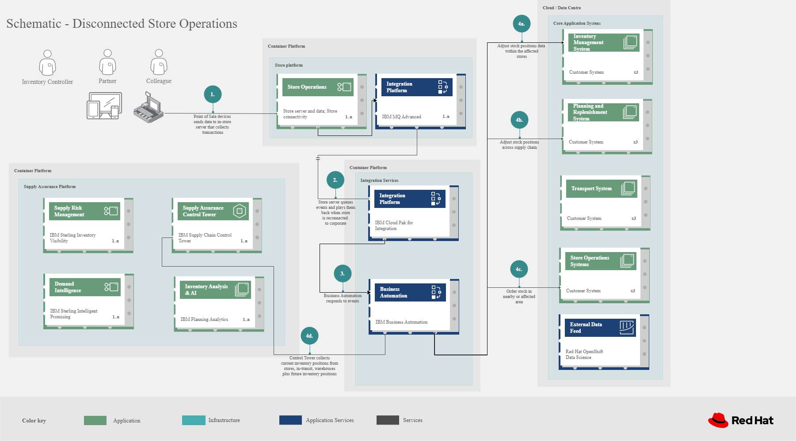

# Disaster readiness

Companies are facing natural disasters and extreme weather conditions, including those impacted by:

- Climate change, such as hurricanes, typhoons, floods, earthquakes, wildfires, droughts
- Acts of terrorism or violence, including active shooter situations; energy shortages
- Public health issues, including pandemics and quarantines 

Each can negatively affect your supply chain operations and financial performance. 

In this article, we discuss how your organization can prepare for business disruption, including

- Preparations when a weather event is anticipated.
- How systems can work together to mitigate the business disruption when stores become disconnected from corporate data centers.

## Use case

Events could result in physical damage to our properties, limitations on store operating hours, less frequent visits by members to physical locations, the temporary closure of warehouses, depots, manufacturing or home office facilities, the temporary lack of an adequate work force, disruptions to our IT systems, the temporary or long-term disruption in the supply of products from some local or overseas suppliers, the temporary disruption in the transport of goods to or from overseas, delays in the delivery of goods to our warehouses or depots, and the temporary reduction in the availability of products in our warehouses.

In 2020, there were [22 separate billion-dollar weather and climate disasters](https://www.climate.gov/news-features/blogs/beyond-data/2020-us-billion-dollar-weather-and-climate-disasters-historical) in the US alone and you can understand why modeling the risk from weather is so critical to your operations. 

## Background

Business need to anticipate and respond to supply chain challenges due to unanticipated disasters.

According to the [Business Continuity Institute](https://www.thebci.org/), 72% of suppliers who dealt with a breakdown in their supply chain lacked the full, real-time visibility needed to come up with a fast and simple solution.

## Business problem

A central feature is time to recover (TTR), the time it would take for a particular node — a supplier facility, a distribution center, or a transportation hub — to be restored to full functionality after a disruption.

The second concept is risk exposure, an assessment of exposure to risk based on a model that applies suppliers' TTR to estimate the performance impact, including operational (lost production) and financial (lost revenue and profit).

### Challenges / Business Drivers 

**Challenges**

Harvard Business Review article identified the following objectives for companies facing disaster situtations.

- Identify exposure to risk associated with parts and suppliers.
- Prioritize and allocate resources effectively.
- Invest in mitigation strategies such as booking logistics capacity.

**Drivers**

- **Monitor for disruptive environmental conditions** such as severe weather, wildfires, flooding, air quality, and carbon emissions and send alerts when detected.
- **Predict potential impacts** of climate change and weather across the business using climate risk analytics.
- **Reconfigure supply chain** Some critical but vulnerable suppliers will go out of business.
- **Reposition inventory** in anticipation of certain regions or facilities facing disaster.
- **Route deliveries around impacted areas**.
- **Continuous operation when store are disconnected from corporate data center**.

### Responses

| Business Problem | Solution |
| - | - |
| Unusual events, such as the global pandemic, war or other international incident, port issues, and waterway obstructions illustrate the need for enterprises to build resilient supply chains. | Respond with intelligence, speed, and confidence to reduce the impact of disruptions, turning these events into opportunities to outperform and outcompete. |
| Manual processes, limited capabilities of inventory management tools, and global operations pose a challenge for enterprises to manage and act on inventory and mitigate disruptions to meet actual demand. | Monitor and manage network inventory availability and respond to disruptions such as out-of-stock with alerts and recommended actions. |
| The lack of pertinent product information and poor data flow across partners lead to inefficient inventory management, waste, and lost sales. | Gain detailed visibility into inventory characteristics at each location. |
| Point of sales may not be connected to corporate office during a disaster | Data can be queued and then sent to corporate at a later time |

## Solution overview

The solution shown in Figure 1 uses components that can be grouped into three main categories as shown in the following diagram:

- **Core application systems**. Often customer-provided technologies, such as order management or facilities management. These systems can be standalone applications, on-premises and cloud services, and databases.
- **Foundational infrastructure**. The Red Hat/IBM solution is built on Red Hat OpenShift with data routed through API management and events routed through business automation tools such as Business Automation Workshop.
- **Inventory Optimization** platform consisting of a Supply Assurance Control Panel, Fulfillment Optimization, and Inventory Analysis & AI.

_Figure 1. Overall view of demand risk solution._

## Logical diagrams

_Figure 2. The personas and technologies that provide a platform for some of the biggest potential breakthroughs in the supply chain._

## Architecture

The figures in this section show the interaction of customer systems with supply chain optimization platform systems in the context of a retail scenario with branch stores.

### Weather disruption preparation

_Figure 3. Schematic diagram of weather disruption preparation use case._

Weather disruption preparation workflow steps:

<ol>
<li>External data feed, such as IBM Environmental Intelligence Suite, anticipated disruptive environmental condition.
<li>Demand Intelligence system is alerted to the potential disruption.
<li>Inventory analysis anticipates potential low stock levels and predicts extraordinary demand levels
<li>Current inventory levels data collected
<li>Control Tower collects current inventory positions from stores, in-transit, warehouses plus future inventory positions
<li>Control Tower alerts colleage with a set of work queues to mitigate the disrutpion Colleague takes remediation action by selecting actions provided by Control Tower.
<li>Colleague triggers Business Automation to remediate stock levels using a combination of options, including:
<ol type="a">
<li>Ordering more stock in nearby and affected area.
<li>Adjusting stock positions within existing Supply Chain.
<li>Plan transport around affected area.
<li>Coordinate with suppliers and vendors to position inventory
</ol>
</ol>

### Disconnected store

_Figure 4. Schematic diagram of disaster response with a disconnected store use case._

Disconnected store workflow steps:

<ol>
<li>Point of sale devices send information to in-store server that collects transactions.
<li>Once connection is restored, store server queues events and plays them back as events. 
<li>The transaction events are read, business automation workflows are triggered to update corporate systems.
<li>Data is updated through business automation to:
<ol type="a">
<li>Adjust stock positions data for the affected stores.
<li>Update replentishment system.
<li>Upste store operations data.
<li>Consolidate data for to update work queue in Supply Chain Control Tower.
</ol>
</ol>

## Action Guide

From a high-level perspective, the **Action Guide** represents a future state for organizations considering a comprehensive commitment. The idea is to outline a set steps that can be prioritized to reach that future state by adding new functionality to your existing systems.

- Automation
- Sustainability
- Modernization

| | Actionable Step | Implementation details |
| - | - | - |
| Automation | <ul><li>Monitor for disruptive environmental conditions such as severe weather, wildfires, flooding, air quality, and carbon emissions<li>Predict potential impacts of climate change and weather across the business using climate risk analytics</ul> | <ul><li>Gain insights into potential operational disruptions and prioritize mitigation and response efforts<li>Measure and report on environmental initiatives, while reducing the burden of this reporting on procurement and operations teams</ul> |
| Automation | Accelerate automation in extended workflows | Prepare for severe weather-related shipping and inventory disruptions, or factor environmental risks into future warehouse locations |
| Automation | Amp up AI to make workflows smarter | When users are inspecting inventory items by drilling down on the item, users see where they have available inventory and receive recommendations about how much inventory can and should be transferred. These recommendations are based on adding automation and AI to make workflows smarter. |
| Automation | Respond to disconnected store proactively | Use available data to take actions to support disconnected store. |
| Sustainability | Include sustainability commitments in decision making | Integrate sustainability metrics in disaster planning and response decision making. |
| Sustainability| Combine your proprietary and third-party geospatial information with weather data | <ul><li>Predict energy demand and reduce waste so that you don’t buy more power than you need.<li>Use weather information to predict and avoid disruptions and plot the most efficient routes.</ul>
| Modernization | Modernization for modern infrastructures, scale hybrid cloud platforms | The decision for a future, Kubernetes-based enterprise platform is defining the standards for development, deployment and operations tools and processes for years to come and thus represents a foundational decision point. |
| Modernization | Modernize application deployment and operations practices | <ul><li>Include DevOps best practices to deploy, monitor, and maintain applications<li>Use automation across the enterprise to maintain and update local store operations infrastructure</ul> |
| Modernization | Manage disconnected operations | Computing capabilities and data can be mirrored in stores to maintain local data needed to support store operations, such as product catalogs, and transactions, to provide basic services<li>Provide for data redundancy and high availability in local store operations. | 

For specific steps on this approach, see **The Action Guide** details in [_Own Your Transformation_](https://www.ibm.com/downloads/cas/1BYY6VEM) survey of 1500 CSCOs across 24 industries.

## Technology

The following technologies offered by Red Hat and IBM can augment the solutions already in place in your organization.

### Core platform

[*Red Hat OpenShift*](https://www.redhat.com/en/technologies/cloud-computing/openshift) Kubernetes offering, the hybrid platform offering allow deployment across data centers, private and public clouds offering choices and flexible for hosting system and services. You can manage clusters and applications from a single console, with built-in security policies with:

- [_Red Hat Advanced Cluster Management_](https://www.redhat.com/en/technologies/management/advanced-cluster-management)
- [_Red Hat Advanced Cluster Security_](https://www.redhat.com/en/technologies/cloud-computing/openshift/advanced-cluster-security-kubernetes)

[*Red Hat Ansible Automation Platform*](https://www.redhat.com/en/technologies/management/ansible) operate, scale and delegate automate IT services, track changes an update inventory, prevent configuration drift and  integrated with ITSM.

[*Red Hat OpenShift DevOps*](https://www.redhat.com/en/getting-started-devops) represents an approach to culture, automation and platform design intended to deliver increased business value and responsiveness through rapid, high-quality service delivery. DevOps means linking legacy apps with newer cloud-native apps and infrastructure. A DevOps developer can link legacy apps with newer cloud-native apps and infrastructure.

### Integration services

[*IBM Business Automation*](https://www.ibm.com/business-automation) delivers intelligent automations quickly with low-code tooling, such as business processes automation, decisioning software, robotic process automation, process mining, workflow automation, business process mapping, Watson Orchestrate, content services, and document processing. Rules processing, intelligent decison making, and regulation compliance using automation gives business flexible, auditable, policy-based workflows across the enterprise.

[*IBM Data Fabric*](https://www.ibm.com/data-fabric) empowers your teams and works across the ecosystem by connecyting data from disparate data sources in multicloud envrionments. In particular, [_Watson Knowledge Catalog_](https://www.ibm.com/cloud/watson-knowledge-catalog) provides you users with a catalog tool for intelligent, self-service discovery of data, models. [_Watson Query_](https://www.ibm.com/products/watson-query) provides data consumers with a universal query engine that executes distributed and virtualized queries across databases, data warehouses, data lakes, and streaming data without additional manual changes, data movement or replication. 

[*Red Hat OpenShift API Management*](https://access.redhat.com/documentation/en-us/red_hat_openshift_api_management/1/guide/53dfb804-2038-4545-b917-2cb01a09ef98) is a managed API traffic control and program management service to secure, manage, and monitor APIs at every stage of the development lifecycle.

[*Red Hat Intgration*](https://www.redhat.com/en/products/integration) is a comprehensive set of integration and messaging technologies to connect applications and data across hybrid infrastructures. It is an agile, distributed, containerized, and API-centric solution. It provides service composition and orchestration, application connectivity and data transformation, real-time message streaming, change data capture, and API management.

### Supply Assurance Platform

[*IBM Supply Chain Control Tower*](https://www.ibm.com/products/supply-chain-intelligence-suite) provides actionable visibility to orchestrate your end-to-end supply chain network, identify and understand the impact of external events to predict disruptions, and take actions based on recommendations to mitigate the upstream and downstream effects.

[*IBM Sterling Intelligent Promising*](https://www.ibm.com/products/intelligent-promising) provides shoppers with greater certainty, choice and transparency across their buying journey. It includes:

- [*IBM Sterling Fulfillment Optimizer with Watson*](https://www.ibm.com/products/fulfillment-optimizer) to determine the best location from which to fulfill an order, based on business rules, cost factors, and current inventory levels and placement
- [*Sterling Inventory Visibility*](https://www.ibm.com/products/inventory-visibility) to processes inventory supply and demand activity to provide accurate and real-time global visibility across selling channels.

[*IBM Planning Analytics with Watson*](https://www.ibm.com/products/planning-analytics) streamlines and integrates financial and operational planning across the enterprise.

[*Envizi*](https://www.ibm.com/products/envizi) simplifies the capture, consolidation, management, analysis and reporting of your environmental, social and governance (ESG) data.

[*IBM Environmental Intelligence Suite*](https://www.ibm.com/products/environmental-intelligence-suite) provides climate and weather insights to anticipate disruptive environmental conditions, proactively manage risk and build more sustainable operations.

## References

- [Supply chain planning and analytics](https://www.ibm.com/products/planning-analytics/supply-chain-planning)
- MIT Solan Managmenet Review [Three Scenarios to Guide Your Global Supply Chain Recovery](https://sloanreview.mit.edu/article/three-scenarios-to-guide-your-global-supply-chain-recovery/)
- Harvard Business Review [Managing Unpredictable Supply-Chain Disruptions](https://hbr.org/2014/01/from-superstorms-to-factory-fires-managing-unpredictable-supply-chain-disruptions)
- IBM [The missing link: Why visibility is essential to creating a resilient supply chain](https://www.ibm.com/blog/supply-chain-visibility-tool/)
- IBM [How to create more sustainable operations – one asset at a time](https://www.ibm.com/blogs/internet-of-things/sustainable-operations-one-asset-at-a-time/)

## Next steps

See:

- Loss and waste management (coming soon)
- Product timeliness (coming soon)
- Perfect order (coming soon)
- Intelligent order (coming soon)
- Returns (coming soon)
- Disaster readiness (coming soon)

For a comprehensive supply chain overview, see [Supply Chain Optimization](https://www.redhat.com/architect/portfolio/detail/36).

## Contributors

- Iain Boyle, Chief Architect, Red Hat
- Anthony Giles, Business Automation Technical Specialist, IBM
- Eric Singsaas, Account Technical Lead, IBM Technology
- Bruce Kyle, Sr Solution Architect, IBM Client Engineering
- Mahesh Dodani, Principal Industry Engineer, IBM Technology
- Mike Lee, Principal Integration Technical Specialist, IBM
- Thalia Hooker, Senior Principal Specialist Solution Architect, Red Hat
- Lee Carbonell, Senior Solution Architect & Master Inventor, IBM

## Download diagrams

View and download all of the **Inventory Optimization diagrams** shown in previous sections in our open source tooling site.

- PowerPoint Solution Overview: [Open Solution Overview](./downloads/SupplyChainOptimization.SolutionOverview.pptx)
- PowerPoint Reference Architecture: [Open Workflow Diagrams](./downloads/SupplyChainOptimization.ReferenceArchitecture.pptx)
- DrawIO: [Open Schematic Diagrams](./downloads/SupplyChainOptimization.drawio)
