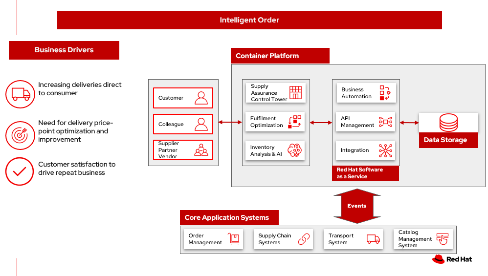

# Intelligent order

_Last mile delivery_, also known as _last mile logistics_, is the transportation of goods from a distribution hub to the final delivery destination — the door of the customer. The goal of last mile delivery logistics is to deliver the packages as affordably, quickly and accurately as possible. 

The last mile describes the difficulty of getting goods (especially large and bulky ones) from a transportation hub to their final destination because it might include installation and configuration while providing an excellent experience at the same time.

_Intelligent order_ is a process that uses inventory management systems and AI to provide effective last mile delivery.

For businesses this means:

- Decrease waste
- Order optimization
- Reduced cost

Consumers benefit with:

- Delivery promises fulfilled
- Proof of delivery

In this article, we explore two scenarios. One that optimizes last mile delivery and one that includes both your customers and third party logistics (3PL) providers.

## Business problem

If the last mile promise to delivery is incorrect and a product arrives late, there’s a good chance that the customer will shop with a competitor next time.

If last mile tracking information is incorrect, a product arrives late, is damaged, or is never delivered, there’s a good chance that the customer will shop with a competitor next time.

Customers want:

- Fast delivery
- Delivery tracking
- Security
- Convenience
- Specialization
- Selection delivery based on cost 

Business need to consider:

- Fuel costs
- Idling and downtime
- Warehousing
- Failed deliveries
- Returns
- Sustainability commitments

Key metrics:

- 47.6% of shoppers will shop elsewhere if they cannot see inventory availability before they buy
- 49% of shoppers would cancel their cart due to mismatch between expectations for delivery date and actual delivery date
- 58% of shoppers report checking inventory availability in the last 6 months

Deloitte describes key sector trends in [Last mile delivery landscape in the grocery sector](https://www.deloitte.com/global/en/Industries/consumer/perspectives/last-mile-delivery.html):

- Shifting tactics – evolving channel strategies and business models
- Need convenience delivered – customer’s new mantra
- Future of Last Mile increasingly a story of better software and connectivity

## Use cases

| Business scenario | Challenge | 
| - | - |
| Consumers are purchasing more products online | Online purchases of goods and direct to consumer deliveries are increasing dramatically.  This has driven huge increases in the volume  and importance of last mile delivery and installation services. |
| Consumers are placing more emphasis on after sales services | Consumers are demanding more control over delivery times and processes and want more value-added services. Manufacturers and suppliers are not meeting expectations, especially with last mile services. |
| New service providers are entering the market; reshaping the landscape | New entrants to 3PL (third party logistics) services such as Amazon and Uber are disrupting traditional service models.  Same day delivery is now an expectation, and this increases infrastructure and transportation services cost. Improved supply and demand forecasting is key to delivering last mile services. |
| Logistics costs are increasing, while product prices are eroding | Manufacturers are forced to react quickly to changing client demands while managing rising costs. Costs for warehousing, transportation and labor are increasing and this increases pressure on perfect order performance for both profitability and client loyalty.  |

### Proof of Delivery

Proof of delivery, or POD, is an acknowledgment that an order successfully arrived at its intended destination and is used to show a service was completed, which is why proof of delivery is also called proof of completion. Proof of delivery comes in two forms: paper and electronic. Benefits of POD are captured in the table.

| Benefits for customers | Benefits for businesses |
| - | - |
| Customers in control | Promise of delivery provides a better customer experience |
| Proof of Delivery makes it less likely orders will be stolen | Improves order accuracy and saves money on unnecessary refunds or replacements |
| Lets customers know their service is complete | POD automation accelerates back-office operations |

## Challenges / Business Drivers 

**Challenges**

- Consumer demand for delivery as promised
- Consumers wanting control of delivery and return processes
- Logistics costs in providing last mile delivery
- Logistics ecosystem complexity

**Drivers**

- Increasing deliveries direct to consumer
- Need for delivery price-point optimization and improvement
- Customer satisfaction to drive repeat business

## Responses

By definition, last mile delivery is relevant for businesses that deliver products directly to their consumers. 

| Business Problem | Solution |
| - | - |
| Maximize inventory productivity | Use real-time inventory visibility to confidently expose inventory and maximize conversions, gaining granular control over inventory actions, such as safety stock setting based on configurable business rules. Improve inventory turns by applying additional context like channel, fulfillment type and labor availability when making available-to promise decisions. |
| Make and manage order promises | Improve conversion rates by confidently delivering order and delivery promises across every step of the shopping journey, including the product list page, product detail page, cart, and checkout. Automate the review of inventory, capacity and costs to make informed promises, and harness powerful AI during fulfillment to simplify complex scenarios like orders with third-party services, and support a wide range of fulfillment options. |
| Optimize omnichannel profitability | Set operating performance objectives and KPIs using real cost drivers (like distance, labor, capacity, and carrier costs) and profit drivers markdown, stockout), so you can confidently make the best fulfillment decisions for your business objectives. By optimizing across thousands of fulfillment permutations in milliseconds, retailers can ensure balance between profitability and the best customer experience. |

## Business outcomes

- **Decrease waste**. Decrease order fragmentation and waste with decrease in packages per order.
- **Order optimization**. In-stock improvement through holiday season using Order Optimizer.
- **Reduce costs**. Reduced costs and emissions by housing software on the cloud more efficiently than on-premises
- **Minimize disruption**. Gain visibility to minimize disruption to business despite supply and demand shocks
- **Returns optimization**. Returns refurbished to create a revenue stream by re-circulation, refurbishment, repairs thereby reducing disposal and recycling costs.

## Solution overview 

This solution focuses on _Automation_ and _Modernization_ in our Action Guide as shown in the following diagram:

- Create a world-class sensing and risk-monitoring operation. 
- Accelerate automation in extended workflows
- Amp up AI to make workflows smarter
- Modernize for modern infrastructures, scale hybrid cloud platforms

The solution uses the following technologies, which can be grouped into three main categories as shown in the following diagram:

- Core application systems. Often customer-provided technologies, such as order management, facilities management. These systems can be stand-alone applications, on premises and cloud services, databases. 
- Foundational infrastructure. The Red Hat/IBM solution is built on Red Hat OpenShift. Data is routed through API management. Events are routed through Business Automation tools such as Business Automation Workshop. 
- Fulfillment optimization
- Intelligent promising

## Intelligent order

The following diagram shows the schematic for the intelligent order use case.

Intelligent order steps:

<ol>
<li>Customer places/track/confirm order thru omni channel 
<li>Inventory fulfilment, and delivery tracking information is quicky obtained from supply assurance Platform
<li>Access underlying backend system via API Management
<li>Integration services
<li>Check with the Store Operations System if inventory available in store
<li>If store cannot fulfill order, check with Warehouse Management System where inventory is available
<li>Update Transport/Logistics System to schedule delivery
<li>Cross check with the Fulfilment System to schedule and track the order
<li>Provide real-time tracking of the order and upon delivery provide POD (electronic or paper)
</ol>

## Delivery optimization

The following diagram shows the schematic for the delivery optimization use case to improve your supply chain.

Delivery optimization workflow steps:

<ol>
<li>Customer chooses items to buy online using the business app.
<li>Determine sustainability posture by determining ESG indicator values.
<li>Before providing cost and delivery options, provide customer sustainability options – equivalent greener items, later delivery day, pickup option, etc. If customer opts into sustainability option order is tagged so Supply Assurance Platform can honor that request.
<li>Inventory fulfilment system updates inventory data.
<li>Delivery Optimization system plays a key role in sustainability play. It determines whether to contact 3PL or if in-house Route Optimization can fulfill the requirements.
<li>If 3PL is the only option, contact the sustainability approved 3PL company to fulfill the order. 3PL company takes over the delivery flow from here. If business has the means to fulfill the order continue with next Step 6a.
<ul>
<li>Access underlying backend system via API Management
</ul>
<li>Alert the Order Fulfilment System (OFS) this special order via system APIs.
<li>OFS notifies the Warehouse Management System to package and get it ready for delivery.
<li>The Transport/Logistics System is alerted to schedule delivery. 
<ol>
<li>Track the order, notify customer and provide real-time tracking.
<li>Delivery department maintains the sustainability posture and upon final delivery provides POD (electronic or paper) to customer.
</ol>
<li>All sub-systems are updated via the data fabric that helps maintain a consistent view.
</ol>

## Action Guide

From a high-level perspective, there are several main steps your organization can take to drive innovation and move toward a digital supply chain:

- Automation
- Sustainability
- Modernization

| | Actionable Step | Implementation details |
| - | - | - |
| Automation | Create a world-class sensing and risk-monitoring operation |  Delivering greater certainty, choice and transparency to shoppers to enhance shopping experiences, improve digital and in-store conversion, and increase omnichannel revenue. |
| Automation | Accelerate automation in extended workflows | Combine inventory and capacity visibility with sophisticated fulfillment decisioning to maximize inventory productivity, make reliable and accurate order promises, and optimize fulfillment decisions at scale.  |
| Automation | Provide visibility across multiple systems | Build a global view of real-time inventory, including available-to-promise (ATP) inventory, capacity to process orders at different locations, and transportation availability. |
| Automation | Amp up AI to make workflows smarter | Optimize fulfillment execution and inventory levels to improve cost-to-serve and balance operations with industry-leading machine learning technology. Use AI with learned sell-through patterns to understand potential stockouts, demand shifts, markdowns, shipping costs, labor costs, and capacity so that retailers can make sourcing decisions that balance costs and service |
| Sustainability | Deliver on corporate commitment to sustainability | Include sustainability KPIs in the selection of delivery methods |
| Modernization | Modernization for modern infrastructures, scale hybrid cloud platforms | The decision for a future, Kubernetes-based enterprise platform is defining the standards for development, deployment and operations tools and processes for years to come and thus represents a foundational decision point. |

## Technology

The following technologies offered by Red Hat and IBM can augment the solutions already in place in your organization.

### Core solution

[*Red Hat OpenShift*](https://www.redhat.com/en/technologies/cloud-computing/openshift) Kubernetes offering, the hybrid platform offering allow deployment across data centers, private and public clouds offering choices and flexible for hosting system and services. You can manage clusters and applications from a single console, with built-in security policies with [_Red Hat Advanced Cluster Management_](https://www.redhat.com/en/technologies/management/advanced-cluster-management) and [_Red Hat Advanced Cluster Security_](https://www.redhat.com/en/technologies/cloud-computing/openshift/advanced-cluster-security-kubernetes).

[*Red Hat Ansible Automation Platform*](https://www.redhat.com/en/technologies/management/ansible) operate, scale and delegate automate IT services, track changes an update inventory, prevent configuration drift and  integrated with ITSM.

[*Red Hat OpenShift DevOps*](https://www.redhat.com/en/getting-started-devops) represents an approach to culture, automation and platform design intended to deliver increased business value and responsiveness through rapid, high-quality service delivery. DevOps means linking legacy apps with newer cloud-native apps and infrastructure. A DevOps developer can link legacy apps with newer cloud-native apps and infrastructure.

### Integration services

[*Red Hat OpenShift API Management*](https://access.redhat.com/documentation/en-us/red_hat_openshift_api_management/1/guide/53dfb804-2038-4545-b917-2cb01a09ef98) is a managed API traffic control and program management service to secure, manage, and monitor APIs at every stage of the development lifecycle.

[*Red Hat Intgration*](https://www.redhat.com/en/products/integration) is a comprehensive set of integration and messaging technologies to connect applications and data across hybrid infrastructures. It is an agile, distributed, containerized, and API-centric solution. It provides service composition and orchestration, application connectivity and data transformation, real-time message streaming, change data capture, and API management.

[*IBM Business Automation*](https://www.ibm.com/business-automation) delivers intelligent automations quickly with low-code tooling, such as business processes automation, decisioning software, robotic process automation, process mining, workflow automation, business process mapping, Watson Orchestrate, content services, and document processing. 

[*IBM Data Fabric*](https://www.ibm.com/data-fabric) empowers your teams and works across the ecosystem by connecyting data from disparate data sources in multicloud envrionments. In particular, [_Watson Knowledge Catalog_](https://www.ibm.com/cloud/watson-knowledge-catalog) provides you users with a catalog tool for intelligent, self-service discovery of data, models. [_Watson Query_](https://www.ibm.com/products/watson-query) provides data consumers with a universal query engine that executes distributed and virtualized queries across databases, data warehouses, data lakes, and streaming data without additional manual changes, data movement or replication. 

### Supply Assurance Platform

[*IBM Sterling Intelligent Promising*](https://www.ibm.com/products/intelligent-promising) provides shoppers with greater certainty, choice and transparency across their buying journey. It includes:

- [*IBM Sterling Fulfillment Optimizer with Watson*](https://www.ibm.com/products/fulfillment-optimizer) to determine the best location from which to fulfill an order, based on business rules, cost factors, and current inventory levels and placement
- [*Sterling Inventory Visibility*](https://www.ibm.com/products/inventory-visibility) to processes inventory supply and demand activity to provide accurate and real-time global visibility across selling channels.

## Similar use cases

See:

- [Inventory management](./perfectorder.md)
- [Demand risk](./demandrisk.md)
- [Loss and waste management](lossmanagement.md)
- [Product timeliness](timeliness.md)
- [Returns](./returns.md)
- [Disaster readiness](./disasterreadiness.md)

For a comprehensive supply chain overview, see [Supply Chain Optimization](supplychain.md).

## Downloads

View and download all of the **Inventory Optimization diagrams** shown in previous sections in our open source tooling site.

- PowerPoint Solution Overview: [Open Solution Overview](./downloads/SupplyChainOptimization.SolutionOverview.pptx)
- PowerPoint Reference Architecture: [Open Workflow Diagrams](./downloads/SupplyChainOptimization.ReferenceArchitecture.pptx)
- DrawIO: [Open Schematic Diagrams](./downloads/SupplyChainOptimization.drawio)

## References

- [Last mile delivery landscape in the grocery sector](https://www.deloitte.com/global/en/Industries/consumer/perspectives/last-mile-delivery.html)
- IDC Blog: [Enabling the Retail Workforce for Omnichannel Fulfillment](https://blogs.idc.com/2021/06/30/kickin-it-curbside-enabling-the-retail-workforce-for-omnichannel-fulfillment)
- COVID-19 Survey: [Accurate Delivery Dates Are Key To Win Consumer Confidence](https://www.getconvey.com/blog-b-consumer-research-estimated-delivery-date)
- Lauren Freedman, The Shopper Speaks: [3 secrets why curbside will not die post-COVID-19](https://www.digitalcommerce360.com/2021/03/19/the-shopper-speaks-3-secrets-why-curbside-will-not-die-post-covid-19)

## Contributors

- Rajeev Shrivastava, Account Technical Lead, IBM
- Ashok Iyengar, Executive Cloud Architect, IBM
- Karl Cama, Chief Architect, Red Hat
- Iain Boyle, Chief Architect, Red Hat
- Bruce Kyle, Solutions Architect, IBM Client Engineering
- Lee Carbonell, Senior Solution Architect & Master Inventor, IBM
