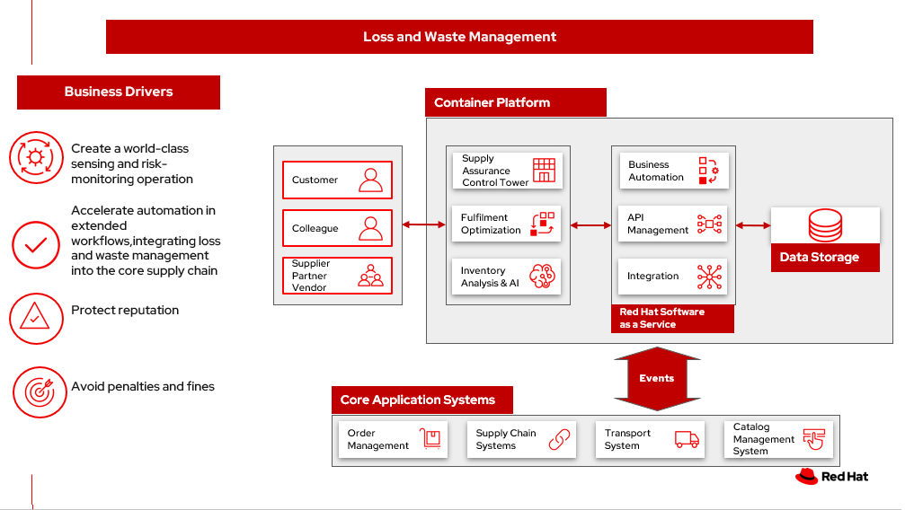

# Loss and waste management

A key focus when dealing with loss and waste management in relation to inventory optimization is how to handle unplanned or unforseen situations causing an inventory item be considered damaged or spoiled. If the situation or problem is rectified withing a well defined time window, there is a possibility of salvaging the product. In some cases once the incident occurs, there is no possibility of salvage and the product is considered damaged. Typically these events are external factors forced upon the business and cannot always be planned or predicted. 

To demonstrate the importance of inventory optimization for any business, we will focus on two main use cases of an unanticipated exception:

- **Environment Exceptions** such as power outages or temperature changes that creates potential spoilage 
- **Product contamination or recall** such as foreign objects or bacteria occuring earlier in the processing or supply chain

We will start by defining the business problem and the two main use cases: Environmental Exceptions and Product contamination or recall, describe the challenges and business drivers organizations face. Next, we will provide an action guide, provide an overview of the solution, show a schematic of the two use cases: Environmental Exceptions and Product contamination or recall, and conclude with the technology used in the solution.

For a comprehensive inventory solution overview, see [Inventory Optimization](supplychain.md).

## Business problem

Loss and waste management is principally focused on ensuring food and food related products remain fit for consumption at the time they are sold to the end consumer. However, external factors outside the control of the business can cause food items to be marked as spoiled or damaged. The problem faced by the business is ensuring the overall loss and wastage is minimised.

To prevent spoilage, food products must typically be stored and transported at temperatures within well defined ranges. For example:
- Frozen food must be kept below a specific temperature (0°F) at all times. If the temperature rises and food defrosts, it cannot be refrozen.
- Chilled food must be kept within a temperature range (34°F - 39°F). The temperature can sometimes go above the higher limit for a short space of time before returning to the correct temperature, without becoming spoiled. If the high temperature is exceeded for a specified duration it must be considered spoiled.
- Shelf stable food does not require chilling, but needs to be stored withing a temperature range to ensure the product shelf life is maintained. A shelf stable food product's shelf life can be 6 weeks to 5 years, depending on the product.

To keep food at the correct temperature, refrigeration and chilling during transport and storage are the primary options. Power outages will happen. The ability to deal with the situation within well defined time periods is critical to ensuring the loss and wastage is minimised. If the problem can be rectified quickly and easily, there is every chance the product can remain in perfect conditiona and be sold to a consumer. Failure to act quickly will result in spoilage and loss of the product.

Between farm and end consumer, food products generally go through multiple stages which vary depending on the end product. For convenience foods, there can be several manufuacturing steps, for fresh produce packaging and transport are the main stages. At any stage in the process, there is a possibility of contamination through foreign objects or bacteria. Both of which can trigger a recall of the food products. With any kind of contamination, a fast and efficient recall process to prevent the products beng purchased by consumers is vital.

All retailers handing and selling food products need processes to reduce food waste through external factors and ensure recall procedures in the event of contamination are fast, efficient and minimise any risk to public health.

## Use cases
The main use cases represented by loss management are:

- **Environmental Exceptions** &dash; an environmental issue or problem places the food product at risk. If the issue is not dealt with quickly and efficiently the product will be spoiled making unavailable for sale to a consumer. Typically this would be a failure of refrigeration equipment or a loss of power to refrigeration euipment. If the temperature can be kept within a specific range, the product will remain suitable for sale to a consumer. If the temperature moves beyond the specified range for a set period of time, the product will be considered spoiled and no longer suitable for sale to a consumer.
- **Product contamination or recall** &dash; a contamination or recall requires the food product to be removed immediately from the inventory and supply chain. The contamination issue or recall notice can come from external parties such as suppliers or food standards agencies, or through the retailer identifying an issue. Once the issue has been identified, the reatiler must immediately remove all affected products from their own inventory and supply chain, then destroy or pass the product to a third party. The issue can be caused by foreign objects or the detection of selected bateria in the product.

## Challenges / Business Drivers 

**Challenges**

- Protect public health: Businesses that sell consumable products are expected to protect the public health by implementing specific processes to address food safety. Maintaining equipment that refrigerates or freezes food or pharmaceutical products for storage until purchase or combined into a recipe and responding to and documenting actions taken to a food safety recall notification by either the supplier or regulatory body are key challenges.
- Regulatory compliance: Business that sell consumable products are expected to comply with local, state, and federal regulatory requirements for food and pharmaceutical products. Automated documentation of compliance is preferred over manual, error-prone documentation.

**Drivers**

- Industry leading inventory management system, incorporating sensors that can mitigate risks before they create an exposure.
- Integrating loss and waste management into the core supply chain applications, leveraging technical investments in modern infrastructures and edge devices.
- Protect Reputation
- Avoid Penalties and fines

### Responses

All businesses that require a supply chain have unanticipated issues. 

| Business problem | Solution |
| - | - |
| Manual processes, limited capabilities of inventory management tools, and global operations pose a challenge for enterprises to manage and act on inventory and mitigate disruptions to meet actual demand. | Monitor and manage network inventory availability and anticipate actions due to unanticipated exception with alerts and recommended actions |
| Business process for handling unexpected issues may not be consistent across the enterprise | Gain detailed visibility into inventory characteristics at each location and provide transparency to inventory. Enable actionable inventory shifts across the enterprise |
| Visibility into actions needed and alternatives to anticipate and respond to inventory in an unanticipated event. | Provide actionable tasks, work orders, visibility for workers and supply chain partners to remove recalled items. Proactively replace items in response to demand.

## Business outcomes

- Respond to unexpected events quickly
- Automated processes provide up-to-date transparently into inventory 
- Risks mitigated

## Solution overview 

This solution focuses on _Automation_ and _Modernization_ in our Action Guide as shown in the following diagram:

- Create a world-class sensing and risk-monitoring operation. 
- Accelerate automation in extended workflows
- Amp up AI to make workflows smarter
- Modernize for modern infrastructures, scale hybrid cloud platforms

The solution uses the following technologies, which can be grouped into three main categories as shown in the following diagram:

- Core application systems. Often customer-provided technologies, such as order management, facilities management. These systems can be stand-alone applications, on premises and cloud services, databases. 
- Foundational infrastructure. The Red Hat/IBM solution is built on RedHat OpenShift. Data is routed through API management. Events are routed through Business Automation tools such as Business Automation Workshop. 
- Inventory Optimization platform

## Solution principles

**True end-to-end visibility**. Remove data silos and create a unified view across supply chain data with a standard data platform. Personalized dashboards and insights provide a 360-degreee view of KPIs and significant events.

**Manage by exception**. Detect, display, and prioritize work tasks in real time. This allows clients to sense and react to issues quickly while managing risks and disruptions in a supply chain proactively.

**Intelligent workflows**. Actionable workflows can be customized to meet unique requirements and process steps required to automate actions within source transactional systems. Make informed decisions with a supply chain virtual assistant that provides responses to issues based on a client’s supply chain data using natural language search.

## Environment Exception

The following diagram shows the schematic for the understock use case.

Food Loss - Environmental Exception steps:

<ol>
<li>Environmental event detected (e.g. Temperature out of range or loss of power)
<li>Notification sent to Supply Risk Management via API Management service
<li>Inventory Control Tower notified of risk
<li>Inventory Control Tower triggers process to manage issue
<li>Inventory Controller notified and action determined
<li>Update process with Inventory Controller decision
<li>Remediation
  <ol type="a">
    <li>Inventory analysis notified to determine remediation
    <li>Facilities personel notified to take remediation action
    <li>Update Inventory Control Tower
  </ol>
</ol>

## Contamination/Recall 

The following diagram shows the schematic for the contamination recall use case.

Food Loss - Contamination recall steps:

)

<ol><li>External notification of food safety event
<li>Notification sent to Supply Intelligence & Inventory Analysis via API Management service
<li>Determine scope
  <ol type="a">
    <li>Determine if supply affected
    <li>Determine which locations received affected product
  </ol>
<li>Notify Inventory Control Tower
<li>Inventory Control Tower processes event data and starts remedediation action
<li>Colleague remediates inventory and counts, then removes product from inventory
<li>Remediation
  <ol type="a">
    <li>Inventory updated
    <li>Apply financial reimbursement. Generate new order
  </ol>
</ol>

## Use case and benefits

| Use Case | The Problem | The Solution | The Benefits and Implications |
| - | - | - | - |
| Automated processes | Manual input and follow up | Business automation provides a systematic way to notifications, documentation of notifications, and creation of work orders. | Actions follow a consistent business process and can be easily updated as needs change | 
| Damaged or potential issues products | Facilities issues can immediately impact product liability, lead to lost revenue and decreased brand / retailer loyalty. | Control Tower monitors inventory connections to multiple core application systems foster visibility,  create items in the work queue when revenue is at risk. When drilling down on the item, users can see where they have available inventory and receive recommendations about how much inventory can and should be ordered for replacement based on demand. | Action can be taken directly from the Control Tower user interface. Product situations are efficiently managed and OOS are avoided with minimal human intervention. |
| API Management | Separation of systems, control and monitoring of access, providing consistent user authentication and security between platforms | API Manages the access and permissions required for data between systems. | Improved security, monitoring of frequency of access between systems |
| Supply intelligence, inventory analysis | Avoid discarding items not included in recall, contamination Provide alternative products that can be substituted. Determine alternative locations or steps to stage product | Supply intelligence and inventory analytics provides record of product details, visibility into substitute products, - visibility of item locations, suggested remediation steps | Supplies can be immediately removed from sale, substitute product offered, steps to ship unaffected products as needed based on actual demand |
| Colleage and partner engagement | Quick sharing data between enterprise silos and to partners who can provide solutions | Visibility into recall issues |

## Action Guide

From a high-level perspective, there are several main steps your organization can take to drive innovation and move toward a digital supply chain:

- Automation
- Systainability
- Modernization

| | Actionable Step | Implementation details |
| - | - | - |
| Automation | Create a world-class sensing and risk-monitoring operation | Leveraging IOT/Edge devices, implement the ability to detect abnormal variations in temperature, power, water, machinery, and transportation to quickly react and correct. |
| Automation | Accelerate automation in extended workflows | Business automation provides a systematic way to notifications, documentation of notifications, and creation of work orders. |
| Automation | Amp up AI to make workflows smarter | For Damaged or potential issues products, Control Tower monitors inventory connections to multiple core application systems foster visibility, create items in the work queue when revenue is at risk. When drilling down on the item, users can see where they have available inventory and receive recommendations about how much inventory can and should be ordered for replacement based on demand. |
| Modernization | Modernization for modern infrastructures, scale hybrid cloud platforms | The decision for a future, Kubernetes-based enterprise platform is defining the standards for development, deployment and operations tools and processes for years to come and thus represents a foundational decision point. |

## Technology

The following technologies offered by Red Hat and IBM can augment the solutions already in place in your organization.

### Core systems

[*Red Hat OpenShift*](https://www.redhat.com/en/technologies/cloud-computing/openshift) Kubernetes offering, the hybrid platform offering allow deployment across data centers, private and public clouds offering choices and flexible for hosting system and services. You can manage clusters and applications from a single console, with built-in security policies with [_Red Hat Advanced Cluster Management_](https://www.redhat.com/en/technologies/management/advanced-cluster-management) and [_Red Hat Advanced Cluster Security_](https://www.redhat.com/en/technologies/cloud-computing/openshift/advanced-cluster-security-kubernetes).

[*Red Hat Ansible Automation Platform*](https://www.redhat.com/en/technologies/management/ansible) operate, scale and delegate automate IT services, track changes an update inventory, prevent configuration drift and  integrated with ITSM.  

[*Red Hat OpenShift DevOps*](https://www.redhat.com/en/getting-started-devops) represents an approach to culture, automation and platform design intended to deliver increased business value and responsiveness through rapid, high-quality service delivery. DevOps means linking legacy apps with newer cloud-native apps and infrastructure. A DevOps developer can link legacy apps with newer cloud-native apps and infrastructure.

### Integration services

[*Red Hat OpenShift API Management*](https://access.redhat.com/documentation/en-us/red_hat_openshift_api_management/1/guide/53dfb804-2038-4545-b917-2cb01a09ef98) is a managed API traffic control and program management service to secure, manage, and monitor APIs at every stage of the development lifecycle.

[*IBM Business Automation*](https://www.ibm.com/business-automation) delivers intelligent automations quickly with low-code tooling, such as business processes automation, decisioning software, robotic process automation, process mining, workflow automation, business process mapping, Watson Orchestrate, content services, and document processing.

### Supply assurance platform

[*IBM Supply Chain Control Tower*](https://www.ibm.com/products/supply-chain-intelligence-suite) provides actionable visibility to orchestrate your end-to-end supply chain network, identify and understand the impact of external events to predict disruptions, and take actions based on recommendations to mitigate the upstream and downstream effects.

[*IBM Sterling Intelligent Promising*](https://www.ibm.com/products/intelligent-promising) provides shoppers with greater certainty, choice and transparency across their buying journey. It includes:

- [*IBM Sterling Fulfillment Optimizer with Watson*](https://www.ibm.com/products/fulfillment-optimizer) to determine the best location from which to fulfill an order, based on business rules, cost factors, and current inventory levels and placement
- [*Sterling Inventory Visibility*](https://www.ibm.com/products/inventory-visibility) to processes inventory supply and demand activity to provide accurate and real-time global visibility across selling channels.

[*IBM Planning Analytics with Watson*](https://www.ibm.com/products/planning-analytics) streamlines and integrates financial and operational planning across the enterprise.

## Similar use cases

See:

- [Inventory management](./perfectorder.md)
- [Demand risk](./demandrisk.md)
- [Product timeliness](timeliness.md)
- [Intelligent order](./intelligentorder.md)
- [Returns](./returns.md)
- [Disaster readiness](./disasterreadiness.md)

For a comprehensive supply chain overview, see [Supply Chain Optimization](supplychain.md).

## Downloads

View and download all of the **Inventory Optimization diagrams** shown in previous sections in our open source tooling site.

- PowerPoint Solution Overview: [Open Solution Overview](./downloads/SupplyChainOptimization.SolutionOverview.pptx)
- PowerPoint Reference Architecture: [Open Workflow Diagrams](./downloads/SupplyChainOptimization.ReferenceArchitecture.pptx)
- DrawIO: [Open Schematic Diagrams](./downloads/SupplyChainOptimization.drawio)

## Contributors

- Mike Lee, IBM
- Iain Boyle, Red Hat
- Bruce Kyle, IBM
- Mahesh Dodani, IBM
- Thalia Hooker, Red Hat
- Jeric Saez, IBM
- Lee Carbonell, IBM
- James Stewart, IBM
- Lee Carbonell, IBM
