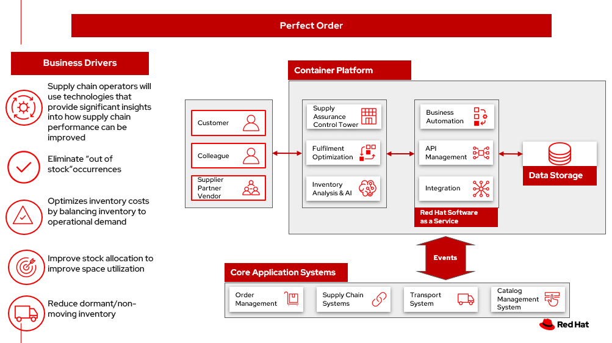

# Perfect order

Managing inventory efficiently is critical to any business that sells physical goods, is responsible for maintenance, repair and operations (MRO) supplies. 

_Inventory management_ encompasses procedures and processes that directly or indirectly affect the bottom line &dash; ordering, receiving, storing, tracking and accounting for all of the goods a business sells. It is a key element of supply chain management.

In this scenario, you will explore the implications of a _perfect and imperfect order_ in which inventory:

- Can meet customer expecation.
- May not have all items available.

## Business problem

- **Inventory visibility**. Multichannel order fulfillment operations typically have inventory spread across many places throughout the supply chain. Inventory visibility is knowing what inventory you have and where it’s located. Businesses need an accurate view of inventory to guarantee fulfillment of customer orders, reduce shipment turnaround times, and minimize stockouts, oversells and markdowns.
- **Orders may not match available inventory**. Inventory may not be on hand or in a different location than expected. Multiple and partial shipments may be able to solve many customer requests.

## Business solution

The goal of _inventory management_ is to have the right products in the right place at the right time. This requires inventory visibility — knowing when to order, how much to order and where to store stock. The basic steps of inventory management include:

- **Purchasing inventory**. Ready-to-sell goods are purchased and delivered to the warehouse or directly to the point of sale.
- **Storing inventory**. Inventory is stored until needed. Goods or materials are transferred across your fulfillment network until ready for shipment.
- **Profiting from inventory**. The amount of product for sale is controlled. Finished goods are pulled to fulfill orders. Products are shipped to customers.

## Use cases

More and more businesses are looking at having sustainable supply chains because customers are demanding it. 

| Use case | Problem statement | Solution |
| - | - | - |
| Stock on hand | **Inventory visibility** What goods are in stock, how much do you have and where are the items? All that information is required to fill orders. | An Inventory management system helps provide that information and more. |
| Forecasting for fulfillment / Demand forecasting | **Forecasting** Forecasting is predicting how much inventory you’ll need on hand to meet upcoming demand. |  Goal of forecasting is to have just enough inventory on hand to cover predicted sales for a prescribed period of time. |
| Optimal inventory | **Monitor Orders & Inventory**  By minimizing lost sales, misplaced stock and excess ordering, inventory management boosts your profits and can even reduce your taxes. | Optimal inventory level is the ideal quantity of product that one should have in a fulfillment center(s) at any given time. By optimizing inventory levels, you reduce the risk of common inventory issues, from high storage costs to out-of-stock items. |
| Warehouse location | **Inside the Warehouse** refers to the specific spot, such as a shelf or a bin, where a product is located within the four walls of a warehouse. It impacts the efficiency and timeliness of picking products. | The products most often picked is placed in the most efficient spot. As products change and demand for products changes, the inventory layout can be updated to ensure continued efficiency. |
| Warehouse location | Physical Location of the Warehouse | Choosing the site for a warehouse is based on many factors: <ul><li>Rent Rates & Taxes<li>Workforce Availability, Labor Skills & Costs<li>Access Roads, Highways & Traffic Flow<li>Proximity to Airport, Railway Stations & Ports<li>Proximity to Markets & Local Environment<li>Building Availability & Utility Costs<li>Building intelligent</ol> |

## Challenges / Business Drivers 

**Challenges**

- **Inventory visibility**. Multichannel order fulfillment operations typically have inventory spread across many places throughout the supply chain. Inventory visibility is knowing what inventory you have and where it’s located. Businesses need an accurate view of inventory to guarantee fulfillment of customer orders, reduce shipment turnaround times, and minimize stockouts, oversells and markdowns.
- **Orders may not match available inventory**. Inventory may not be on hand or in a different location than expected. Multiple and partial shipments may be able to solve many customer needs.
- **Spreadsheets, hand-counted stock levels and manual order placement** have largely been replaced by advanced inventory tracking software. An inventory management system can simplify the process of ordering, storing and using inventory by automating end-to-end production, business management, demand forecasting and accounting.

**Drivers**

- Supply chain operators will use technologies that provide significant insights into how supply chain performance can be improved. They’ll anticipate anomalies in logistics costs and performance before they occur and have insights into where automation can deliver significant scale advantages
- Eliminate “out of stock” occurrences
- Optimizes inventory costs by balancing inventory to operational demand
- Improve stock allocation to improve space utilization
- Reduce dormant/non-moving inventory
- Have an accurate assessment of critical spares and the money invested in those parts
- Deliver transparency and visibility to critical and non-critical spares inventory for the organization
- Reduce time spent looking for and ordering parts
- Accelerate disposal of obsolete materials

## Business outcomes

- **Decrease waste**. Decrease order fragmentation and waste with decrease in packages per order.
- **Order optimization**. In-stock improvement through holiday season using Order Optimizer.
- **Reduce costs**. Reduced costs and emissions by housing software on the cloud more efficiently than on-premises
- **Minimize disruption**. Gain visibility to minimize disruption to business despite supply and demand shocks
- **Returns optimization**. Returns refurbished to create a revenue stream by re-circulation, refurbishment, repairs thereby reducing disposal and recycling costs.

## Solution overview 

This solution focuses on _Automation_ and _Modernization_ in our Action Guide as shown in the following diagram:

- Increase inventory visibility
- Monitor the criticality of inventory items to the organization 
- Accelerate automation in extended workflows
- Amp up AI to make workflows smarter
- Modernize for modern infrastructures, scale hybrid cloud platforms

## Solution principles

**True end-to-end visibility**. Remove data silos and create a unified view across supply chain data with a standard data platform. Personalized dashboards and insights provide a 360-degreee view of KPIs and significant events.

**Manage by exception**. Detect, display, and prioritize work tasks in real time. This allows clients to sense and react to issues quickly while managing risks and disruptions in a supply chain proactively.

**Intelligent workflows**. Actionable workflows can be customized to meet unique requirements and process steps required to automate actions within source transactional systems. Make informed decisions with a supply chain virtual assistant that provides responses to issues based on a client’s supply chain data using natural language search.

## Perfect order

The following diagram shows the inventory management scenario for an perfect order with responses for cases where the order is not perfect.

<ol>
<li>Customer places/track/confirm order thru omni channel 
<li>Inventory fulfilment, and delivery tracking information is quicky obtained from supply assurance Platform
<li>Access underlying backend system via API Management
<li>Notify various backend systems via the Integration Services
<li>Check with the Inventory Management System if inventory is available then lock the items and update the inventory.
<li>Use Store Operations System to determine if store can fulfill order. Store can only fulfill partial order. Notify customer about partial order fill. If acceptable, package order and get it ready for delivery to customer. Go to Step 7. If partial order is not acceptable, get it ready to be sent to warehouse. Go to Step 8.
<li>Notify Transport/Logistics System to schedule delivery. 
<li>Use Warehouse Management System to find which warehouse can fulfill remaining order items. Send alert to warehouse to combine partial orders and package itmes and get it ready for delivery. Notify customer and update/sync related systems.
<li>Update Transport/Logistics System to schedule delivery.
<li>Cross check with the Fulfilment System to schedule and track the order and notify customer.
<li>Provide real-time tracking of the order to customer and upon delivery provide POD (electronic or paper) to customer.
</ol>

## Action guide

From a high-level perspective, there are several main steps your organization can take to drive innovation and move toward a digital supply chain:

- Automation
- Sustainability
- Modernization

| | Actionable Step | Implementation details |
| - | - | - |
| Automation | Monitor the criticality of inventory items to the organization  | Some are critical to operations or employee safety. Others are “nice to have” but not urgent. Select a methodology and a solution that routinely audit those parameters. For example, any time a new transaction is created in the Enterprise Resource Planning (ERP), the solution needs to apply that transaction against the material to determine if the criticality is still correct. |
| Automation | Accelerate automation in extended workflows | Automate the response using workflows that are consistant with criticality of the inventory items. |
| Automation | Provide visibility into the inventory system | When users are inspecting inventory items, users can see where they have available inventory and receive recommendations about how much inventory can and should be transferred to the OOS / AOOS locations. These recommendations are based on adding automation and AI to make workflows smarter. |
| Automation | Automate the maintenance of scores to each individual item | Eliminate data manual entry for criticality with a systems wide approach. |
| Sustainability | Includes sustainability metrics into decision making | Surface sustainability information as part of the inventory management processes. |
| Modernization | Modernization for modern infrastructures, scale hybrid cloud platforms | The decision for a future, Kubernetes-based enterprise platform is defining the standards for development, deployment and operations tools and processes for years to come and thus represents a foundational decision point. |

## Technology

The following technologies offered by Red Hat and IBM can augment the solutions already in place in your organization.

### Core systems

[*Red Hat OpenShift*](https://www.redhat.com/en/technologies/cloud-computing/openshift) Kubernetes offering, the hybrid platform offering allow deployment across data centers, private and public clouds offering choices and flexible for hosting system and services. You can manage clusters and applications from a single console, with built-in security policies with [_Red Hat Advanced Cluster Management_](https://www.redhat.com/en/technologies/management/advanced-cluster-management) and [_Red Hat Advanced Cluster Security_](https://www.redhat.com/en/technologies/cloud-computing/openshift/advanced-cluster-security-kubernetes).

[*Red Hat Ansible Automation Platform*](https://www.redhat.com/en/technologies/management/ansible) operate, scale and delegate automate IT services, track changes an update inventory, prevent configuration drift and  integrated with ITSM.

[*Red Hat OpenShift DevOps*](https://www.redhat.com/en/getting-started-devops) represents an approach to culture, automation and platform design intended to deliver increased business value and responsiveness through rapid, high-quality service delivery. DevOps means linking legacy apps with newer cloud-native apps and infrastructure. A DevOps developer can link legacy apps with newer cloud-native apps and infrastructure.

### Integration services

[*Red Hat OpenShift API Management*](https://access.redhat.com/documentation/en-us/red_hat_openshift_api_management/1/guide/53dfb804-2038-4545-b917-2cb01a09ef98) is a managed API traffic control and program management service to secure, manage, and monitor APIs at every stage of the development lifecycle.

[*Red Hat Intgration*](https://www.redhat.com/en/products/integration) is a comprehensive set of integration and messaging technologies to connect applications and data across hybrid infrastructures. It is an agile, distributed, containerized, and API-centric solution. It provides service composition and orchestration, application connectivity and data transformation, real-time message streaming, change data capture, and API management.

[*IBM Business Automation*](https://www.ibm.com/business-automation) delivers intelligent automations quickly with low-code tooling, such as business processes automation, decisioning software, robotic process automation, process mining, workflow automation, business process mapping, Watson Orchestrate, content services, and document processing.

### Supply assurance platform

[*IBM Supply Chain Control Tower*](https://www.ibm.com/products/supply-chain-intelligence-suite) provides actionable visibility to orchestrate your end-to-end supply chain network, identify and understand the impact of external events to predict disruptions, and take actions based on recommendations to mitigate the upstream and downstream effects.

[*IBM Sterling Intelligent Promising*](https://www.ibm.com/products/intelligent-promising) provides shoppers with greater certainty, choice and transparency across their buying journey. It includes:

- [*IBM Sterling Fulfillment Optimizer with Watson*](https://www.ibm.com/products/fulfillment-optimizer) to determine the best location from which to fulfill an order, based on business rules, cost factors, and current inventory levels and placement
- [*Sterling Inventory Visibility*](https://www.ibm.com/products/inventory-visibility) to processes inventory supply and demand activity to provide accurate and real-time global visibility across selling channels.

[*IBM Planning Analytics with Watson*](https://www.ibm.com/products/planning-analytics) streamlines and integrates financial and operational planning across the enterprise.

[*IBM Maximo MRO Inventory Optimization*](https://www.ibm.com/products/mro-inventory-optimization) can help you optimize your maintenance, repair and operations (MRO) inventory by providing an accurate, detailed picture of performance.

## Similar use cases

See:

- [Demand risk](./demandrisk.md)
- [Loss and waste management](lossmanagement.md)
- [Product timeliness](timeliness.md)
- [Intelligent order](./intelligentorder.md)
- [Returns](./returns.md)
- [Disaster readiness](./disasterreadiness.md)

For a comprehensive supply chain overview, see [Supply Chain Optimization](supplychain.md).

## Downloads

View and download all of the **Inventory Optimization diagrams** shown in previous sections in our open source tooling site.

- PowerPoint Solution Overview: [Open Solution Overview](./downloads/SupplyChainOptimization.SolutionOverview.pptx)
- PowerPoint Reference Architecture: [Open Workflow Diagrams](./downloads/SupplyChainOptimization.ReferenceArchitecture.pptx)
- DrawIO: [Open Schematic Diagrams](./downloads/SupplyChainOptimization.drawio)

## Reference

- IBM documentation [What is inventory management?](https://www.ibm.com/topics/inventory-management)
- Blog [Understanding “Spares Criticality” in your MRO inventory](https://www.ibm.com/blogs/internet-of-things/mro-inventory-spares-criticality/)

## Contributors

- Rajeev Shrivastava, Account Technical Lead, IBM
- Ashok Iyengar, Executive Cloud Architect, IBM
- Karl Cama, Chief Architect, Red Hat
- Iain Boyle, Chief Architect, Red Hat
- Bruce Kyle, Solutions Architect, IBM Client Engineering
- Lee Carbonell, Senior Solution Architect & Master Inventor, IBM
