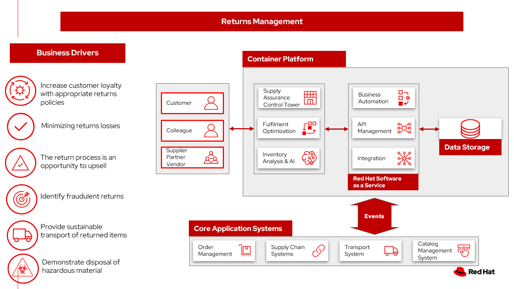

# Returns

Evolving customer expectations have forced retailers to figure out how to better manage the ripple effects that the current global crisis has created. This includes the realm of returns. 

## Use cases

- Manage return policies and manage customer expectations.
- Minimizing return losses.
- Categorize return items for recycle, dispose, or return for sales.
- Determine fraudulent returns.
- Identify and track returns items with hazardous materials.

## Background

Let’s look at some of the trends that 2020 has seen so far:

- Extended return windows: Many retailers have instituted extended return periods that go beyond the average 30-day window for customers.
- Increased returns: With physical stores closed, ecommerce is on the rise. But with this shift comes increased returns, as customers can’t be certain what they’re buying online will be what the right size and fit.
- Not accepting returns: In the face of health concerns around coronavirus lingering on surfaces for extended periods of time, some retailers have stopped accepting product returns at all.

## Business problem

Meet consumer demands by modernizing IT for the retail and consumer packaged goods (CPG) industry.

### Challenges / Business Drivers 

**Challenges**

Making returns easy for consumers is a way to create a loyal customer.

*Minimizing returns losses* by:

- Sell the right item. One major step that eliminates a possible return is to make sure you sell the right item to the right customer. 
- Save the sale. The ‘save the sale’ method is key for businesses who are looking to compensate for returns through a loyalty incentive. 
- Smart returns. Smart returns will require a connected network of inventory visibility, as well as predicted demand.
- Predict returns. Data plays a vital role when it comes to predicting returns. Specifically, data that tracks the reason for a return: whether it's done directly (item was damaged, didn’t fit, wasn’t as pictured, etc.) or learned through predictive analytics.
- Buy online, pick up (or return) in-store. Retailers can give shoppers greater flexibility by allowing them to purchase online and then pick up in-store. While they’re there to pick up, they can test or try products they’ve ordered and make an exchange via curbside processing if needed.
- Virtual or personal shopping. Whether it’s a virtual showcase of new items for your most loyal customers, or enabling sales associates to set aside items for shoppers based on their past purchase history, these tech-enabled shopping solutions should help lower the risk of returns.
- Process returns quickly and efficiently, reducing the amount of time and employee hours spent.

*Identify fraudulent returns*:

- Returning stolen merchandise
- Receipt fraud
- Employee fraud
- Price switching
- Price arbitrage
- Switch fraud
- Bricking
- Cross-retail return
- Open-box fraud
- Wardrobing

**Drivers**

- Increase customer loyalty with appropriate returns policies
- Minimizing returns losses
- The return process is an opportunity to upsell
- Identify fraudulent returns
- Provide sustainable transport of returned items
- Demonstrate proper disposal of hazardous material returns

## Business outcomes

- Determine return policy suitable by item
- Setting and meeting customer expectations on returned items
- Enhance loyalty of customers
- Minimize losses by having fewer returns
- Identify items for resale, open box, refurbish, resale, donation to charity
- Hazardous materials handled properly

## Solution overview

The solution shown in Figure 1 uses components that can be grouped into three main categories as shown in the following diagram:

- **Core application systems**. Often customer-provided technologies, such as order management or facilities management. These systems can be standalone applications, on-premises and cloud services, and databases.
- **Foundational infrastructure**. The Red Hat/IBM solution is built on Red Hat OpenShift with data routed through API management and events routed through business automation tools such as Business Automation Workshop.
- **Supply Chain Optimization** platform consisting of a Supply Assurance Control Panel, Fulfillment Optimization, and Inventory Analysis & AI.

_Figure 1. Overall view of demand risk solution._

## Logical diagrams

_Figure 2. The personas and technologies that provide a platform for some of the biggest potential breakthroughs in the supply chain._

## Architectures

The figures in this section show the interaction of customer systems with supply chain optimization platform systems in the context of a retail scenario with branch stores.

## Returns management

_Figure 3. Schematic diagram of returns management use case._

Returns workflow steps:

<ol>
<li>Customer initiates return, provides reason at a kiosk, store, or mobile application
<li>Set customer expectation of refund, store credit, or upsell
<li>Business automation orchestrates, return item process
<ol type="a">
<li>Item is picked up and returns to a warehouse or store location
<li>The item is returned to a location
<li>Disposition system determines whether item is for disposal, resell as open box, referbish based on business rules.
</ol>
<li>Review return for fraudulent return patterns
<li>Track hazardous material disposal
</ol>

## Action Guide

From a high-level perspective, the **Action Guide** represents a future state for organizations considering a comprehensive commitment. The idea is to outline a set steps that can be prioritized to reach that future state by adding new functionality to your existing systems.

- Automation
- Sustainability
- Modernization

| | Actionable Step | Implementation details |
| - | - | - |
| Automation | Create a world-class sensing and risk-monitoring operation | Integrate data from multiple systems to get enterprise-wide view of returns of items in inventory demand. Monitor and analyze returns in real-time. |
| Automation | Accelerate automation in extended workflows | Automate returns policy for consistency across the enterprise and customize based on item. |
| Automation | Amp up AI to make workflows smarter | <ul><li>Use AI to identify product deficiencies that lead to return patterns, generate upsell recommendations, identify fraud patterns, and recommend sustainable transport options for return items.<li>Use AI to determine likely returned items<li>Use AI to identify fraudulent returns</ul>|
| Sustainability | Include sustainability commitments in decision making | Integrate sustainability metrics in returns decision making, especially return items transport or disposal. |
| Sustainability | Track disposal of hazardous returns | Report on how hazardous returns are handled. |
| Modernization | Modernization for modern infrastructures, scale hybrid cloud platforms | The decision for a future, Kubernetes-based enterprise platform is defining the standards for development, deployment and operations tools and processes for years to come and thus represents a foundational decision point. |
| Modernization | Modernize application deployment and operations practices | Include DevOps best practices to deploy, monitor, and maintain applications |

For specific steps on this approach, see **The Action Guide** details in [_Own Your Transformation_](https://www.ibm.com/downloads/cas/1BYY6VEM) survey of 1500 CSCOs across 24 industries.

## Technology

The following technologies offered by Red Hat and IBM can augment the solutions already in place in your organization.

### Core systems

[*Red Hat OpenShift*](https://www.redhat.com/en/technologies/cloud-computing/openshift) Kubernetes offering, the hybrid platform offering allow deployment across data centers, private and public clouds offering choices and flexible for hosting system and services. You can manage clusters and applications from a single console, with built-in security policies with [_Red Hat Advanced Cluster Management_](https://www.redhat.com/en/technologies/management/advanced-cluster-management) and [_Red Hat Advanced Cluster Security_](https://www.redhat.com/en/technologies/cloud-computing/openshift/advanced-cluster-security-kubernetes).

[*Red Hat Ansible Automation Platform*](https://www.redhat.com/en/technologies/management/ansible) operate, scale and delegate automate IT services, track changes an update inventory, prevent configuration drift and  integrated with ITSM.

[*Red Hat OpenShift DevOps*](https://www.redhat.com/en/getting-started-devops) represents an approach to culture, automation and platform design intended to deliver increased business value and responsiveness through rapid, high-quality service delivery. DevOps means linking legacy apps with newer cloud-native apps and infrastructure. A DevOps developer can link legacy apps with newer cloud-native apps and infrastructure.

### Integration services

[*Red Hat OpenShift API Management*](https://access.redhat.com/documentation/en-us/red_hat_openshift_api_management/1/guide/53dfb804-2038-4545-b917-2cb01a09ef98) is a managed API traffic control and program management service to secure, manage, and monitor APIs at every stage of the development lifecycle.

[*Red Hat Intgration*](https://www.redhat.com/en/products/integration) is a comprehensive set of integration and messaging technologies to connect applications and data across hybrid infrastructures. It is an agile, distributed, containerized, and API-centric solution. It provides service composition and orchestration, application connectivity and data transformation, real-time message streaming, change data capture, and API management.

[*IBM Business Automation*](https://www.ibm.com/business-automation) delivers intelligent automations quickly with low-code tooling, such as business processes automation, decisioning software, robotic process automation, process mining, workflow automation, business process mapping, Watson Orchestrate, content services, and document processing. Rules processing, intelligent decison making, and regulation compliance using automation gives business flexible, auditable, policy-based workflows across the enterprise.

### Supply assurance platform

[*IBM Sterling Fulfillment Optimizer with Watson*](https://www.ibm.com/products/fulfillment-optimizer) to determine the best location from which to fulfill an order, based on business rules, cost factors, and current inventory levels and placement.

[*IBM Planning Analytics with Watson*](https://www.ibm.com/products/planning-analytics) streamlines and integrates financial and operational planning across the enterprise.

## References

- IBM [The future of retail returns](https://www.ibm.com/blog/ibm-future-of-returns/)
- Digital Commerce 360 [How returns can be a retail ‘superpower’](https://www.digitalcommerce360.com/2023/02/28/how-ecommerce-returns-can-be-a-retail-superpower/)
- Digital Commerce 360 [Loop processes 60,000 returns a day during 2022 holiday season](https://www.digitalcommerce360.com/2023/01/09/loop-processes-60000-returns-a-day-during-2022-holiday-season/)

## Next steps

See:

- Loss and waste management (coming soon)
- Product timeliness (coming soon)
- Perfect order (coming soon)
- Intelligent order (coming soon)
- Returns (coming soon)

For a comprehensive supply chain overview, see [Supply Chain Optimization](https://www.redhat.com/architect/portfolio/detail/36).

## Contributors

- Iain Boyle, Chief Architect, Red Hat
- Bruce Kyle, Sr Solution Architect, IBM Client Engineering
- Ramesh Yerramsetti, Customer Success Architect, IBM Technology
- Mahesh Dodani, Principal Industry Engineer, IBM Technology
- Thalia Hooker, Senior Principal Specialist Solution Architect, Red Hat
- Lee Carbonell, Senior Solution Architect & Master Inventor, IBM
- Eric Singsaas, Account Technical Lead, IBM Technology
- Mike Lee, Principal Integration Technical Specialist, IBM

## Download diagrams

View and download all of the **Inventory Optimization diagrams** shown in previous sections in our open source tooling site.

- PowerPoint Solution Overview: [Open Solution Overview](./downloads/SupplyChainOptimization.SolutionOverview.pptx)
- PowerPoint Reference Architecture: [Open Workflow Diagrams](./downloads/SupplyChainOptimization.ReferenceArchitecture.pptx)
- DrawIO: [Open Schematic Diagrams](./downloads/SupplyChainOptimization.drawio)