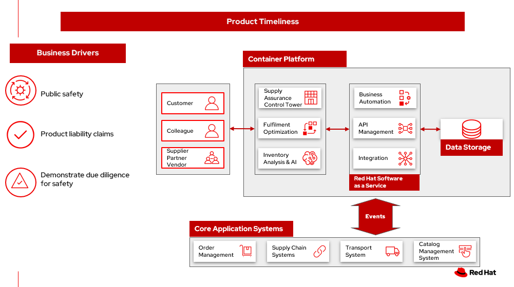

# Product timeliness

Foods and ingredients expire or become unusable at some point. Manufactured parts and goods also experience decay and deterioration. Each of these may be measured.

In the food industry, you may see different terms and date types on the packaging, the following are common practices and their meanings according to the USDA and FDA as explained in [Expiring Products – Food & Ingredients](https://www.canr.msu.edu/news/expiring-products-food-ingredients) by Michigan State University:

- Best if used by/before: this term is NOT an expiration date, rather it’s the date where the food may be at its best quality 
- Use by: on any food OTHER than infant formula, this term is NOT an expiration date, rather it’s the date where the food may be at its best quality. If “used by” is present on infant formula, it’s an expiration date, and you should discard the infant formula after the use by date.  
- Sell by: this term is NOT an expiration date, rather it’s the date where the food may be at its best quality 
- Freeze by: this term is NOT an expiration date, rather it’s the date where the food should be frozen to maintain the best quality 
- Expiration or EXP: this is an expiration date and usually only found on infant formula and some baby foods 
- Guaranteed fresh: this term is NOT an expiration date, rather it’s the date where the food may be at its best quality 
 
Other products, particularly pharmaceuticals, must be used within specific time frames to be warantted or to be considered safe and effective. 

Manufactured parts may be warranteed for specific periods or number of uses. For example, manufactured parts must be replaced when outside of certain tolerances.

Some products may still continue to be useful beyond their expiration date or use. 

Products such as seasonal goods may not have, or require an expiriation date. In these cases the product should ideally be sold at the most relevant time within the calendar year. Once the seasonal timeframe has passed, the goods can still be sold, but demand and price can reduce. For any goods remaining once the season and demand has passed, the retailer must decide whether to discount the goods, pass to a third-party or retain and attempt to sell in the next season.

For a comprehensive inventory solution overview, see [Inventory Optimization](supplychain.md).

## Business problem

Product liability claims can wreck a business. 

Defects and liability risks affect product manufacturers, designers, distributors, wholesalers, and retailers. Physical or digital items that omit adequate warnings, injure a third party, or cause a wrongful death can lead to lawsuits for any party involved in the product.

## Use Cases

How should a business track and respond to issues?

- Responding to **Shelf life** defines a set of actions to be taken with products that expire on specific dates and must be removed from use or sale. For example, food can expire and need to be removed from shelves. 
- **Relevance** defines a set of actions that can be taken when products are no longer relevance, possibly due to seasonality, but that may be still have some benefit. For example, seasonality of clothing can be warehoused until the following year.

In both shelf life and relevance, you will want to plan and to take proactive steps in anticipation of product expirations.

## Challenges / Business Drivers 

**Challenges**

- Protect public safety by automating tracking and remediating items for shelf life and relevance
- Mitigate risks through specific actions, such as product removal, replacement, work order tracking to demonstrate the product is handled with due care

**Drivers**

- Improve Public safety through automated shelf life tracking and management
- Reduce product liability claims through automation and AI
- Demonstrate due diligence for safety
- Identify and manage stock with reducing relevance to reduce financial loss

### Responses

Many goods offered in retail and supplier businesses expire. 

| Business problem | Solution |
| - | - |
| Manual processes, limited capabilities of inventory management tools, and global operations pose a challenge for enterprises to manage and act on inventory and mitigate disruptions to meet actual demand. | Monitor and manage network inventory availability and anticipate actions due to expiration of products with alerts and recommended actions. |
| The lack of pertinent product information (remaining shelf life, ambient temperature, etc.) and poor data flow across partners lead to inefficient inventory management, wastage and lost sales. | Gain detailed visibility into inventory characteristics at each location – e.g., by remaining shelf life, time-since-harvested. Maintain freshness by acting on alerts received when items are at risk. |
| Visibility into actions needed and alternatives to anticipate and respond to inventory as items approach end of shelf life. | Provide actionable tasks, work orders, visibility for workers and supply chain partners to remove end of life items. Proactively replace items in response to product timeliness. |

## Business outcomes

- Proactively protect public safety
- Mitigate product liability claims
- Demonstrate due diligence for safety
- Reduce financial loss due to reduced relevance

## Solution overview 

This solution focuses on _Automation_ and _Modernization_ in our Action Guide as shown in the following diagram:

- Create a world-class sensing and risk-monitoring operation. 
- Accelerate automation in extended workflows
- Amp up AI to make workflows smarter
- Modernize for modern infrastructures, scale hybrid cloud platforms

The solution uses the following technologies, which can be grouped into three main categories as shown in the following diagram:

- Core application systems. Often customer-provided technologies, such as order management, facilities management. These systems can be stand-alone applications, on premises and cloud services, databases. 
- Foundational infrastructure. The Red Hat/IBM solution is built on RedHat OpenShift. Data is routed through API management. Events are routed through Business Automation tools such as Business Automation Workshop. 
- Inventory Optimization platform

## Solution Principles

**True end-to-end visibility**. Remove data silos and create a unified view across supply chain data with a standard data platform. Personalized dashboards and insights provide a 360-degreee view of KPIs and significant events.

**Manage by exception**. Detect, display, and prioritize work tasks in real time. This allows clients to sense and react to issues quickly while managing risks and disruptions in a supply chain proactively.

**Intelligent workflows**. Actionable workflows can be customized to meet unique requirements and process steps required to automate actions within source transactional systems. Make informed decisions with a supply chain virtual assistant that provides responses to issues based on a client’s supply chain data using natural language search.

## Shelf life

The following diagram shows the schematic for the shelf life use case.

Shelf life steps:

1. Inventory Control Tower hueristics determines product inventory is near its "Use by" date
2. Inspects current inventory
3. Notifies the Inventory Controller to take action
4. Creates replenishment order
5. Engages partners (Charity, recycler) to remediate expired or near expired stock

## Relevance

The following diagram shows the schematic for the relevance use case.

Relevance steps:

<ol>
<li>Demand Intelligence determines requirements for seasonal, product trends and time sensitive future inventory
<li>Demand Intelligence informs Control Tower of future inventory to meet seasonal and product trends
<li>Control Tower collects Inventory (3a) and Supply Chain Intelligence (3b) information to understand current position and ability to meet future demand
<li>Control Tower determines current and future Inventory does not match inventory timeliness requirements for business and automates changes to Inventory via Fulfilment Optimiztion
<li>For any non-automated changes, alerts Colleague to take remediation action
<li>Colleague runs “what-if” analysis in Control Tower to determine best course of actions using Inventory and Demand data
<li>Colleague triggers Business Automation to remediate stock levels using a combination of options, including:
<ol type="a">
    <li> Adjust product orders
    <li> Managing inventory held at existing stores or by moving existing inventory
    <li> Select alternative products
</ol>
</ol>

## Technology

The following technology was chosen for this solution:

[*Red Hat OpenShift*](https://www.redhat.com/en/technologies/cloud-computing/openshift) Kubernetes offering, the hybrid platform offering allow deployment across data centers, private and public clouds offering choices and flexible for hosting system and services. You can manage clusters and applications from a single console, with built-in security policies with [_Red Hat Advanced Cluster Management_](https://www.redhat.com/en/technologies/management/advanced-cluster-management) and [_Red Hat Advanced Cluster Security_](https://www.redhat.com/en/technologies/cloud-computing/openshift/advanced-cluster-security-kubernetes).

[*Red Hat Ansible Automation Platform*](https://www.redhat.com/en/technologies/management/ansible) operate, scale and delegate automate IT services, track changes an update inventory, prevent configuration drift and  integrated with ITSM.  

[*Red Hat OpenShift API Management*](https://access.redhat.com/documentation/en-us/red_hat_openshift_api_management/1/guide/53dfb804-2038-4545-b917-2cb01a09ef98) is a managed API traffic control and program management service to secure, manage, and monitor APIs at every stage of the development lifecycle.

[*Red Hat Intgration*](https://www.redhat.com/en/products/integration) is a comprehensive set of integration and messaging technologies to connect applications and data across hybrid infrastructures. It is an agile, distributed, containerized, and API-centric solution. It provides service composition and orchestration, application connectivity and data transformation, real-time message streaming, change data capture, and API management.

[*Red Hat OpenShift DevOps*](https://www.redhat.com/en/getting-started-devops) represents an approach to culture, automation and platform design intended to deliver increased business value and responsiveness through rapid, high-quality service delivery. DevOps means linking legacy apps with newer cloud-native apps and infrastructure. A DevOps developer can link legacy apps with newer cloud-native apps and infrastructure.

[*Business Automation Workflow*](https://www.ibm.com/products/business-automation-workflow) automate business processes, case work, task automation with Robotic Process Automation (RPA) and Intelligent Automation such as conversation intelligence. 

[*IBM Data Fabric*](https://www.ibm.com/data-fabric) empowers your teams and works across the ecosystem by connecyting data from disparate data sources in multicloud envrionments. In particular, [_Watson Knowledge Catalog_](https://www.ibm.com/cloud/watson-knowledge-catalog) provides you users with a catalog tool for intelligent, self-service discovery of data, models. [_Watson Query_](https://www.ibm.com/products/watson-query) provides data consumers with a universal query engine that executes distributed and virtualized queries across databases, data warehouses, data lakes, and streaming data without additional manual changes, data movement or replication. 

[*IBM Supply Chain Control Tower*](https://www.ibm.com/products/supply-chain-intelligence-suite) provides actionable visibility to orchestrate your end-to-end supply chain network, identify and understand the impact of external events to predict disruptions, and take actions based on recommendations to mitigate the upstream and downstream effects.

[*IBM Sterling Intelligent Promising*](https://www.ibm.com/products/intelligent-promising) provides shoppers with greater certainty, choice and transparency across their buying journey. It includes:

- [*IBM Sterling Fulfillment Optimizer with Watson*](https://www.ibm.com/products/fulfillment-optimizer) to determine the best location from which to fulfill an order, based on business rules, cost factors, and current inventory levels and placement
- [*Sterling Inventory Visibility*](https://www.ibm.com/products/inventory-visibility) to processes inventory supply and demand activity to provide accurate and real-time global visibility across selling channels.

[*IBM Planning Analytics with Watson*](https://www.ibm.com/products/planning-analytics) streamlines and integrates financial and operational planning across the enterprise.

[*Envizi*](https://www.ibm.com/products/envizi) simplifies the capture, consolidation, management, analysis and reporting of your environmental, social and governance (ESG) data.

| Use Case | The Problem | The Solution | The Benefits and Implications |
| - | - | - | - |
| Automated processes | Manual input and follow up | Business automation provides a systematic way to notifications, documentation of notifications, and creation of work orders. | Actions follow a consistent business process and can be easily updated as needs change |
| Expiring products | Expiring item situations lead to lost revenue and decreased brand / retailer loyalty. | Control Tower monitors inventory levels at all locations in a client’s network and creates items in the work queue when revenue is at risk. When drilling down on the item, users can see where they have available inventory and receive recommendations about how much inventory can and should be ordered for replacement based on demand. |  Action can be taken directly from the Control Tower user interface. Expiring product situations are efficiently managed and OOS are avoided with minimal human intervention. |
| API Management | Separation of systems, control and monitoring of access, providing consistent user authentication and security between platforms. | API Manages the access and permissions required for data between systems. | Improved security, monitoring of frequency of access between systems. Improved system maintainability. |

## Action Guide

From a high-level perspective, there are several main steps your organization can take to drive innovation and move toward a digital supply chain:

- Automation
- Sustainability
- Modernization

| | Actionable Step | Implementation details |
| - | - | - |
| Automation | Create a world-class sensing and risk-monitoring operation | Integrate data from multiple systems to get enterprise-wide view of changes in inventory demand. Monitor and analyze near real-time data |
| Automation | Accelerate automation in extended workflows |Provide actionable tasks, work orders, visibility for workers and supply chain partners to remove end of life items. Proactively replace items in response to product timeliness. |
| Automation | Amp up AI to make workflows smarter | For expiring products, Control Tower monitors inventory levels at all locations in a client’s network and creates items in the work queue when revenue is at risk. When drilling down on the item, users can see where they have available inventory and receive recommendations about how much inventory can and should be ordered for replacement based on demand. |
| Sustainability | Include sustainability commitments in decision making | Decision making includes sustainability in handing items being removed from stock. |
| Modernization | Modernization for modern infrastructures, scale hybrid cloud platforms | The decision for a future, Kubernetes-based enterprise platform is defining the standards for development, deployment and operations tools and processes for years to come and thus represents a foundational decision point.  |

## Similar use cases

See:

- [Inventory management](./perfectorder.md)
- [Demand risk](./demandrisk.md)
- [Loss and waste management](lossmanagement.md)
- [Intelligent order](./intelligentorder.md)
- [Sustainable supply chain](./sustainablesupplychain.md)

For a comprehensive supply chain overview, see [Supply Chain Optimization](supplychain.md).

## Downloads

View and download all of the **Inventory Optimization diagrams** shown in previous sections in our open source tooling site.

- PowerPoint Solution Overview: [Open Solution Overview](./downloads/SupplyChainOptimization.SolutionOverview.pptx)
- PowerPoint Reference Architecture: [Open Workflow Diagrams](./downloads/SupplyChainOptimization.ReferenceArchitecture.pptx)
- DrawIO: [Open Schematic Diagrams](./downloads/SupplyChainOptimization.drawio

## Contributors

- Iain Boyle, Chief Architect, Red Hat
- Mike Lee, Principal AI Ops Technical Specialist, IBM
- James Stewart, Principle Account Technical Leader, IBM
- Bruce Kyle, Sr Solution Architect, IBM Client Engineering
- Mahesh Dodani, Principal Industry Engineer, IBM Technology
- Thalia Hooker, Senior Principal Specialist Solution Architect. Red Hat
- Jeric Saez, Senior Solution Architect, IBM
- Lee Carbonell, Senior Solution Architect & Master Inventor, IBM
