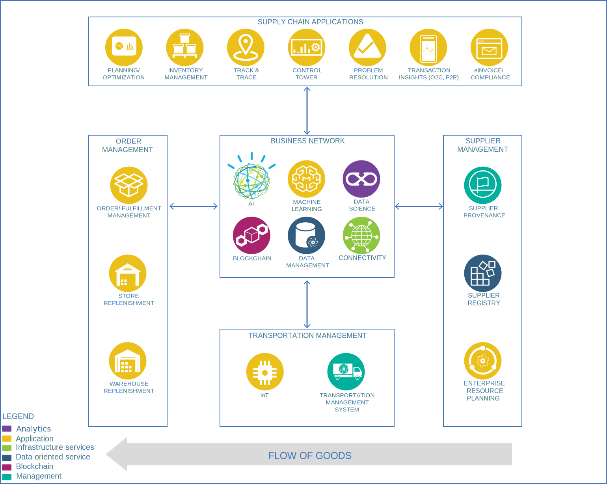

# IBM Supply Chain Control Tower

With IBM Supply Chain Control Tower, you:

- **View**. End to end supply chain coverage

    - Visibility across siloed data sources
    - External data Track & trace

- **Detect**. Work – queues of prioritized issues

    - KPIs based on business rules and alerts
    - Analytics using AI and machine learning

- **Guide**. Determine best approach for the situation

    - Defined best practice solutions
    - Context and recommendations

- **Act**. Quick, efficient and uniform problem resolution

    - Intelligent workflows with guidance
    - Automation to back-end systems

SCIS allows you to respond faster to changes, enable efficient collaboration and decision support, and drive operational automation.

The following diagram provides the architecture for the Supply Chain Intelligence Suite.

