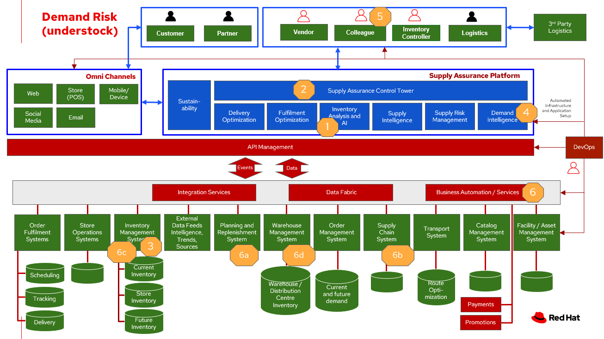
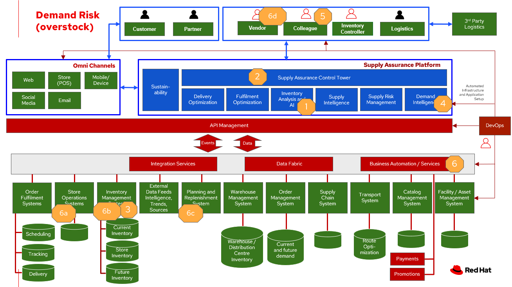

# Inventory Optimisation - Demand Risk

To demonstrate the importance of inventory optimisation for any business, this document will focus on one of the main demand risk use cases: under stocking and over stocking. For a comprehensive inventory solution overview, see [Inventory Optimisation](inventory.md).

## Business problem

Inventory optimisation is a critical element of any retail organisation's fulfilment process. It represents a balancing act between two key viewpoints in the fulfilment process.

The first viewpoint is **demand**. The business needs to understand their current demand for products, goods and services. There are two aspects of demand, the “current” demand and the “future” demand. Current demand asks the question, “how many unsatisfied orders or requests do we have in the system at this point in time?” Future demand asks the more difficult question, “how many orders or requests do we expect to have at some point in the future?” This future point could be measured in minutes, hours, days, weeks, months and even years. The further into the future, the harder it becomes to predict the demand.

The second viewpoint is **inventory**. The business needs to have a clear understanding of all the inventory held within their fulfilment system. This is stock or inventory available for sale to customers. As with demand, inventory has two aspects, “current” and “future” inventory. Current inventory asks two questions, “how many items of a particular product do I have available at this point in time?” and “where are those items located?” Future inventory asks the question, “how much inventory is required at some point in the future”. As with demand, this future point could range from minutes to years and becomes increasingly harder to predict the further into the future. 

_Inventory optimisation_ is making sure the current and future demand is accurately balanced against current and future inventory. Getting the balance correct leads to a successful and profitable retail business. Getting the balance wrong leads to failure and in the worst case, eventual collapse of the business.

To demonstrate the importance of inventory optimisation for any retail business, this document will focus on main use cases of demand and inventory.

## Use cases

Two main issues are represented by demand risk.

**Under stocking** - not holding sufficient inventory to meet current demand. This includes not having enough inventory today but also, not having enough inventory in the very near future that could be used to meet the demand. The end result is disappointed customers who order but don’t get fulfillment or can’t order due to lack of product. This “stock out” position often represents between 4-8% of total sales lost, but can also be a failed opportunity to satisfy customer in other ways, through up-sell and cross-sell. KPIs that can help avoid an under stock or stock-out position. include inventory turn over rate, days on hand and lead time (how long it takes to get more inventory from a supplier).

**Over stocking** - holding more stock than required to meet current and future demand. This results in additional costs to store then dispose of overstocked items via discounts, selling at a loss or destruction. Whilst under stocking is measured in customer satisfaction and loss of future opportunity, over stocking has direct impact on the bottom line costs and profitability of the business. KPIS relevant to over stocking include, holding costs, dead stock (in-stock items failing to sell) and inventory turnover rates.

## Challenges / Business Drivers 

**Challenges**. 

- Stores receive inventory from warehouse or direct from suppliers. Managing direct ship is a real challenge for each store as it has to be managed at the store level.
- Maintaining inventory control of high value items to minimise loss and associated cost.

**Driver**

- Inventory turnover - if improve by 2 or 3 times then will drive bigger profit
- Managing cap
- Inital costs - how much spending on warehouse and store to storeinventory on shelf

### Responses

| Business Problem | Solution |
| - | - |
| Unusual events, such as the global pandemic, war or other international incident, port issues, and waterway obstructions illustrate the need for enterprises to build resilient supply chains. | Respond with intelligence, speed, and confidence to reduce the impact of disruptions, turning these events into opportunities to outperform and outcompete. |
| Manual processes, limited capabilities of inventory management tools, and global operations pose a challenge for enterprises to manage and act on inventory and mitigate disruptions to meet actual demand. | Monitor and manage network inventory availability and respond to disruptions such as out-of-stock and overstock with alerts and recommended actions. |
| The lack of pertinent product information and poor data flow across partners lead to inefficient inventory management, waste, and lost sales. | Gain detailed visibility into inventory characteristics at each location. |

## Solution overview

The technologies can be grouped into three main categories as shown in the following diagram:

- Core application systems. Often customer-provided technologies, such as order management, facilities management. These systems can be stand-alone applications, on premises and cloud services, databases. 
- Foundational infrastructure. The Red Hat/IBM solution is built on RedHat OpenShift. Data is routed through API management. Events are routed through Business Automation tools such as Business Automation Workshop. 
- Inventory Optimisation platform

## Understock

The following diagram shows the workflow for the understock use case.

Understock workflow steps:

<ol>
<li>Inventory Analysis detects low stock levels and predicts inventory will become unavailable sooner than originally expected.
<li>Inventory Control Tower alerted to the understock position.
<li>Inventory Control Tower collects current inventory positions from stores, in-transit, warehouses plus future inventory positions
<li>Inventory Control Tower collects future demand requirements from Demand Intelligence.
<li>Colleague alerted and asked to take remediation action.
<li>Colleague triggers Business Automation to remediate stock levels using a combination of options, including:
<ol type="a"><li>Ordering more stock
<li>Adjusting stock positions within existing Supply Chain
<li>Managing inventory held at existing stores or by moving existing inventory
<li>Managing inventory held at existing warehouses or by moving existing inventory
</ol>
</ol>

The following diagram shows the schematic for the understock use case.

## Overstock

The following diagram shows the workflow for the overstock use case.

Overstock workflow steps:

<ol>
<li>Inventory Analysis detects high stock levels and predicts inventory will not be sold as quickly as expected.</li>
<li>Inventory Control Tower alerted to the overstock position.</li>
<li>Inventory Control Tower collects current inventory positions from stores, in-transit, warehouses plus future inventory positions.</li>
<li>Inventory Control Tower collects future demand requirements from Demand Intelligence.</li>
<li>Colleague alerted and asked to take remediation action.</li>
<li>Colleague triggers Business Automation to remediate stock levels using a combination of options, including:</li>
    <ol type="a"><li>Product discounting and promotions.</li>
    <li>Adjust stock positions within stores by moving stock between stores or warehouses to accelerate sales in conjunction with promotions.</li>
    <li>Reduce future inventory requirements to slow down or stop replenishment.</li>
    <li>Offering stock to partners for liquidation, destruction, donation, sale via alternative channels or to food-waste partners.</li>
    </ol>
</ol>

The following diagram shows the schematic for the overstock use case.

## Technology

The following technology was chosen for this solution:

*Red Hat OpenShift* Kubernetes offering, the hybrid platform offering allow deployment across data centers, private and public clouds as it brings choices and flexible for hosting system and services.

*Red Hat Ansible Automation Platform* operate, scale and delegate automate IT services, track changes an update inventory, prevent configuration drift and  integrated with ITSM.  

*Business Automation Workflow* automate business processes, case work, task automation with Robotic Process Automation (RPA) and Intelligent Automation such as conversation intelligence. 

*IBM Supply Chain Control Tower* provides actionable visibility to orchestrate your end-to-end supply chain network, identify and understand the impact of external events to predict disruptions, and take actions based on recommendations to mitigate the upstream and downstream effects.

*IBM Sterling Intelligent Promising* provides shoppers with greater certainty, choice and transparency across their buying journey. It includes:

- *IBM Sterling Fulfillment Optimizer with Watson* to determine the best location from which to fulfill an order, based on business rules, cost factors, and current inventory levels and placement
- *Sterling Inventory Visibility* to processes inventory supply and demand activity to provide accurate and real-time global visibility across selling channels.

### Inventory Optimisation Platform details

With Inventory Control Tower, you:

- **View**. End to end supply chain coverage

    - Visibility across siloed data sources
    - External data Track & trace

- **Detect**. Work – queues of prioritized issues

    - KPIs based on business rules and alerts
    - Analytics using AI and machine learning

- **Guide**. Determine best approach for the situation

    - Defined best practice solutions
    - Context and recommendations

- **Act**. Quick, efficient and uniform problem resolution

    - Intelligent workflows with guidance
    - Automation to back-end systems

Respond faster to changes, enable efficient collaboration and decision support, and drive operational automation with Control Tower.

| Use Case | The Problem | The Solution | The Benefits and Implications |
| - | - | - | - |
| Reduce out of stock (OOS) or approaching out of stock (AOOS)conditions | Out of stock situations lead to lost revenue and decreased brand / retailer loyalty. | SCIS Control Tower monitors inventory levels at all locations in a client's network and creates items in the work queue when revenue is at risk. When drilling down on the item, users can see where they have available inventory and receive recommendations about how much inventory can and should be transferred to the OOS / AOOS locations. | Action can be taken directly from the Control Tower user interface. OOS situations are efficiently managed and AOOS are avoided with minimal human intervention. |
| Manage industrial and manufacturing critical supplies | Out of stock situations lead to line outages, manufacturing delays, and lost revenue. | SCIS Control Tower monitors inventory to requested demand and creates items in the work queue when delivery is at risk. When drilling down on the item, users can see parts by SKU and location to see which supply is at risk take action to minimize impact. | Minimize production and parts impact due to OOS / AOOS situations. Increase throughput and minimize customer delays. Minimize expedited and remediation costs. |

Inventory is managed by exception. Manage and predict inventory exceptions such as: low inventory, stockouts, slow moving and aging inventory. Optimize inventory transfers to mitigate these circumstances.

## Similar use cases

See:

- [Loss and waste management](lossmanagement.md)
- [Product timeliness](timeliness.md)

## Contributors

- Iain Boyle, Red Hat
- Bruce Kyle, IBM
- Mahesh Dodani, IBM
- Thalia Hooker, Red Hat
- Jeric Saez, IBM
- Mike Lee, IBM
- Lee Carbonell, IBM
- James Stewart, IBM