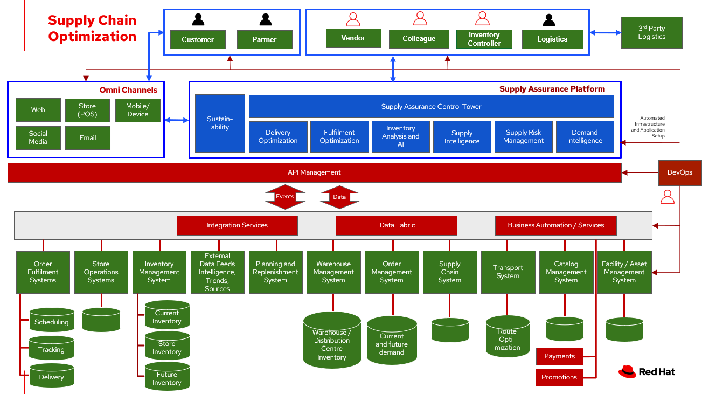

# Inventory Optimization Overview

_Fulfilment_ is the process of exceeding customer expectations when the customer receives their requested products, good or services. The items must be made available in a suitable timeframe, at the correct location and in an acceptable condition.

Fulfilment optimisation takes the fulfillment process a step further by using information and knowledge about the supply chain, inventory and stock positions to ensure any promises made to the customer are met or exceeded.

A key element of the retail fulfilment process is knowing the inventory position. This is the amount of stock available for sale to a customer, it’s location and the time it takes to make it available to the customer. 

_Inventory optimisation_ is a collection of best practices for ensuring the retail organisation maintains complete and accurate stock levels whilst balancing customer demand against current and future stock levels.

In this overview, we will discuss the business challenges, business value, and business outcomes and then provide automation and modernization actionable steps organizations can take to drive innovation and move toward a digital supply chain. These are based on The Action Guide in Own your transformation survey of 1500 CSCOs across 24 industries. 
These actionable steps will be developed through the lens of use cases on how the main risk factors can be transformed: 
-	Demand Risk (under stock and over stock), 
-	Loss and waste management, and 
-	Product timeliness. 
We will then give an overview of the solution, reference architecture, logical diagram, and how these capabilities are realized by technology capabilities.

## Business challenges

Chief Supply Chain Officers (CSCOs) face issues related to supply chain disruptions, technology infrastructure, sustainability, and market shifts as their greatest challenges. Yet when addressed with an open mindset, challenges create opportunities within the enterprise—and visibility. 

Harvard Business Review article, [Three steps to prepare your supply chain for the next crisis](https://hbr.org/2022/11/3-steps-to-prepare-your-supply-chain-for-the-next-crisis). reports:

> Companies that are well prepared and as a result prosper in a crisis can expect to recover more quickly than their competitors. In a review of corporate performance during the past four U.S. downturns (since 1985), Boston Consulting Group (BCG) found that 14% of companies increased their sales and their profit margin.
>
> Investors are starting to reward companies that build for the future by becoming more innovative and more resilient. In June 2020, during the depths of the Covid-19 pandemic, BCG surveyed major institutional investors and found that nine out of ten believed it was "important for healthy companies to prioritize the building of business capabilities — even if it means lowering earnings-per-share guidance or delivering below consensus."

The McKinsey report [How COVID-19 is reshaping supply chains](https://www.mckinsey.com/capabilities/operations/our-insights/how-covid-19-is-reshaping-supply-chains) explains that companies found it was easier to increase inventories than implement their preferred strategy of nearshoring or regionalization.  In addition, "The proactive monitoring of supplier risks was the primary focus …, yet significant blind spots remain in most companies’ supply-chain risk-management setups. Just under half of the companies in our survey say they understand the location of their tier-one suppliers and the key risks those suppliers face."

Enhanced customer experiences, improved profitability, and more predictive forecasts are high on CSCOs' priority lists according to a report by IBM Institute for Business Value, [Own your transformation: Data-led innovation for the modern supply chain](https://www.ibm.com/downloads/cas/1BYY6VEM). 

## Business value

Inventory optimisation is making sure the current and future demand is accurately balanced against current and future inventory across the enterprise. Getting the balance correct leads to a successful and profitable retail business. Getting the balance wrong leads to failure and in the worst case, eventual collapse of the business.

## Business outcomes

[According to the IBM IBV study](https://www.ibm.com/downloads/cas/1BYY6VEM), innovators track well ahead of their peers when it comes to AI-enabled workflows for risk management and to handle other predictions. And they expect continued development of these workflows and other capabilities over the next three years. Right now, Innovator CSCOs report developing digitized workflows and leveraging AI automation a full 95% more than their peers.

Innovators also stand out by leveraging data with AI and advanced analytics in demand management. With demand volatility and associated supplier, operations, and logistics disruption at all-time highs, CSCOs are applying AI and machine learning to the critical and strategic continuous planning elements of demand management and forecasting. A full 90% of Innovators use AI and advanced analytics in demand management and predictive forecasting, 18% more than their peers (76%).

Directly influence the following KPIs:

- Improve lost sales from stock out 4-8% 
- Solution cost savings 10% 
- Increase stock turnover
- Reduce days on hand
- Manage lead time (may be leading indicator of stock overage)
- Reduce holding cost
- Manage product at risk/perishability/age
- Improve gross margin return on investment
- Reduce return rate
- Black swan events. Manage unusual events regarding weather, natural disaster, supply chain interruption.
- Improve customer satisfaction

## Action guide

From a high-level perspective, there are several main steps your organization can take to drive innovation and move toward a digital supply chain.

### Automation 

- Accelerate automation in extended workflows 
- Amp up AI to make workflows smarter 
- Cultivate collaborative ecosystems 

### Sustainability 

- Link environmental and social initiatives with business solutions 
- Optimize workflows with AI to manage carbon, waste, energy, and water consumption 
- Compete with new sustainable products and services 

### Modernization 

- Architect modern infrastructures 
- Scale hybrid cloud platforms 
- Increase awareness of cybersecurity vulnerabilities and solutions

For specific steps on this approach, see **The Action Guide** in [Own your transformation](https://www.ibm.com/downloads/cas/1BYY6VEM) survey of 1500 CSCOs across 24 industries.

## Scenarios

To demonstrate the importance of inventory optimisation for any business, several articles outline main use cases on how the main risk factors can be transformed:

- [Demand risk](./demandrisk.md)
- [Loss and waste management](lossmanagement.md)
- [Product timeliness](timeliness.md)

### Demand Risk

**Understock** - not holding sufficient inventory to meet current demand. This includes not having enough inventory today but also, not having enough inventory in the very near future that could be used to meet the demand.

**Overstock** - holding more stock than required to meet current and future demand. This results in additional costs to store then dispose of overstocked items via discounts, selling at a loss or destruction. 

For more information about the solution details on this scenario, see [Inventory Optimisation - Demand Risk](demandrisk.md).

### Inventory Risk - Loss and waste management

**Loss and waste management** - take decisive action in cases of:

- Shelf life. Identify and timely replace items as shelf life expires.
- Environmental exception. Food expirations, power interruption or other disaster affecting the product salability.
- Contamination or recall. Quickly identify, remove contaminated and recalled items from sale or items that have a contaminated component. Proactively provide safe alternative or replacement when safe.

For more information about the solution details on this scenario, see [Inventory Optimisation - Loss management](lossmanagement.md).

### Inventory Risk - Product timeliness

**Product timeliness** - having goods and products in the right place at the right time, packed correctly and in line with customer expectations. This risk is particular to seasonal goods, fast fashion, drugs, cosmetics, grocery and food supply industry. KPIs relevant to product timeliness include dead stock and inventory days on hand.

For more information about the solution details on this scenario, see [Inventory Optimisation - Product timeliness](timeliness.md).

## Overview

This solution focuses on _Automation_ and _Modernization_ in our Action Guide as shown in the following diagram:

- Create a world-class sensing and risk-monitoring operation. 
- Accelerate automation in extended workflows
- Amp up AI to make workflows smarter
- Modernization for modern infrastructures, scale hybrid cloud platforms.

Specifically, [Harvard Business Review article](https://hbr.org/2022/11/3-steps-to-prepare-your-supply-chain-for-the-next-crisis?autocomplete=true) recommends:

> CEOs need to invest in risk intelligence and strategic foresight, creating a team of procurement super-forecasters equipped with the latest artificial-intelligence (AI)-powered sensing technology.

## Reference architecture

The following diagram provides an overall reference architecture for the solution.

## Logical diagram

The following reference architecture describes a set of personas and technologies that provide a platform for some of the biggest potential for ideation and breakthroughs with supply chain.

### Personas

The following stakeholders within the organization.

**Executive sponsors**. Global Supply Chain VP/Officer, VP Global Supply Chain Operations, IT Innovation, eComm Inventory Controller, Merchandize Logistics Manager, Store Operations VP/Lead

**Influencers**. Inventory Control Specialists, Inventory management director, Supply chain professional, store inventory manager, fulfillment manager, inventory analyst, financial control officer/controller, Demand forecaster analyst, Inventory planning

**Operations**. Warehouse managers, logistics managers

### Solution tiers

The technologies can be grouped into main categories:

- **User applications**. Applications where supply chain activities are reported and used by customers, colleagues, suppliers, and logistics. In particular, the inventory controller interacts with the Inventory Optimisation Platform, described in a following section.
- **Core application systems**. Often customer-provided technologies, such as order management, facilities management. These include services, data, and systems currently used within the organization, such as:

    - Point of Sale systems
    - Store Operations Systems
    - External Data Feeds
    - Planning and Replentishment system
    - Warehouse management
    - Order management
    - Supply chain system
    - Transport system
    - Catalog Management system
    - Facility Asset Management system

- **Foundational technologies**. Manages the events and data between systems, and includes:

    - Integration services
    - Data fabric
    - Business automation
    - DevOps
    - API Management

- **Inventory Optimisation** platform, including systems supporting:

    - Inventory control tower
    - Fulfillment optimization
    - Inventory analysis and AI
    - Supply intelligence
    - Supply risk management
    - Demand intelligence

## The technology capabilities

This section provides the logical components of the solution.

### Foundational technologies

- **Red Hat Enterprise Linux** is the world’s leading enterprise Linux platform. It’s an open-source operating system (OS). It’s the foundation from which you can scale existing apps—and roll out emerging technologies—across bare-metal, virtual, container, and all types of cloud environments.
- **Red Hat OpenShift** is an enterprise-ready Kubernetes container platform built for an open hybrid cloud strategy. It provides a consistent application platform to manage hybrid cloud, multi-cloud, and edge deployments.- Red Hat Integration is a comprehensive set of integration and messaging technologies to connect applications and data across hybrid infrastructures.
- **Business Automation Workflow**, such as [Business Automation Workflow](https://www.ibm.com/products/business-automation-workflow) unites information, processes and users to help you automate digital workflows on premises or on cloud. Create workflows that increase productivity, improve collaboration between teams, and gain new insight to resolve cases and drive better business outcomes.

### Core application systems 

The core application systems can be in-house applications, cloud services, IBM or competitive applications. The core applications provide data through the foundational technologies (such as API management that provides monitoring and security). They can also respond to automated actions based on business rules or from other layers in the system.

### Inventory Optimisation Platform

Each of the core application systems provides data and responds to events through the foundational technologies.

**Inventory Control Tower**. Gartner describes [supply chain technology](https://www.gartner.com/smarterwithgartner/gartner-predicts-the-future-of-supply-chain-technology) as a central hub as an integrated part of a broader SCM platform using these building blocks: people, process, data, organization and technology. The idea is to capture and use data to provide enhanced real-time visibility and in-depth analysis. 
[IBM Supply Chain Control Tower](https://www.ibm.com/products/supply-chain-intelligence-suite), powered by industry-leading AI, provides actionable visibility to orchestrate your end-to-end supply chain network, identify and understand the impact of external events to predict disruptions, and take actions based on recommendations to mitigate the upstream and downstream effects. 

**Fulfillment optimisation**. Gartner describes the [fulfillment forecasting approach](https://www.gartner.com/en/doc/fulfillment-forecasting-key-to-optimizing-retail-inventory-poisitioning), which provides a more accurate view of consumer fulfillment choices. This approach enables retailers to accurately gauge the right amount of inventory required to meet demand in stores, distribution centers and other inventory holding notes throughout the retailer’s network. IBM offers [IBM Sterling Intelligent Promising ](https://www.ibm.com/products/intelligent-promising) provides shoppers with greater certainty, choice and transparency across their buying journey. 

**Inventory Analysis and AI**. This cognitive analytic engine enhances existing order management systems. It determines the best location from which to fulfill an order, based on business rules, cost factors, and current inventory levels and placement. IBM includes [IBM Sterling Fulfillment Optimizer with Watson](https://www.ibm.com/products/fulfillment-optimizer) as a component of IBM Sterling Intelligent Promising. 

**Supply Risk Management**. Gartner describes the key tenets of supply chain risk management enhance resilience and improve competitiveness. 

- Market disruptions include: natural disasters, pandemics, political uncertainty, economic upheaval, cyber and terrorist attacks, third-party or supplier threats, and rapid swings in consumer preferences and demand.
- Supply chain transformation also complicates supply chain risk management &dash; lean, but complex and globally dispersed operations add risks, and the supply chain risk management process is vital in wringing out efficiencies and costs.

IBM offers [Sterling Inventory Visibility](https://www.ibm.com/products/inventory-visibility) that is included with IBM Sterling Intelligent Promising to processes inventory supply and demand activity to provide accurate and real-time global visibility across selling channels. 

## References

- McKinsey: [How COVID-19 is reshaping supply chains](https://www.mckinsey.com/capabilities/operations/our-insights/how-covid-19-is-reshaping-supply-chains)
- Harvard Business Review: [Three steps to prepare your supply chain for the next crisis](https://hbr.org/2022/11/3-steps-to-prepare-your-supply-chain-for-the-next-crisis)
- Gartner: [What is a Supply Chain Control Tower and what's needed to deploy one](https://www.gartner.com/en/articles/what-is-a-supply-chain-control-tower-and-what-s-needed-to-deploy-one)
- Gartner: [Fulfillment Forecasting: The Key to Optimizing Retail Inventory Positioning](https://www.gartner.com/en/doc/fulfillment-forecasting-key-to-optimizing-retail-inventory-poisitioning)
- Gartner: [Supply Chain Risk Management (SCRM): What & Why Is It Important](https://www.gartner.com/en/supply-chain/insights/supply-chain-risk-management)
- IBM Institute for Business Value [Own your transfomation](https://www.ibm.com/downloads/cas/1BYY6VEM)

## Downloads

View and download all of the **Inventory Optimisation diagrams** shown in previous sections in our open source tooling site.

- PowerPoint: [Open Workflow Diagrams](./downloads/InventoryOptimisation.pptx)
- DrawIO: [Open Schematic Diagrams](./downloads/InventoryOptimisation.drawio)

## Contributors

- Iain Boyle, Red Hat
- Bruce Kyle, IBM
- Mahesh Dodani, IBM
- Thalia Hooker, Red Hat
- Jeric Saez, IBM
- Mike Lee, IBM
- Lee Carbonell, IBM
- James Stewart, IBM