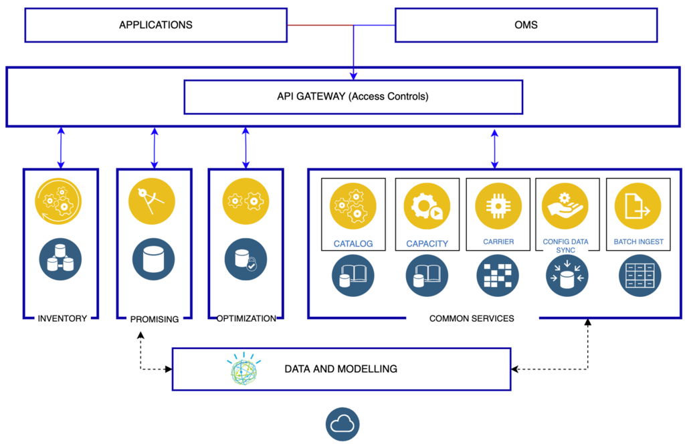

# Last mile delivery

_Last mile delivery_, also known as _last mile logistics_, is the transportation of goods from a distribution hub to the final delivery destination — the door of the customer. The goal of last mile delivery logistics is to deliver the packages as affordably, quickly and accurately as possible. 

The last mile describes the difficulty of getting goods (especially large and bulky ones) from a transportation hub to their final destination because it might include installation and configuration while providing an excellent experience at the same time.

## Business challenges

| Business scenario | Challenge | 
| - | - |
| Consumers are purchasing more products online | Online purchases of goods  and direct to consumer deliveries are increasing dramatically.  This has driven huge increases in the volume  and importance of  last mile delivery and installation services. |
| Consumers are placing more emphasis on after sales services | Consumers are demanding more control over delivery times and processes and want more value-added services. Manufacturers and suppliers are not meeting expectations, especially with last mile services. |
  New service providers are entering the market; reshaping the landscape | New entrants to 3PL (third party logistics) services such as Amazon and Uber are disrupting traditional service models.  Same day delivery is now an expectation, and this increases infrastructure and transportation services cost. Improved supply and demand forecasting is key to delivering last mile services. |
| Logistics costs are increasing, while product prices are eroding | Manufacturers are forced to react quickly to changing client demands while managing rising costs. Costs for warehousing, transportation and labor are increasing and this increases pressure on perfect order performance for both profitability and client loyalty.  |

## Solution

By definition, last mile delivery is relevant for businesses that deliver products directly to their consumers. 

### Promise of Delivery

Promise of Delivery or Delivery Promise is the cornerstone of customer experience. Remember, poor customer experience can lead to lost brand loyalty. The goal is to provide information in real-time regarding the delivery methods and times.

Intelligent Promising Solution

Making a promise to a customer, keeping that promise while optimizing the fulfillment task takes a lot of coordination and effort between different areas of the business. IBM offers an Intelligent Promising Solution where you can pick and choose services based on your business needs. 

## Solution architecture

The component diagram above illustrates:

- Independent deployable, scaled business services
- Composable, Stateless modular services 
- API first approach to building any service
- Inter communication between services asynchronous
- Business functions, API access controls managed independently

This intelligent promising platform can be deployed across multiple data centers for HA capable of tenant level failover.

Proof of Delivery

Proof of delivery, or POD, is an acknowledgment that an order successfully arrived at its intended destination and is used to show a service was completed, which is why proof of delivery is also called proof of completion.Proof of delivery comes in two forms: paper and electronic. Benefits of POD are captured in the table.

| Benefits for customers | Benefits for businesses |
| - | - |
| Customers feel in control | POD provides a better customer experience |
| Proof of Delivery makes it less likely orders will be stolen | Improves order accuracy and saves money on unnecessary refunds or replacements |
| Lets customers know their service is complete | POD automation accelerates back-office operations |

