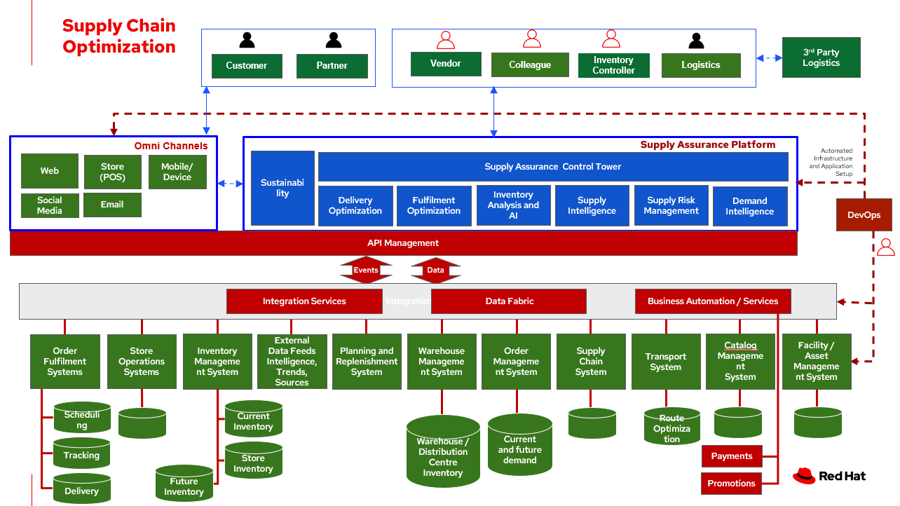

# Supply Chain Optimization Overview

_Fulfilment_ is the process of exceeding customer expectations when the customer receives their requested products, good or services. The items must be made available in a suitable timeframe, at the correct location and in an acceptable condition.

Fulfilment optimization takes the fulfillment process a step further by using information and knowledge about the supply chain, inventory and stock positions to ensure any promises made to the customer are met or exceeded.

A key element of the retail fulfilment process is knowing the inventory position. This is the amount of stock available for sale to a customer, it’s location and the time it takes to make it available to the customer. 

_Inventory optimization_ is a collection of best practices for ensuring the retail organisation maintains complete and accurate stock levels whilst balancing customer demand against current and future stock levels.

In this overview, we will discuss the business challenges, business value, and business outcomes and then provide automation and modernization actionable steps organizations can take to drive innovation and move toward a digital supply chain. These are based on The Action Guide in Own your transformation survey of 1500 CSCOs across 24 industries. 
Actionable steps will be developed through the lens of use cases on how the main risk factors can be transformed: 

- Demand Risk (under stock and over stock) 
- Loss and waste management
- Product timeliness
- Perfect order
- Last mile delivery

We will then give an overview of the solution, reference architecture, logical diagram, and how these capabilities are realized by technology capabilities.

## Business challenges

Chief Supply Chain Officers (CSCOs) face issues related to supply chain disruptions, technology infrastructure, sustainability, and market shifts as their greatest challenges. Yet when addressed with an open mindset, challenges create opportunities within the enterprise—and visibility. 

Harvard Business Review article, [Three steps to prepare your supply chain for the next crisis](https://hbr.org/2022/11/3-steps-to-prepare-your-supply-chain-for-the-next-crisis). reports:

> Companies that are well prepared and as a result prosper in a crisis can expect to recover more quickly than their competitors. In a review of corporate performance during the past four U.S. downturns (since 1985), Boston Consulting Group (BCG) found that 14% of companies increased their sales and their profit margin.
>
> Investors are starting to reward companies that build for the future by becoming more innovative and more resilient. In June 2020, during the depths of the Covid-19 pandemic, BCG surveyed major institutional investors and found that nine out of ten believed it was "important for healthy companies to prioritize the building of business capabilities — even if it means lowering earnings-per-share guidance or delivering below consensus."

The McKinsey report [How COVID-19 is reshaping supply chains](https://www.mckinsey.com/capabilities/operations/our-insights/how-covid-19-is-reshaping-supply-chains) explains that companies found it was easier to increase inventories than implement their preferred strategy of nearshoring or regionalization.  In addition, "The proactive monitoring of supplier risks was the primary focus …, yet significant blind spots remain in most companies’ supply-chain risk-management setups. Just under half of the companies in our survey say they understand the location of their tier-one suppliers and the key risks those suppliers face."

Enhanced customer experiences, improved profitability, and more predictive forecasts are high on CSCOs' priority lists according to a report by IBM Institute for Business Value, [Own your transformation: Data-led innovation for the modern supply chain](https://www.ibm.com/downloads/cas/1BYY6VEM). 

## Business value

Inventory optimization is making sure the current and future demand is accurately balanced against current and future inventory across the enterprise. Getting the balance correct leads to a successful and profitable retail business. Getting the balance wrong leads to failure and in the worst case, eventual collapse of the business.

## Business outcomes

According to the [IBM IBV study](https://www.ibm.com/downloads/cas/1BYY6VEM), innovators track well ahead of their peers when it comes to AI-enabled workflows for risk management and to handle other predictions. And they expect continued development of these workflows and other capabilities over the next three years. Right now, Innovator CSCOs report developing digitized workflows and leveraging AI automation a full 95% more than their peers.

Innovators also stand out by leveraging data with AI and advanced analytics in demand management. With demand volatility and associated supplier, operations, and logistics disruption at all-time highs, CSCOs are applying AI and machine learning to the critical and strategic continuous planning elements of demand management and forecasting. A full 90% of Innovators use AI and advanced analytics in demand management and predictive forecasting, 18% more than their peers (76%).

Directly influence the following KPIs:

- Improve lost sales from stock out 4-8% 
- Solution cost savings 10% 
- Increase stock turnover
- Reduce days on hand
- Manage lead time (may be leading indicator of stock overage)
- Reduce holding cost
- Manage product at risk/perishability/age
- Improve gross margin return on investment
- Reduce return rate
- Black swan events. Manage unusual events regarding weather, natural disaster, supply chain interruption.
- Improve customer satisfaction

## Action guide

From a high-level perspective, there are several main steps your organization can take to drive innovation and move toward a digital supply chain.

### Automation 

- Accelerate automation in extended workflows 
- Amp up AI to make workflows smarter 
- Cultivate collaborative ecosystems 

### Sustainability 

- Link environmental and social initiatives with business solutions 
- Optimize workflows with AI to manage carbon, waste, energy, and water consumption 
- Compete with new sustainable products and services 

### Modernization 

- Architect modern infrastructures 
- Scale hybrid cloud platforms 
- Increase awareness of cybersecurity vulnerabilities and solutions

For specific steps on this approach, see **The Action Guide** in [Own your transformation](https://www.ibm.com/downloads/cas/1BYY6VEM) survey of 1500 CSCOs across 24 industries.

## Scenarios

To demonstrate the importance of inventory optimization for any business, several articles outline main use cases on how the main risk factors can be transformed:

- [Inventory management - Perfect or Imperfect Order](./inventorymanagement.md)
- [Inventory risk - Demand risk](./demandrisk.md)
- [Inventory risk - Loss and waste management](lossmanagement.md)
- [Inventory risk - Product timeliness](timeliness.md)
- [Inventory management - Last mile delivery](./lastmiledelivery.md)
- [Inventory risk - Timeliness](./timeliness.md)

### Inventory management &dash; Perfect / Imprefect order

Inventory may not be on hand or in a different location than expected. Multiple and partial shipments may be able to solve many customer requests.

The business can respond to the imperfect order and increase customer responsiveness with:

- Intelligent promising
- Optmization user expectations with improved demand forecasting 
- Automated responses

For more information and solution details on this scenario, see [Inventory management &dash; Perfect/Imperfect order](./inventorymanagement.md)

### Inventory Risk &dash; Demand Risk

_Understock_ - not holding sufficient inventory to meet current demand. This includes not having enough inventory today but also, not having enough inventory in the very near future that could be used to meet the demand.

_Overstock_ - holding more stock than required to meet current and future demand. This results in additional costs to store then dispose of overstocked items via discounts, selling at a loss or destruction. 

For more information about the solution details on this scenario, see [Inventory Optimization - Demand Risk](demandrisk.md).

### Inventory Risk &dash; Loss and waste management

**Loss and waste management** requires you to take decisive action in cases of:

- _Shelf life_. Identify and timely replace items as shelf life expires. *NOTE: this is covered in Product timeliness*
- _Environmental exceptions_. Food expirations, power interruption or other disaster affecting the product salability.
- _Contamination or recall_. Quickly identify, remove contaminated and recalled items from sale or items that have a contaminated component. Proactively provide safe alternative or replacement when safe.

For more information about the solution details on this scenario, see [Inventory Optimization - Loss and waste management](lossmanagement.md).

### Inventory management &dash; Last mile delivery

If the **last mile delivery** promise is incorrect and a product arrives late, there’s a good chance that the customer will shop with a competitor next time.

If last mile tracking information is incorrect, a product arrives late, is damaged, or is never delivered, there’s a good chance that the customer will shop with a competitor next time.

For more information about the solution details on this scenario, see [Inventory management - Last mile delivery](./lastmiledelivery.md).

### Inventory Risk &dash; Product timeliness

**Product timeliness** is having goods and products in the right place at the right time, packed correctly and in line with customer expectations. This risk is particular to seasonal goods, fast fashion, drugs, cosmetics, grocery and food supply industry. KPIs relevant to product timeliness include dead stock and inventory days on hand.

- _Shelf life_ defines a set of actions to be taken with products that expire on specific dates and must be removed from use or sale. For example, food can expire and need to be removed from shelves. 
- _Timeliness_ defines a set of actions that can be taken when products expire, but that may be still have some benefit. For example, seasonality of clothing can be warehoused until the following year.

For more information about the solution details on this scenario, see [Inventory Optimization - Product timeliness](timeliness.md).

## Overview

This solution focuses on _Automation_ and _Modernization_ in our Action Guide as shown in the following diagram:

- Create a world-class sensing and risk-monitoring operation. 
- Accelerate automation in extended workflows
- Amp up AI to make workflows smarter
- Modernize for modern infrastructures, scale hybrid cloud platforms

Specifically, [Harvard Business Review article](https://hbr.org/2022/11/3-steps-to-prepare-your-supply-chain-for-the-next-crisis?autocomplete=true) recommends:

> CEOs need to invest in risk intelligence and strategic foresight, creating a team of procurement super-forecasters equipped with the latest artificial-intelligence (AI)-powered sensing technology.

## Reference architecture

The following diagram provides an overall reference architecture for the solution.

## Logical diagram

The following reference architecture describes a set of personas and technologies that provide a platform for some of the biggest potential for ideation and breakthroughs with supply chain.

### Solution tiers

The technologies can be grouped into main categories:

- **User applications**. Applications where supply chain activities are reported and used by customers, colleagues, suppliers, and logistics. In particular, the inventory controller interacts with the Inventory Optimization Platform, described in a following section.
- **Core application systems**. Often customer-provided technologies, such as order management, facilities management. These include services, data, and systems currently used within the organization, such as:

    - Point of Sale systems
    - Store Operations Systems
    - External Data Feeds
    - Planning and Replentishment system
    - Warehouse management
    - Order management
    - Supply chain system
    - Transport system
    - Catalog Management system
    - Facility Asset Management system

- **Foundational technologies**. Manages the events and data between systems, and includes:

    - Integration services
    - Data fabric
    - Business automation
    - DevOps
    - API Management

- **Supply Assurance** platform, including systems supporting:

    - Supply assurance control tower
    - Fulfillment optimization
    - Inventory analysis and AI
    - Supply intelligence
    - Supply risk management
    - Demand intelligence
    - Sustainability

- **Omni-channels**

    - Web applications for users
    - Point of sale applications in stores
    - Mobility and device applications
    - Social media
    - Email
    - Parter applications

### Personas

The following stakeholders within the organization.

- **Executive sponsors**. Global Supply Chain VP/Officer, VP Global Supply Chain Operations, IT Innovation, eComm Inventory Controller, Merchandize Logistics Manager, Store Operations VP/Lead
- **Influencers**. Inventory Control Specialists, Inventory management director, Supply chain professional, store inventory manager, fulfillment manager, inventory analyst, financial control officer/controller, Demand forecaster analyst, Inventory planning
- **Operations**. Warehouse managers, logistics managers

The following represent users of the system outside of the organization.

- **Customers**
- **Business partners**
- **Vendors**

## The technology capabilities

This section provides the logical components of the solution. The solution architecture provides for:

- Independent deployable, scaled business services
- Composable, stateless modular services 
- API first approach to building any service
- Inter communication between services asynchronous
- Business functions, API access controls managed independently
- Can be deployed across multiple data centers for HA capable of tenant level failover

### Foundational technologies &dash; Hybrid Cloud Platform

The decision for a future, Kubernetes-based enterprise platform is defining the standards for development, deployment and operations tools and processes for years to come and thus represents a foundational decision point. Key client value areas include:

- Platform for Digital Transformation and Modernization
- Accelerated application development for faster go-to-market and innovation
- Engineering excellence through an enterprise grade open source container platform
- Self-service transformation with DevOps/SRE and automated operations

Specifically, the recommended platform includes:

- [**Red Hat Enterprise Linux**](https://developers.redhat.com/products/rhel/overview) is the world’s leading enterprise Linux platform. It’s an open-source operating system (OS). It’s the foundation from which you can scale existing apps—and roll out emerging technologies—across bare-metal, virtual, container, and all types of cloud environments.
- [**Red Hat OpenShift**]((https://www.redhat.com/en/technologies/cloud-computing/openshift)) is an enterprise-ready Kubernetes container platform built for an open hybrid cloud strategy. It provides a consistent application platform to manage hybrid cloud, multi-cloud, and edge deployments.- Red Hat Integration is a comprehensive set of integration and messaging technologies to connect applications and data across hybrid infrastructures.
- [**Business Automation Workflow**](https://www.ibm.com/products/business-automation-workflow) unites information, processes and users to help you automate digital workflows on premises or on cloud. Create workflows that increase productivity, improve collaboration between teams, and gain new insight to resolve cases and drive better business outcomes.
- [**Red Hat Ansible Automation Platform**](https://www.redhat.com/en/technologies/management/ansible) operate, scale and delegate automate IT services, track changes an update inventory, prevent configuration drift and  integrated with ITSM.  
- [**Red Hat OpenShift API Management**](https://access.redhat.com/documentation/en-us/red_hat_openshift_api_management/1/guide/53dfb804-2038-4545-b917-2cb01a09ef98) is a managed API traffic control and program management service to secure, manage, and monitor APIs at every stage of the development lifecycle.
- [**Red Hat OpenShift DevOps**](https://www.redhat.com/en/getting-started-devops) reoresents an approach to culture, automation and platform design intended to deliver increased business value and responsiveness through rapid, high-quality service delivery. DevOps means linking legacy apps with newer cloud-native apps and infrastructure. A DevOps developer can link legacy apps with newer cloud-native apps and infrastructure. 

### Core application systems 

The core application systems can be in-house applications, cloud services, IBM or competitive applications. The core applications provide data through the foundational technologies (such as API management that provides monitoring and security). They can also respond to automated actions based on business rules or from other layers in the system.

### Supply Assurance Platform

Each of the core application systems provides data and responds to events through the foundational technologies. 

**Supply assurance control tower**. Gartner describes [supply chain technology](https://www.gartner.com/smarterwithgartner/gartner-predicts-the-future-of-supply-chain-technology) as a central hub as an integrated part of a broader SCM platform using these building blocks: people, process, data, organization and technology. The idea is to capture and use data to provide enhanced real-time visibility and in-depth analysis. [IBM Supply Chain Control Tower](https://www.ibm.com/products/supply-chain-intelligence-suite), powered by industry-leading AI, provides actionable visibility to orchestrate your end-to-end supply chain network, identify and understand the impact of external events to predict disruptions, and take actions based on recommendations to mitigate the upstream and downstream effects. 

**Fulfillment optimization**. Gartner describes the [fulfillment forecasting approach](https://www.gartner.com/en/doc/fulfillment-forecasting-key-to-optimizing-retail-inventory-poisitioning), which provides a more accurate view of consumer fulfillment choices. This approach enables retailers to accurately gauge the right amount of inventory required to meet demand in stores, distribution centers and other inventory holding notes throughout the retailer’s network. IBM offers [IBM Sterling Intelligent Promising ](https://www.ibm.com/products/intelligent-promising) provides shoppers with greater certainty, choice and transparency across their buying journey. 

**Inventory analysis and AI**. This cognitive analytic engine enhances existing order management systems. It determines the best location from which to fulfill an order, based on business rules, cost factors, and current inventory levels and placement. IBM includes [IBM Sterling Fulfillment Optimizer with Watson](https://www.ibm.com/products/fulfillment-optimizer) as a component of IBM Sterling Intelligent Promising.

**Supply risk management**. Gartner describes the key tenets of supply chain risk management enhance resilience and improve competitiveness. 

- Market disruptions include: natural disasters, pandemics, political uncertainty, economic upheaval, cyber and terrorist attacks, third-party or supplier threats, and rapid swings in consumer preferences and demand.
- Supply chain transformation also complicates supply chain risk management &dash; lean, but complex and globally dispersed operations add risks, and the supply chain risk management process is vital in wringing out efficiencies and costs.

**Inventory visibility**. This processes inventory supply and demand activity to provide accurate and real-time global visibility across selling channels. For this solution, IBM offers [Sterling Inventory Visibility](https://www.ibm.com/products/inventory-visibility), which is included with IBM Sterling Intelligent Promising. 

**Planning and analytics**. Businesses need to evolve their planning and analysis strategies to include continuous, integrated planning. This means creating a single source of truth to streamline planning, manage performance and build alignment across the enterprise. In this category IBM offers:

- [IBM Planning Analytics with Watson](https://www.ibm.com/products/planning-analytics) to streamline and integrate financial and operational planning across the enterprise.
- [IBM Maximo MRO Inventory Optimization](https://www.ibm.com/products/mro-inventory-optimization) to help you optimize your maintenance, repair and operations (MRO) inventory by providing an accurate, detailed picture of performance.

## References

- McKinsey: [How COVID-19 is reshaping supply chains](https://www.mckinsey.com/capabilities/operations/our-insights/how-covid-19-is-reshaping-supply-chains)
- Harvard Business Review: [Three steps to prepare your supply chain for the next crisis](https://hbr.org/2022/11/3-steps-to-prepare-your-supply-chain-for-the-next-crisis)
- Gartner: [What is a Supply Chain Control Tower and what's needed to deploy one](https://www.gartner.com/en/articles/what-is-a-supply-chain-control-tower-and-what-s-needed-to-deploy-one)
- Gartner: [Fulfillment Forecasting: The Key to Optimizing Retail Inventory Positioning](https://www.gartner.com/en/doc/fulfillment-forecasting-key-to-optimizing-retail-inventory-poisitioning)
- Gartner: [Supply Chain Risk Management (SCRM): What & Why Is It Important](https://www.gartner.com/en/supply-chain/insights/supply-chain-risk-management)
- IBM Institute for Business Value [Own your transfomation](https://www.ibm.com/downloads/cas/1BYY6VEM)

## Downloads

View and download all of the **Inventory Optimization diagrams** shown in previous sections in our open source tooling site.

- PowerPoint: [Open Workflow Diagrams](./downloads/SupplyChainOptimization.pptx)
- DrawIO: [Open Schematic Diagrams](./downloads/SupplyChainOptimization.drawio)

## Contributors

- Iain Boyle, Chief Architect, Red Hat
- Mike Lee, Principal AI Ops Technical Specialist, IBM
- James Stewart, Principle Account Technical Leader, IBM
- Bruce Kyle, Sr Solution Architect, IBM Client Engineering
- Mahesh Dodani, Principal Industry Engineer, IBM Technology
- Thalia Hooker, Senior Principal Specialist Solution Architect, Red Hat
- Rajeev Shrivastava, Account Technical Lead, IBM
- Ashok Iyengar, Executive Cloud Architect, IBM
- Karl Cama, Chief Architect, Red Hat
- Jeric Saez, Senior Solution Architect, IBM
- Lee Carbonell, Senior Solution Architect & Master Inventor, IBM
- Ramesh Yerramsetti, Customer Success Architect, IBM
