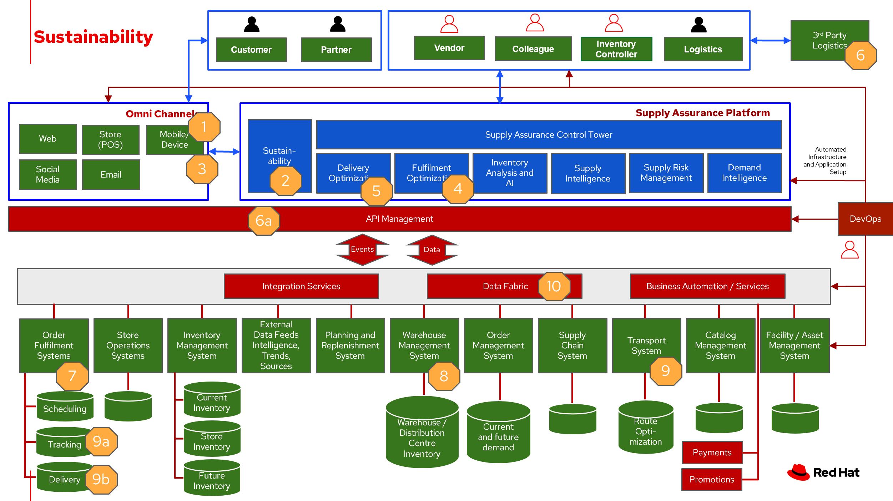

# Sustainability

Businesses are looking for sustainable supply chains. Some of the questions they ask:

- How can I ensure my products, vendors and partners along my supply chain are aligned with my sustainability goals?
- Is my supply chain transparent and traceable? 
- How can I get a handle on my Scope 3 emissions?

Businesses are seeking to balance the long-term imperative to protect the planet with the short-term need to preserve the bottom line. 

Examples of sustainability in business:

- Improving energy management efficiency using alternative power sources and carbon accounting
- Deploying infrastructure that reduces GHG emissions, preserves water resources and eliminates waste 
- Operating dynamic and efficient supply chains to empower a circular economy, encourage reuse, design out waste, promote sustainable consumption and protect natural resources
- Enabling sustainable development by assessing risks and improving resiliency while adhering to external regulations and development goals

In this article, we explore **sustainable supply chains**. Reduce waste, cost-to-serve and logistics-related emissions by optimizing fulfillment and delivery with trusted supply chain solutions that are powered by AI, backed by blockchain, and built on an open, hybrid-cloud platform.

## Use cases

Five key focus areas to plan a resilient and profitable path forward:

- [Climate risk management and ESG reporting](https://www.ibm.com/resources/guides/business-operations/manage-climate-risk/)
- [Resilient infrastructure and intelligent operations](https://www.ibm.com/resources/guides/business-operations/sustainable-operations-one-asset-at-a-time/)
- [Sustainable supply chains and circularity](https://www.ibm.com/resources/guides/business-operations/supply-chain-sustainability/)
- [Electrification, energy and emissions reduction](https://www.ibm.com/resources/guides/business-operations/sustainably-accelerating-decarbonization/)
- [Sustainability strategy](https://www.ibm.com/resources/guides/business-operations/sustainability-core-business-strategy/)

For a deeper dive into each of the use cases, see [What is sustainability in business?](https://www.ibm.com/topics/business-sustainability).

## Challenges / Business drivers

**Challenges**

There are several challenges to overcome in the pursuit of becoming a truly sustainable business:

- **Customer readiness**. While the mindset around sustainability is shifting, no business can afford to be left behind, and few can financially afford to be too far ahead of the appetite for sustainable offerings. Co-creating a sustainable future requires a deep understanding of your customers and having partners with the right relationships and ecosystems to bring them along on the journey.
- **Cost**. Implementing sustainable business practices typically requires higher upfront investments. In the short term, it will often be cheaper to stick with the status quo. Some organizations will need help building an investment case to show how immediate investment will result in more durable profitability over the long run.
- **Systemic inertia**. While sustainability is an important goal, it often isn’t seen as more important than other key priorities that may provide benefits sooner. Many businesses plan in ten-year increments, so while a 2050 commitment is good, it often isn’t enough to drive sufficient action in this decade, from a planning standpoint. It comes back to reframing risks as opportunities and building the case that acting on sustainability now is necessary to achieving future sustainability in business.
- **Lack of tools, insights and expertise**. Being unprepared to develop a corporate sustainability vision, strategy and framework is a monumental risk. Companies may lack the ability to implement sustainable solutions or even know where to start. Sustainability in business is evolving and so are the answers. Every business needs an ecosystem of innovation partners to help them reinvent the world and create a sustainable future.

**Business drivers**

Sustainability is good for business.

Many of the world’s top economies have or are developing, corporate disclosure requirements around environmental impact, driving businesses to curb GHG emissions.

55% of consumers say environmental responsibility is very or extremely important when choosing a brand. Being known as a sustainable business can improve your brand awareness and help you attract consumers that are favorably predisposed to companies actively engaged in sustainable practices.

The rise of environmental, social and governance (ESG) investment criteria and sustainable investing means that a sustainable business is inherently more attractive to the rising numbers of responsible investors. Investment in ESG assets may reach $53 trillion by 2025, representing over a third of global assets.

In 2021, we also found that half of consumers said they were willing to pay a premium for a sustainable brand or sustainable products. And this year, 49% of consumers say they’ve paid a premium—an average of 59% more—for products branded as sustainable or socially responsible in the last 12 months.

### Responses

| Business Problem | Solution |
| - | - |
| Automating ESG Reporting | Capture and manage over  quantitative and qualitive data types to support your expanding sustainability reporting requirements to frameworks and reporting schemes  |
| Strategic goal set for sustainability | |
| Incorporate sustainability options into customer decison making | Connect your strategy with day-to-day operations to embed sustainability into your business transformation |
| Create a lower-emissions business | Build intelligent asset management into operations |

## Business outcomes

- Along with cost savings usingsustainable material andcreating sustainableproducts helps create agreener environment
- In the long run emissionssavings results in energysavings
- Customers value eco-friendly packaging and greendelivery options which improves brand awareness
- A delivery fleet that is notdependent on fossil fuelscontributes to the business’sESG indicator values

## Solution overview

This solution focuses on _Automation_ and _Modernization_ in our Action Guide as shown in the following diagram:

The solution uses the following technologies, which can be grouped into three main categories as shown in the following diagram:

- Core application systems. Often customer-provided technologies, such as order management, facilities management. These systems can be stand-alone applications, on premises and cloud services, databases. 
- Foundational infrastructure. The Red Hat/IBM solution is built on Red Hat OpenShift. Data is routed through API management. Events are routed through Business Automation tools such as Business Automation Workshop. 
- Inventory Optimization platform
- Sustainability system acts as a key driver for automated product and transport selection, in addition to reporting and creating goal-driven outcomes.

## Sustainability

The following diagram shows the schematic for the sustainability use case to improve your supply chain.

<ol>
<li>Customer chooses items to buy online using the business app.
<li>Determine sustainability posture by determining ESG indicator values.
<li>Before providing cost and delivery options, provide customer sustainability options – equivalent greener items, later delivery day, pickup option, etc. If customer opts into sustainability option order is tagged so Supply Assurance Platform can honor that request.
<li>Inventory fulfilment system updates inventory data.
<li>Delivery Optimization system plays a key role in sustainability play. It determines whether to contact 3PL or if in-house Route Optimization can fulfill the requirements.
<li>If 3PL is the only option, contact the sustainability approved 3PL company to fulfill the order. 3PL company takes over the delivery flow from here. If business has the means to fulfill the order continue with next Step 6a.
<ul>
<li>Access underlying backend system via API Management
</ul>
<li>Alert the Order Fulfilment System (OFS) this special order via system APIs.
<li>OFS notifies the Warehouse Management System to package and get it ready for delivery.
<li>The Transport/Logistics System is alerted to schedule delivery. 
<ol>
<li>Track the order, notify customer and provide real-time tracking.
<li>Delivery department maintains the sustainability posture and upon final delivery provides POD (electronic or paper) to customer.
</ol>
<li>All sub-systems are updated via the data fabric that helps maintain a consistent view.
</ol>

## Technology

The following technology was chosen for this solution:

[*Red Hat OpenShift*](https://www.redhat.com/en/technologies/cloud-computing/openshift) Kubernetes offering, the hybrid platform offering allow deployment across data centers, private and public clouds as it brings choices and flexible for hosting system and services.

[*Red Hat Ansible Automation Platform*](https://www.redhat.com/en/technologies/management/ansible) operate, scale and delegate automate IT services, track changes an update inventory, prevent configuration drift and  integrated with ITSM.  

[*Red Hat OpenShift API Management*](https://access.redhat.com/documentation/en-us/red_hat_openshift_api_management/1/guide/53dfb804-2038-4545-b917-2cb01a09ef98) is a managed API traffic control and program management service to secure, manage, and monitor APIs at every stage of the development lifecycle.

[*Red Hat OpenShift DevOps*](https://www.redhat.com/en/getting-started-devops) represents an approach to culture, automation and platform design intended to deliver increased business value and responsiveness through rapid, high-quality service delivery. DevOps means linking legacy apps with newer cloud-native apps and infrastructure. A DevOps developer can link legacy apps with newer cloud-native apps and infrastructure.

[*Business Automation Workflow*](https://www.ibm.com/products/business-automation-workflow) automate business processes, case work, task automation with Robotic Process Automation (RPA) and Intelligent Automation such as conversation intelligence. 

[*IBM Supply Chain Control Tower*](https://www.ibm.com/products/supply-chain-intelligence-suite) provides actionable visibility to orchestrate your end-to-end supply chain network, identify and understand the impact of external events to predict disruptions, and take actions based on recommendations to mitigate the upstream and downstream effects.

[*IBM Sterling Intelligent Promising*](https://www.ibm.com/products/intelligent-promising) provides shoppers with greater certainty, choice 
and transparency across their buying journey.

[*IBM Planning Analytics with Watson*](https://www.ibm.com/products/planning-analytics) streamlines and integrates financial and operational planning across the enterprise.

[*Envizi*](https://www.ibm.com/products/envizi) simplifies the capture, consolidation, management, analysis and reporting of your environmental, social and governance (ESG) data.

## Action Guide 

From a high-level perspective, there are several main steps your organization can take to drive innovation and move toward a digital supply chain:

- Automation
- Sustainability
- Modernization

Demand suppliers to become sustainable
Re-imagine everydepartment and businessprocess to adopt asustainable posture
Institute customerexperience with eco-friendlypackaging
Capture and manage variousmetrics throughout thebusiness to support ESGreporting requirements
Partner with third partylogistics (3PL) companiesfor a greener last miledelivery

| | Actionable Step | Implementation details |
| - | - | - |
| Automation | Create a world-class sensing and risk-monitoring operation | Integrate data from multiple systems to get enterprise-wide view of changes in inventory demand. Monitor and analyze near real-time data |
| Sustainability | ESG data collection, analysis and reporting | <ol><li>Build a Data Foundation by automating the collection and consolidation of more than 500 ESG data types into a single system of auditable, financial-grade data.<li>Streamline Reporting and Disclosures that include emissions calculation engine and flexible reporting tools to meet strict internal and external requirements.<li>Accelerate Decarbonization by identifying energy and emissions savings opportunities and tracking progress at every stage of your journey</li></ol> |
| Sustainability | Set and track your carbon-reduction targets to speed decarbonization | Provide visibility to business units that automate capturing and tracking GHG performance against targets at different levels of the organization |
| Sustainability | Include sustainability for user to consider as delivery options | Include cost considerations related to transport, storage,  |
| Modernization | Amp up AI to make workflows smarter | Incroporate sustainability into the workflows |
| Modernization | Modernization for modern infrastructures, scale hybrid cloud platforms | The decision for a future, Kubernetes-based enterprise platform is defining the standards for development, deployment and operations tools and processes for years to come and thus represents a foundational decision point. |

## Similar use cases

See:

- [Inventory management](./perfectorder.md)
- [Demand risk](./demandrisk.md)
- [Loss and waste management](lossmanagement.md)
- [Product timeliness](timeliness.md)
- [Intelligent order](./intelligentorder.md)

For a comprehensive supply chain overview, see [Supply Chain Optimization](supplychain.md).

## Downloads

View and download all of the **Inventory Optimization diagrams** shown in previous sections in our open source tooling site.

- PowerPoint: [Open Workflow Diagrams](./downloads/SupplyChainOptimization.pptx)
- DrawIO: [Open Schematic Diagrams](./downloads/SupplyChainOptimization.drawio)

## Contributors

- Iain Boyle, Chief Architect, Red Hat
- Mike Lee, Principal AI Ops Technical Specialist, IBM
- James Stewart, Principle Account Technical Leader, IBM
- Bruce Kyle, Sr Solution Architect, IBM Client Engineering
- Mahesh Dodani, Principal Industry Engineer, IBM Technology
- Thalia Hooker, Senior Principal Specialist Solution Architect, Red Hat
- Jeric Saez, Senior Solution Architect, IBM
- Lee Carbonell, Senior Solution Architect & Master Inventor, IBM

## References

- IBM Institute for Business Value [Balancing sustainability and profitability](https://www.ibm.com/thought-leadership/institute-business-value/report/2022-sustainability-consumer-research)
- [What is sustainability in business?](https://www.ibm.com/topics/business-sustainability)
- IBM Institute for Business Value [Sustainability at a turning point](https://www.ibm.com/downloads/cas/WLJ7LVP4) 
- Research Insights [Meet the 2020 consumers driving change](https://www.ibm.com/downloads/cas/EXK4XKX8) 
“The future of sustainability reporting standards” EY, June 2021
- Bloomberg Intelligence [ESG assets may hit $53 trillion by 2025](https://www.bloomberg.com/professional/blog/esg-assets-may-hit-53-trillion-by-2025-a-third-of-global-aum/)
- [2022 Last Mile Logistics Trends: Sustainable Sustainability](https://www.dispatchtrack.com/blog/last-mile-logistics-trends-5)
