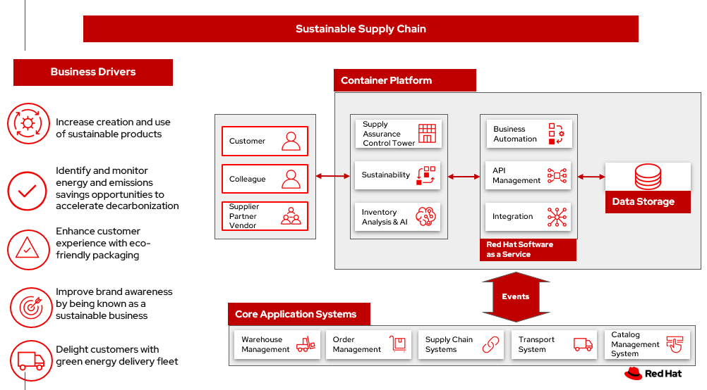

# Sustainable supply chain

Businesses are looking for **sustainable supply chains**. Some of the questions they ask:

- How can I ensure my products, vendors and partners along my supply chain are aligned with my sustainability goals?
- Is my supply chain transparent and traceable? 
- How can I get a handle on my Scope 3 emissions?

Businesses are seeking to balance the long-term imperative to protect the planet with the short-term need to preserve the bottom line. 

Examples of sustainability in business:

- Improving energy management efficiency using alternative power sources and carbon accounting
- Deploying infrastructure that reduces GHG emissions, preserves water resources and eliminates waste 
- Operating dynamic and efficient supply chains to empower a circular economy, encourage reuse, design out waste, promote sustainable consumption and protect natural resources
- Enabling sustainable development by assessing risks and improving resiliency while adhering to external regulations and development goals

In this article, we explore **sustainable supply chains**. Reduce waste, cost-to-serve and logistics-related emissions by optimizing fulfillment and delivery with trusted supply chain solutions that are powered by AI, backed by blockchain, and built on an open, hybrid-cloud platform.

## Challenges / Business drivers

**Challenges**

There are several challenges to overcome in the pursuit of becoming a truly sustainable business:

- Upfront costs to becoming a sustainable business
- Difficuly in measuring and demonstrating lowering green house gas (GHG) emissions
- Customers are willing to pay a premium for sustainable products
- Creating a lower emissions business affects all business processes and departments

**Business drivers**

- Increase creation and use of sustainable products
- Identify and monitor energy and emissions savings opportunities to accelerate decarbonization
- Enhance customer experience with eco-friendly packaging
- Improve brand awareness by being known as a sustainable business
- Delight customers with green energy delivery fleet 

### Responses

| Business Problem | Solution |
| - | - |
| Automating ESG Reporting | Capture and manage over quantitative and qualitive data types to support your expanding sustainability reporting requirements to frameworks and reporting schemes  |
| Strategic goal set for sustainability | |
| Incorporate sustainability options into customer decison making | Connect your strategy with day-to-day operations to embed sustainability into your business transformation |
| Create a lower-emissions business | Build intelligent asset management into operations |

## Business outcomes

- Transparency across multiple systems and suppliers to meet sustainability goals
- Drive business to meet sustainability commitment improves brand awareness
- Allow customer choices to drive sustainability

## Solution overview

This solution focuses on _Automation_ and _Modernization_ in our Action Guide as shown in the following diagram:

The solution uses the following technologies, which can be grouped into three main categories as shown in the following diagram:

- Core application systems. Often customer-provided technologies, such as order management, facilities management. These systems can be stand-alone applications, on premises and cloud services, databases. 
- Foundational infrastructure. The Red Hat/IBM solution is built on Red Hat OpenShift. Data is routed through API management. Events are routed through Business Automation tools such as Business Automation Workshop. 
- Inventory Optimization platform
- Sustainability system acts as a key driver for automated product and transport selection, in addition to reporting and creating goal-driven outcomes.

## Sustainability

The following diagram shows the schematic for the sustainability use case to improve your supply chain.

<ol>
<li>Customer chooses items to buy online using the business app.
<li>Determine sustainability posture by determining ESG indicator values.
<li>Before providing cost and delivery options, provide customer sustainability options – equivalent greener items, later delivery day, pickup option, etc. If customer opts into sustainability option order is tagged so Supply Assurance Platform can honor that request.
<li>Inventory fulfilment system updates inventory data.
<li>Delivery Optimization system plays a key role in sustainability play. It determines whether to contact 3PL or if in-house Route Optimization can fulfill the requirements.
<li>If 3PL is the only option, contact the sustainability approved 3PL company to fulfill the order. 3PL company takes over the delivery flow from here. If business has the means to fulfill the order continue with next Step 6a.
<ul>
<li>Access underlying backend system via API Management
</ul>
<li>Alert the Order Fulfilment System (OFS) this special order via system APIs.
<li>OFS notifies the Warehouse Management System to package and get it ready for delivery.
<li>The Transport/Logistics System is alerted to schedule delivery. 
<ol>
<li>Track the order, notify customer and provide real-time tracking.
<li>Delivery department maintains the sustainability posture and upon final delivery provides POD (electronic or paper) to customer.
</ol>
<li>All sub-systems are updated via the data fabric that helps maintain a consistent view.
</ol>

## Technology

The following technology was chosen for this solution:

[*Red Hat OpenShift*](https://www.redhat.com/en/technologies/cloud-computing/openshift) Kubernetes offering, the hybrid platform offering allow deployment across data centers, private and public clouds as it brings choices and flexible for hosting system and services.

[*Red Hat Ansible Automation Platform*](https://www.redhat.com/en/technologies/management/ansible) operate, scale and delegate automate IT services, track changes an update inventory, prevent configuration drift and  integrated with ITSM.  

[*Red Hat OpenShift API Management*](https://access.redhat.com/documentation/en-us/red_hat_openshift_api_management/1/guide/53dfb804-2038-4545-b917-2cb01a09ef98) is a managed API traffic control and program management service to secure, manage, and monitor APIs at every stage of the development lifecycle.

[*Red Hat OpenShift DevOps*](https://www.redhat.com/en/getting-started-devops) represents an approach to culture, automation and platform design intended to deliver increased business value and responsiveness through rapid, high-quality service delivery. DevOps means linking legacy apps with newer cloud-native apps and infrastructure. A DevOps developer can link legacy apps with newer cloud-native apps and infrastructure.

[*Business Automation Workflow*](https://www.ibm.com/products/business-automation-workflow) automate business processes, case work, task automation with Robotic Process Automation (RPA) and Intelligent Automation such as conversation intelligence. 

[*IBM Supply Chain Control Tower*](https://www.ibm.com/products/supply-chain-intelligence-suite) provides actionable visibility to orchestrate your end-to-end supply chain network, identify and understand the impact of external events to predict disruptions, and take actions based on recommendations to mitigate the upstream and downstream effects.

[*IBM Sterling Intelligent Promising*](https://www.ibm.com/products/intelligent-promising) provides shoppers with greater certainty, choice 
and transparency across their buying journey.

[*IBM Planning Analytics with Watson*](https://www.ibm.com/products/planning-analytics) streamlines and integrates financial and operational planning across the enterprise.

[*Envizi*](https://www.ibm.com/products/envizi) simplifies the capture, consolidation, management, analysis and reporting of your environmental, social and governance (ESG) data.

## Action Guide 

From a high-level perspective, there are several main steps your organization can take to drive innovation and move toward a digital supply chain:

- Automation
- Sustainability
- Modernization

| | Actionable Step | Implementation details |
| - | - | - |
| Automation | Integrate suppliers in business sustainable commitment | Integrate data from multiple systems to get enterprise-wide view of data used to meet sustainability commitments |
| Automation | Amp up AI to make workflows smarter| Incorporate sustainability considerations into automated workflows, including product ordering, delivery, supply replacement, and timeliness. |
| Sustainability | ESG data collection, analysis and reporting | <ol><li>Build a Data Foundation by automating the collection and consolidation of ESG data into a single system of auditable, financial-grade data.<li>Streamline Reporting and Disclosures that include emissions calculation engine and flexible reporting tools to meet strict internal and external requirements.<li>Accelerate Decarbonization by identifying energy and emissions savings opportunities and tracking progress at every stage of your journey</li></ol> |
| Modernization | Modernization for modern infrastructures, scale hybrid cloud platforms | The decision for a future, Kubernetes-based enterprise platform is defining the standards for development, deployment and operations tools and processes for years to come and thus represents a foundational decision point. |

## Similar use cases

See:

- [Inventory management](./perfectorder.md)
- [Demand risk](./demandrisk.md)
- [Loss and waste management](lossmanagement.md)
- [Product timeliness](timeliness.md)
- [Intelligent order](./intelligentorder.md)

For a comprehensive supply chain overview, see [Supply Chain Optimization](supplychain.md).

## Downloads

View and download all of the **Inventory Optimization diagrams** shown in previous sections in our open source tooling site.

- PowerPoint: [Open Workflow Diagrams](./downloads/SupplyChainOptimization.pptx)
- DrawIO: [Open Schematic Diagrams](./downloads/SupplyChainOptimization.drawio)

## Contributors

- Iain Boyle, Chief Architect, Red Hat
- Mike Lee, Principal AI Ops Technical Specialist, IBM
- James Stewart, Principle Account Technical Leader, IBM
- Bruce Kyle, Sr Solution Architect, IBM Client Engineering
- Mahesh Dodani, Principal Industry Engineer, IBM Technology
- Thalia Hooker, Senior Principal Specialist Solution Architect, Red Hat
- Jeric Saez, Senior Solution Architect, IBM
- Lee Carbonell, Senior Solution Architect & Master Inventor, IBM

## References

- IBM Institute for Business Value [Balancing sustainability and profitability](https://www.ibm.com/thought-leadership/institute-business-value/report/2022-sustainability-consumer-research)
- [What is sustainability in business?](https://www.ibm.com/topics/business-sustainability)
- IBM Institute for Business Value [Sustainability at a turning point](https://www.ibm.com/downloads/cas/WLJ7LVP4) 
- Research Insights [Meet the 2020 consumers driving change](https://www.ibm.com/downloads/cas/EXK4XKX8) 
“The future of sustainability reporting standards” EY, June 2021
- Bloomberg Intelligence [ESG assets may hit $53 trillion by 2025](https://www.bloomberg.com/professional/blog/esg-assets-may-hit-53-trillion-by-2025-a-third-of-global-aum/)
- [2022 Last Mile Logistics Trends: Sustainable Sustainability](https://www.dispatchtrack.com/blog/last-mile-logistics-trends-5)
