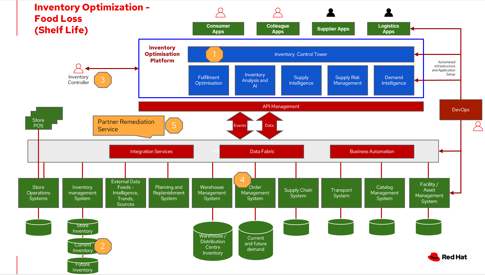

# Inventory Optimisation - Timeliness

To demonstrate the importance of inventory optimisation for any business, this document will focus on main use cases of products that expire or have a known _shelf life_. For a comprehensive inventory solution overview, see [Inventory Optimisation](inventory.md).

## Business case

Many goods offered in retail and supplier businesses expire. 

| Business problem | Solution |
| - | - |
| Manual processes, limited capabilities of inventory management tools, and global operations pose a challenge for enterprises to manage and act on inventory and mitigate disruptions to meet actual demand. | Monitor and manage network inventory availability and anticipate actions due to expiration of products with alerts and recommended actions. |
| The lack of pertinent product information (remaining shelf life, ambient temperature, etc.) and poor data flow across partners lead to inefficient inventory management, wastage and lost sales. | Gain detailed visibility into inventory characteristics at each location – e.g., by remaining shelf life, time-since-harvested. Maintain freshness by acting on alerts received when items are at risk. |
| Visibility into actions needed and alternatives to anticipate and respond to inventory as items approach end of shelf life. | Provide actionable tasks, work orders, visibility for workers and supply chain partners to remove end of life items. Proactively replace items in response to demand. |

## Solution overview

The technologies can be grouped into three main categories as shown in the following diagram:

- Core application systems. Often customer-provided technologies, such as order management, facilities management. These systems can be stand-alone applications, on premises and cloud services, databases. 
- Foundational infrastructure. The Red Hat/IBM solution is built on RedHat OpenShift. Data is routed through API management. Events are routed through Business Automation tools such as Business Automation Workshop. 
- Inventory Optimisation platform

## Principles

**True end-to-end visibility**. Remove data silos and create a unified view across supply chain data with a standard data platform. Personalized dashboards and insights provide a 360-degreee view of KPIs and significant events.

**Manage by exception**. Detect, display, and prioritize work tasks in real time. This allows clients to sense and react to issues quickly while managing risks and disruptions in a supply chain proactively.

**Intelligent workflows**. Actionable workflows can be customized to meet unique requirements and process steps required to automate actions within source transactional systems. Make informed decisions with a supply chain virtual assistant that provides responses to issues based on a client’s supply chain data using natural language search.$$ 

## Workflow

The following diagram shows the workflow for the timeliness / shelf life use case.

Timeliness/Shelf life steps:

1. Inv Ctrl Tower hueristics determines product inventory is near its "Use by" date
2. Inspects current inventory
3. Notifies the Inv Controller to take action
4. Creates replenishment order
5. Engages partners (Charity, recycler) to remediate expired or near expired stock

## Logical diagram

The following diagram shows the schematic for the understock use case.

## Technology

The following technology was chosen for this solution:

*Red Hat OpenShift* Kubernetes offering, the hybrid platform offering allow deployment across data centers, private and public clouds as it brings choices and flexible for hosting system and services.

*Red Hat Ansible Automation Platform* operate, scale and delegate automate IT services, track changes an update inventory, prevent configuration drift and  integrated with ITSM.  

*Business Automation Workflow* automate business processes, case work, task automation with Robotic Process Automation (RPA) and Intelligent Automation such as conversation intelligence. 

*IBM Supply Chain Control Tower* provides actionable visibility to orchestrate your end-to-end supply chain network, identify and understand the impact of external events to predict disruptions, and take actions based on recommendations to mitigate the upstream and downstream effects.

*IBM Sterling Intelligent Promising* provides shoppers with greater certainty, choice and transparency across their buying journey. It includes:

- *IBM Sterling Fulfillment Optimizer with Watson* to determine the best location from which to fulfill an order, based on business rules, cost factors, and current inventory levels and placement
- *Sterling Inventory Visibility* to processes inventory supply and demand activity to provide accurate and real-time global visibility across selling channels.

| Use Case | The Problem | The Solution | The Benefits and Implications |
| - | - | - | - |
| Automated processes | Manual input and follow up | Business automation provides a systematic way to notifications, documentation of notifications, and creation of work orders. | 
Actions follow a consistent business process and can be easily updated as needs change |
| Expiring products | Expiring item situations lead to lost revenue and decreased brand / retailer loyalty. | Control Tower monitors inventory levels at all locations in a client’s network and creates items in the work queue when revenue is at risk. When drilling down on the item, users can see where they have available inventory and receive recommendations about how much inventory can and should be ordered for replacement based on demand. |  Action can be taken directly from the Control Tower user interface. Expiring product situations are efficiently managed and OOS are avoided with minimal human intervention. |
| API Management | Separation of systems, control and monitoring of access, providing consistent user authentication and security between platforms. | API Manages the access and permissions required for data between systems. | Improved security, monitoring of frequency of access between systems. Improved system maintainability. |

## Similar use cases

See:

- [Demand risk](demandrisk.md)
- [Product timeliness](timeliness.md)

## Contributors

- Iain Boyle, Red Hat
- Bruce Kyle, IBM
- Mahesh Dodani, IBM
- Thalia Hooker, Red Hat
- Jeric Saez, IBM
- Mike Lee, IBM
- Lee Carbonell, IBM
- James Stewart, IBM

