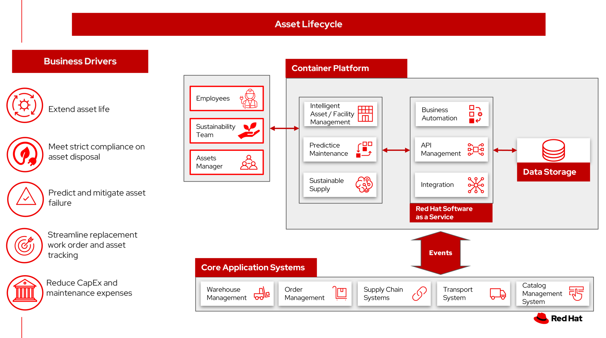

# Asset lifecycle management

By driving greater efficiencies in managing assets, organizations can extend asset life, reduce Capex and maintenance expenses, and improve technician productivity. You’ll find these needs across critical industries: energy and utilities, chemical and petroleum, auto, aerospace and defense, as well as electronics, retail, consumer packaged goods, and government.

By using this cradle-to-grave method allows the company to integrate with environmental reporting processes and incentivize sustainability improvement across the organization. Gain insights into its global waste profile, the company can better engage the waste management team, supply chain team, equipment manufacturers and waste haulers. 

## Use cases

Organizations want to enhance the tracking of assets and associated material components across the enterprise. Through improved visibility into job activities and an asset's lifecycle, the organization can better understand and drive change using data-driven insights. 

## Background

As outlined in a Pennsylvania State University study, "_Hazardous Waste_ is any Waste that has been designated, characterized or otherwise regulated as hazardous by applicable laws or regulations in a country, state, region, or locality. Examples can include a corrosive liquid or a flammable solvent.

"_Product End of Life Management (PELM)_ refers to the demanufacturing, dismantling, reuse, reclamation, recycling, shredding, treatment and / or disposal of end-of-life (EOL) IT equipment and parts."

## Business problem

The business problem consists of lifecycle asset management and proper asset disposal.

Automate procurement, maintenance to support more than tens of thousands or assets and improves inspector productivity and reduce safety incidents.

Then when the asset is at end of life:

- Management (including monitor the collection, transportation, recycling treatment or disposal) of hazardous and nonhazardous special waste that comes from internal operations (e.g., facility operations, on-site waste water treatment, research, manufacturing processes, and environmental remediation programs). Such byproducts are reduced and recycle when possible, followed by treatment and disposal (incinerated and/or sent to landfills).
- Second are products or their parts and components that have reached their intended end of life (a.k.a PELM). These materials may be generated from your own operations or by your clients. These PELM materials may still have value and can be refurbished and resold or, may be disassembled and their parts harvested for reuse or scrapped. 

The output of the scrapping process may involve recoverable materials (e.g., ferrous and non-ferrous metals, precious metals, glass, plastics, etc.) that have intrinsic value and are sold in secondary commodity markets, or waste materials (e.g., non-recyclable packaging material, non-recyclable plastics, shredder fluff, etc.) that have no value and require proper treatment or disposal. 

Waste materials may be considered hazardous or nonhazardous depending on government designation.

Often the disposal of hazardous wastes are contracted through third parties.

As one example, for the waste that is generated, [IBM focuses on preventing pollution](https://www.ibm.com/about/environment/pollution-prevention) through a comprehensive, proactive waste management program. IBM's waste management practices, in order of preference, are: (1) prevention and source reduction, (2) reuse, (3) recycling, (4) recovery, (5) other treatment, and (6) land disposal.

### Challenges / Business Drivers 

**Challenges**

- Tracking tens of thousands of assets, maintenance windows, and work orders during an asset's lifetime.
- Integration with procurement systems, building maintenance systems, supply chain systems.
- Predicting the possible failure and taking mitigating action to prevent asset failure.
- Waste management team manually gathers disposal data from individual haulers for each facility in the organization.
- Manual data collection method limits internal data validation to sporadic certification spot-checks.
- No real-time visibility into hazardous waste lifecycles or raw materials to actively engage with vendors and ensure hazardous waste compliance and forecasting.
- Field teams manage the end-to-end lifecycle and disposal process in spreadsheets.
- The recycling process is manually managed by external regional haulers.

**Business drivers**

- Extend asset life, reduce Capex and maintenance expenses, and improve technician productivity
- Meeting strict compliance with regional hazardous waste management standards
- Setting and meeting environmental waste targets
- Streamline replacement work order management and asset tracking process
- Tracability and controls of waste disposal
- Advise on automation replacement work-orders to engage with waster haulers for reconcilation
- Streamline collection, tracking and reporting of hazardout materials
- Monitor and forecast asset replacement and waste targets

### Business outcomes

- Improved management of regulatory compliance and third-party audit certification.
- Enhanced monitoring by tracking against zero waste targets and diversion rate per location.
- Enhanced visibility of entire lifecycle from consumption to responsible disposal and recycling.
- Improved visibility, monitoring and management of assets and consumables including hazardous and non-hazardous waste.
- Gaining both global view and site level view of consolidated environmental sensitive cradle-to-grave equipment and parts.

## Solution overview

The solution shown in Figure 1 uses components that can be grouped into three main categories as shown in the following diagram:

- Core application systems. Often customer-provided technologies, such as order management, facilities management. These systems can be stand-alone applications, on premises and cloud services, databases. 
- Foundational infrastructure. The Red Hat/IBM solution is built on Red Hat OpenShift. Data is routed through API management. Events are routed through Business Automation tools such as Business Automation Workshop.
- Sustainable enterprise systems acts to coordinate facilities management with workplace management backed by sustainability reporting.

_Figure 1. Overall view of sustainable facilities solution._

The sustainable enterprise works within the existing enterprise infrastructure.

_Figure 2. Sustainable enterprise works within existing digital infrastructure._

## Logical diagrams

_Figure 3. The personas and technologies that provide a platform for some of the biggest potential breakthroughs in the managing sustainability assets._

## Architecture

The figures in this section show the interaction of sustainability data to your customer systems.

### Asset life management

Assets module contains applications that are designed to manage the assets that are owned or leased by your company from purchase to salvage, from the beginning to the end of the life cycle for an asset.

_Figure 4. Schematic diagram of the asset life cycle management case._

Asset life cycle management workflow steps:

1. Create workflow to manage asset including:
    a. Asset purchase approval
    b. Procurement
    c. Asset inventory
2. Add asset in asset management system including location, relationships to related assets (parts or assemblies)
3. Create job plan of steps to be taken to perform preventative maintenance or replacement 
4. Monitor asset health, receive sensor data
5. Predict asset failures
6. Provide work order and tracking to respond to maintenance and replacement
7. Dispose of item at asset end of life

### Asset disposal

In this figure, asset management software provides data and AI for decision making to drive efficiencies in asset disposal.

_Figure 5. Schematic diagram of the asset disposal use case._

1. Asset identified to be replaced, either proactively or due to asset failure
2. Asset replacement decision by asset manager
3. Work order created to:
    a. Order replacement asset ordered
    b. Work order created to replace asset
    c. Completion of work order reported
    d. Assess disposal, recycle process work order provided to regional hauler
4. Regional hauler
    a. Coordinate recycle or hazardous disposal documentation with regional hauler
    b. Use Transparent Supply to track hazardous waste disposal 
    c. In locations where local processing of waste is not possible, store wastes and product end-of-life materials in properly managed storage facilities, as allowed by law
5. Sustainable supply provides data to the control tower to provide compliance reporting on hazardous waste disposal
6. Sustainability officer monitor and forecast against zero waste targets

## Action Guide

From a high-level perspective, the **Action Guide** represents a future state for organizations considering a comprehensive commitment. The idea is to outline a set steps that can be prioritized to reach that future state by adding new functionality to your existing systems.

- Automation
- Sustainability
- Modernization

| | Actionable Step | Implementation details |
| - | - | - |
| Automation | Automate the collection of sustainability data | Reduce manual processing of data |
| Automation | Amp up AI to make workflows smarter | Participants add their data and supporting documents like certifications to the ledger and control who is allowed to see what. Once added to the ledger, data cannot be manipulated, changed or deleted. Participants can track materials and products from source to end customer and, ultimately, the consumer. |
| Sustainability | Include sustainability data in decision making | Integrate sustainability metrics in supply chain, facility management, and data center operations |
| Sustainability | Track sustainability data within your supply chain | Engage vendors and partners to provide sustainability data as part of your purchasing requirements |
| Modernization | Modernization for modern infrastructures, scale hybrid cloud platforms | The decision for a future, Kubernetes-based enterprise platform is defining the standards for development, deployment and operations tools and processes for years to come and thus represents a foundational decision point. |
| Modernization | Modernize application deployment and operations practices | Include DevOps best practices to deploy, monitor, and maintain applications |

For specific steps on this approach, see **The Action Guide** details in [_Own Your Transformation_](https://www.ibm.com/downloads/cas/1BYY6VEM) survey of 1500 CSCOs across 24 industries.

## Technology

The following technologies offered by Red Hat and IBM can augment the solutions already in place in your organization.

### Core systems

[*Red Hat OpenShift*](https://www.redhat.com/en/technologies/cloud-computing/openshift) Kubernetes offering, the hybrid platform offering allow deployment across data centers, private and public clouds offering choices and flexible for hosting system and services. You can manage clusters and applications from a single console, with built-in security policies with [_Red Hat Advanced Cluster Management_](https://www.redhat.com/en/technologies/management/advanced-cluster-management) and [_Red Hat Advanced Cluster Security_](https://www.redhat.com/en/technologies/cloud-computing/openshift/advanced-cluster-security-kubernetes).

[*Red Hat Ansible Automation Platform*](https://www.redhat.com/en/technologies/management/ansible) operate, scale and delegate automate IT services, track changes an update inventory, prevent configuration drift and  integrated with ITSM.

[*Red Hat OpenShift DevOps*](https://www.redhat.com/en/getting-started-devops) represents an approach to culture, automation and platform design intended to deliver increased business value and responsiveness through rapid, high-quality service delivery. DevOps means linking legacy apps with newer cloud-native apps and infrastructure. A DevOps developer can link legacy apps with newer cloud-native apps and infrastructure.

### Integration services

[*Red Hat OpenShift API Management*](https://access.redhat.com/documentation/en-us/red_hat_openshift_api_management/1/guide/53dfb804-2038-4545-b917-2cb01a09ef98) is a managed API traffic control and program management service to secure, manage, and monitor APIs at every stage of the development lifecycle.

[*Red Hat Intgration*](https://www.redhat.com/en/products/integration) is a comprehensive set of integration and messaging technologies to connect applications and data across hybrid infrastructures. It is an agile, distributed, containerized, and API-centric solution. It provides service composition and orchestration, application connectivity and data transformation, real-time message streaming, change data capture, and API management.

[*IBM Business Automation*](https://www.ibm.com/business-automation) delivers intelligent automations quickly with low-code tooling, such as business processes automation, decisioning software, robotic process automation, process mining, workflow automation, business process mapping, Watson Orchestrate, content services, and document processing. 

[*IBM Data Fabric*](https://www.ibm.com/data-fabric) empowers your teams and works across the ecosystem by connecyting data from disparate data sources in multicloud envrionments. In particular, [_Watson Knowledge Catalog_](https://www.ibm.com/cloud/watson-knowledge-catalog) provides you users with a catalog tool for intelligent, self-service discovery of data, models. [_Watson Query_](https://www.ibm.com/products/watson-query) provides data consumers with a universal query engine that executes distributed and virtualized queries across databases, data warehouses, data lakes, and streaming data without additional manual changes, data movement or replication. 

### Sustainable enterprise systems

[*Envizi*](https://www.ibm.com/products/envizi) simplifies the capture, consolidation, management, analysis and reporting of your environmental, social and governance (ESG) data.

[*IBM TRIRIGA*](https://www.ibm.com/products/tririga/sustainability) harnesses the power of data and AI to infuse sustainability into your real estate and facilities management operations.

[*IBM Maximo Application Suite (MAS)*](https://www.ibm.com/products/maximo/sustainability) delivers greater sustainability through intelligent asset management, monitoring, predictive maintenance, computer vision, safety and reliability, all in a single platform..

[*IBM Turbonomic*](https://www.ibm.com/products/turbonomic) monitors resource consumption of applications within the data center. It provides FinOps engineering teams the ability to ensure your applications are performing efficiently, allowing cloud and ITOps teams to cut cloud spend and multiply ROI.

[*Transparent Supply*](https://www.ibm.com/products/supply-chain-intelligence-suite/blockchain-transparent-supply) provides supply chain management with a robust traceability solution.

## References

- [IBM Announces 21 Environmental Sustainability Goals](https://www.environmentalleader.com/2021/07/ibm-announces-21-environmental-sustainability-goals/)
- Pennsylvania State University [Selecting and Evaluating Environmentally Responsible Suppliers of Hazardous, Nonhazardous Special Waste and Product End-Of-Life Management Services](https://www.smeal.psu.edu/sustainability/documents/ibm-case-pdf)
- IBM Blog [Uncover real savings from enterprise asset management no matter the industry](https://www.ibm.com/blog/uncover-real-savings-from-enterprise-asset-management-no-matter-the-industry/)
- IBM Blog [How to create more sustainable operations – one asset at a time](https://www.ibm.com/blog/sustainable-operations-one-asset-at-a-time/)
- IBM [Supplier requirements](https://www.ibm.com/about/environment/supply-chain)

## Contributors

- Iain Boyle, Chief Architect, Red Hat
- Mahesh Dodani, Principal Industry Engineer, IBM Technology
- Thalia Hooker, Senior Principal Specialist Solution Architect, Red Hat
- Lee Carbonell, Senior Solution Architect & Master Inventor, IBM
- Eric Singsaas, Account Technical Lead, IBM Technology
- Mike Lee, Principal Integration Technical Specialist, IBM
- Rajeev Shrivastava, Account Technical Lead, IBM
- Bruce Kyle, Sr Solution Architect, IBM Client Engineering