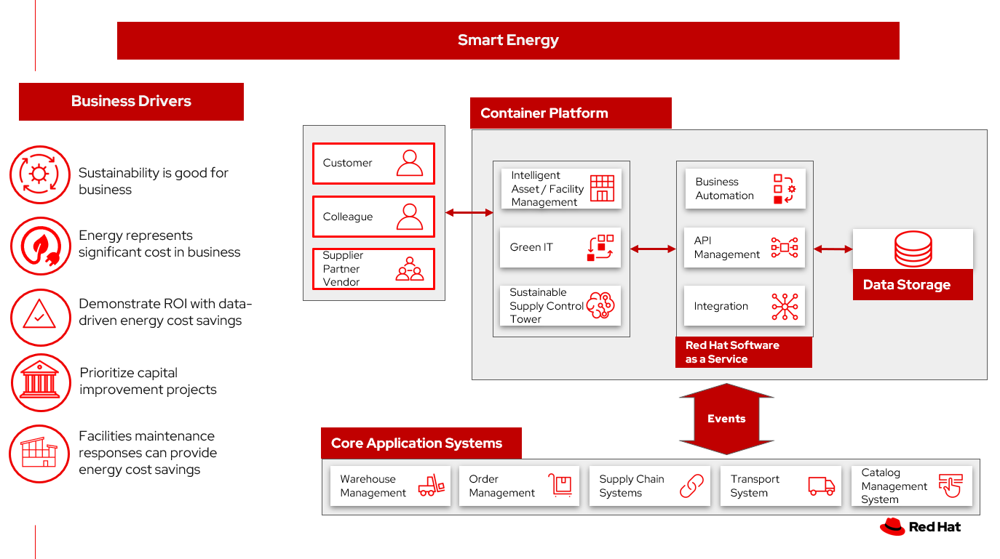

# Smart energy

Energy represents a significant cost in the business.

According to a paper recommended by the United States Department of Energy:

> One of the most lucrative areas for improving bottom line profitability is related to an organization`s costs for utilities and energy. Such things as gas, electric, water, and telephones are treasure chests of cost reduction opportunities. In the past, these items have been viewed as a fixed expense or basic mundane commodity. In recent years, these items have become a large portion of product cost and now must be examined on a continual basis. A formal income improvement program to capture and report on the savings is a requirement for remaining competitive in a global economy.  &mdash; From [Utility and energy cost containment](https://www.osti.gov/biblio/273871)

## Use cases

- Impact the costs due to regrigerators, heating and cooling, and IT
- Connected edge devices
- Provide data to demonstrate energy cost containment results
- Implement price controls and contractor benchmarking
- Automate maintenance, repair, and operations tracking

## Background

Most companies are committed to actions that make your operations more sustainable. At this point, some companies have set and published specific targets.

Businesses are seeking to balance the long-term imperative to protect the planet with the short-term need to preserve the bottom line. 

## Business problem

Businesses need a data-driven solution to demonstrate energy cost savings. Intelligent decision making of specific steps to determine costs of energy providers, capital improvement projects, energy conservation, modernization of infrastructure.

How do you determine the ROI on these steps to drive your sustainability goals?

### Challenges / Business Drivers 

**Challenges**

According to an [IBM Institute of Business Value study](https://newsroom.ibm.com/2022-05-10-IBM-Study-CEOs-Feel-Pressure-to-Act-on-Sustainability-and-See-Business-Benefits,-Yet-Hindered-by-Challenges), 48% of CEOs across industries say increasing sustainability is one of the highest priorities for their organization in the next two to three years. However, 51% also cite sustainability as among their greatest challenges in that same timeframe, with hurdles, such as:

- Lack of data insights
- Unclear ROI
- Technology barriers, as hurdles. 

For these CEOs, scaling business with modern infrastructure can often be one of the barriers to achieving sustainability goals.

**Business Drivers**

- Energy represents a significant cost in the business
- Demonstrate ROI with data-driven energy cost savings
- Investment in energy cost savings can have ROI
- Facility maintenance responses can provide energy cost savings

### Responses

| Business Problem | Solution |
| - | - |
| Manual processes for assembling energy reporting data | Automate data collection activities, such as energy billing reporting and consumption |
| Assembing sensor data in near real time | Provide data systems to collect, manage, and respond to anomalies |
| Energy reporting silos | Automate data collection activities across silos |
| Sensors provide too much data | Scale sensor data collection using event streaming and anomolie detection using AI | 
| Energy consumption disclosure | IBM participates in various external disclosures, such as the Carbon Disclosure Project (CDP), Global Reporting Initiative (GRI) and the Sustainability Accounting Standards Board (SASB) Index. |

## Business outcomes

- Data-based selection of energy saving priorities
- Demonstratable returns on energy savings
- Improved facilities management

## Solution overview

The solution shown in Figure 1 uses components that can be grouped into three main categories as shown in the following diagram:

- Core application systems. Often customer-provided technologies, such as order management, facilities management. These systems can be stand-alone applications, on premises and cloud services, databases. 
- Foundational infrastructure. The Red Hat/IBM solution is built on Red Hat OpenShift. Data is routed through API management. Events are routed through Business Automation tools such as Business Automation Workshop.
- Sustainable enterprise systems acts to coordinate facilities management with workplace management backed by sustainability reporting.

_Figure 1. Overall view of sustainable facilities solution._

The sustainable enterprise works within the existing enterprise infrastructure.

_Figure 2. Sustainable enterprise works within existing digital infrastructure._

## Logical diagrams

_Figure 3. The personas and technologies that provide a platform for some of the biggest potential breakthroughs in managing a sustainable enterprise._

## Architecture

The figures in this section show the interaction of enterprise systems with sustainability enterprise platform systems.

### Energy cost containment

The following diagram shows how systems work together to provide data for decision making in the energy cost containment scenario.

_Figure 4. Schemantic diagram for energy cost containment use case._

Energy cost containment workflow steps:

<ol>
<li>Developer and administrator publish edge computing applications to sensor and edge devices.
<li>Collect sensor and energy consumption (energy, refrigerators, HVAC) across the enterprise. Unusual data can be from a piece of equipment that no longer functions, a walk-in refrigerator door being left open, HVAC that is providing temps outside of nominal ranges
<li>Sensors report to Intelligent Assets and Facilities Management software that provides alerts on abnormal behavior of data from sensors
<li>Alerts are sent to Sustainability Control Tower that takes actions to remediate consumption
<li>Business automation provides consistent ways of handling alerts by:
<ol type=a>
<li>Sending work orders to facility and asset management software
<li>Updating inventory management for spoiled goods as needed
</ol>
<li>Facility management software provides work orders, tracks the completion 
<li>Facility manager is updated on the work orders and successful completion of the remediation steps
<li>Sustainability Manager reviews KPI, update energy consumption metrics, sets energy consumption goals
</ol>

## Action Guide

From a high-level perspective, the **Action Guide** represents a future state for organizations considering a comprehensive commitment. The idea is to outline a set steps that can be prioritized to reach that future state by adding new functionality to your existing systems.

- Automation
- Sustainability
- Modernization

| | Actionable Step | Implementation details |
| - | - | - |
| Automation | Reduce manual data processing | Automate energy data collection between finance and facility management systems |
| Automation | Advance the quality of capital, facility and environmental projects | Integrate data from multiple systems to get enterprise-wide view to capture and evaluate occupancy to align usage with business requirements and objectives.  |
| Automation | Optimize real estate portfolios | Centralize and integrate critical information at an enterprise level, giving organizations the ability to make the most cost-effective decisions |
| Automation | Amp up AI to make workflows smarter |  |
| Sustainability| Create digital twin of your facility. | Mirror and monitor building systems and troubleshoot problems before wasting resources on unnecessary or inaccurate repairs. |
| Sustainability | Include sustainability data in decision making | Integrate sustainability metrics in supply chain, facility management, and data center operations. |
| Sustainability | Decrease energy costs | Consolidate and measure energy cost reporting and provide systems to manage cost savings |
| Sustainability | Increase Green IT in your data center | Identify and measure application needs, shut down servers when they are not needed |
| Modernization | Modernization for modern infrastructures, scale hybrid cloud platforms | The decision for a future, Kubernetes-based enterprise platform is defining the standards for development, deployment and operations tools and processes for years to come and thus represents a foundational decision point. |
| Modernization | Modernize application deployment and operations practices | Include DevOps best practices to deploy, monitor, and maintain applications |

For specific steps on this approach, see **The Action Guide** details in [_Own Your Impact: Practical Pathways to Transformational Sustainability_](https://www.ibm.com/downloads/cas/6NJEKDD8) survey of 3,000 CEOs worldwide, that reveals sustainability's emergence onto the mainstream corporate agenda.

## Technology

The following technologies offered by Red Hat and IBM can augment the solutions already in place in your organization.

### Core systems

[*Red Hat OpenShift*](https://www.redhat.com/en/technologies/cloud-computing/openshift) Kubernetes offering, the hybrid platform offering allow deployment across data centers, private and public clouds offering choices and flexible for hosting system and services. You can manage clusters and applications from a single console, with built-in security policies with [_Red Hat Advanced Cluster Management_](https://www.redhat.com/en/technologies/management/advanced-cluster-management) and [_Red Hat Advanced Cluster Security_](https://www.redhat.com/en/technologies/cloud-computing/openshift/advanced-cluster-security-kubernetes).

[*Red Hat Ansible Automation Platform*](https://www.redhat.com/en/technologies/management/ansible) operate, scale and delegate automate IT services, track changes an update inventory, prevent configuration drift and  integrated with ITSM.

[*Red Hat OpenShift DevOps*](https://www.redhat.com/en/getting-started-devops) represents an approach to culture, automation and platform design intended to deliver increased business value and responsiveness through rapid, high-quality service delivery. DevOps means linking legacy apps with newer cloud-native apps and infrastructure. A DevOps developer can link legacy apps with newer cloud-native apps and infrastructure.

### Integration services

[*Red Hat OpenShift API Management*](https://access.redhat.com/documentation/en-us/red_hat_openshift_api_management/1/guide/53dfb804-2038-4545-b917-2cb01a09ef98) is a managed API traffic control and program management service to secure, manage, and monitor APIs at every stage of the development lifecycle.

[*Red Hat Intgration*](https://www.redhat.com/en/products/integration) is a comprehensive set of integration and messaging technologies to connect applications and data across hybrid infrastructures. It is an agile, distributed, containerized, and API-centric solution. It provides service composition and orchestration, application connectivity and data transformation, real-time message streaming, change data capture, and API management.

[*IBM Business Automation*](https://www.ibm.com/business-automation) delivers intelligent automations quickly with low-code tooling, such as business processes automation, decisioning software, robotic process automation, process mining, workflow automation, business process mapping, Watson Orchestrate, content services, and document processing.

[*IBM Data Fabric*](https://www.ibm.com/data-fabric) empowers your teams and works across the ecosystem by connecyting data from disparate data sources in multicloud envrionments. In particular, [_Watson Knowledge Catalog_](https://www.ibm.com/cloud/watson-knowledge-catalog) provides you users with a catalog tool for intelligent, self-service discovery of data, models. [_Watson Query_](https://www.ibm.com/products/watson-query) provides data consumers with a universal query engine that executes distributed and virtualized queries across databases, data warehouses, data lakes, and streaming data without additional manual changes, data movement or replication. 

[*IBM Edge Application Manager*](https://www.ibm.com/docs/en/eam/4.1?topic=overview-ieam) provides you with edge computing features to help you manage and deploy workloads from a management hub cluster to remote instances of OpenShift Container Platform or other Kubernetes-based clusters.

### Sustainable enterprise systems

[*Envizi*](https://www.ibm.com/products/envizi) simplifies the capture, consolidation, management, analysis and reporting of your environmental, social and governance (ESG) data.

[*IBM TRIRIGA*](https://www.ibm.com/products/tririga/sustainability) harnesses the power of data and AI to infuse sustainability into your real estate and facilities management operations.

[*IBM Maximo Application Suite (MAS)*](https://www.ibm.com/products/maximo/sustainability) Infuse sustainability into your asset management by harnessing the power of data and AI.

[*IBM Turbonomic*](https://www.ibm.com/products/turbonomic) monitors resource consumption of applications within the data center. It provides FinOps engineering teams the ability to ensure your applications are performing efficiently, allowing cloud and ITOps teams to cut cloud spend and multiply ROI.

[*Transparent Supply*](https://www.ibm.com/products/supply-chain-intelligence-suite/blockchain-transparent-supply) provides supply chain management with a robust traceability solution.

## References

- [IBM journey to more sustainable facilities: IBM as client zero](https://www.ibm.com/blogs/internet-of-things/ibm-journey-to-more-sustainable-facilities-ibm-as-client-zero/)
- IBM Institute for Business Value [Balancing sustainability and profitability](https://www.ibm.com/thought-leadership/institute-business-value/report/2022-sustainability-consumer-research)
- [What is sustainability in business?](https://www.ibm.com/topics/business-sustainability)
- IBM Institute for Business Value [Sustainability at a turning point](https://www.ibm.com/downloads/cas/WLJ7LVP4) 
- Forbes: [15 Simple Ways For Businesses To Start Saving Energy](https://www.forbes.com/sites/forbesbusinesscouncil/2022/01/14/15-simple-ways-for-businesses-to-start-saving-energy/)
- IBM [Energy and climate](https://www.ibm.com/about/environment/energy-climate)
- [IBM's 21 goals for environmental sustainability](https://www.ibm.com/about/environment/energy-climate)
- [IBM ESG Report](https://www.ibm.com/about/environment/reporting)

## Contributors

- Iain Boyle, Chief Architect, Red Hat
- Mahesh Dodani, Principal Industry Engineer, IBM Technology
- Thalia Hooker, Senior Principal Specialist Solution Architect, Red Hat
- Lee Carbonell, Senior Solution Architect & Master Inventor, IBM
- Eric Singsaas, Account Technical Lead, IBM Technology
- Mike Lee, Principal Integration Technical Specialist, IBM
- Rajeev Shrivastava, Account Technical Lead, IBM
- Bruce Kyle, Sr Solution Architect, IBM Client Engineering

