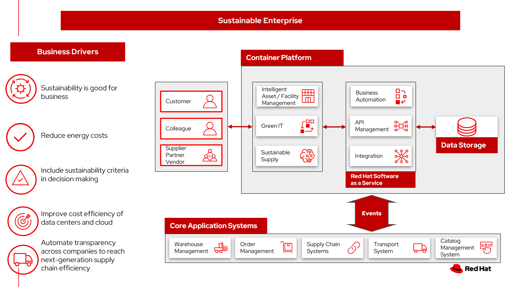

# Environmental management system

Companies are using sustainability commitments as a way to affect the bottom line.

Organizations have an unprecedented opportunity to capture and analyze their data and develop greater operational resiliency and effectiveness. These data insights give companies the tools needed to

- React quickly to change
- Care for their employees and occupants
- Make strategic space and occupancy decisions
- Contain energy costs
- Improve the efficiency in data centers and cloud

One executive described it this way:

> Sustainability promotes business, supports the needs of our customers, generates profitability, and contributes to a better world. This is how we see our transformative role. 
> &mdash; Fausto Ribeiro, CEO of Banco do Brasi

An enterprise-wide environmental management system sets environmental goals that address the significant environmental aspects and impacts the operation. It drives continual improvement of the organization's environmental performance.

Yet, a study of [business leaders](https://www.ibm.com/thought-leadership/institute-business-value/report/esg-ultimatum) says:

> - Executives cite inadequate data (41%) as a top barrier holding back Environmental, Social and Governance (ESG) progress.
> - Only 4 in 10 surveyed consumers feel they have enough data to make environmentally sustainable purchasing (41%) or employment (37%) decisions.

## Use cases

To identify, effectively manage and minimize the potential environmental impact of an organization's operations, companies are adopting environmental management system. It covers hardware product design, manufacturing, data centers, real estate operations, procurement, logistics, asset recovery services, and business services.

In this series of articles, we provde architectures and action plans around key use cases:

- Sustainable supply chain
- Smart energy
- Green IT
- Sustainable facilities
- Asset lifecyle

## Background

Most companies are committed to actions that make your operations more sustainable. At this point, some companies have set and published specific targets. How can companies document, manage the steps taken, and report on driving toward the bold sustainability commitments?

Businesses are seeking to balance the long-term imperative to protect the planet with the short-term need to preserve the bottom line. 

## Business problem

The data needed to combine sustainability into an organization are already in existing systems. But those data need to be organized and presented in ways that help you make informed decisions through the lens of sustainability. And once decisions are made, the steps to be taken can be automated to provide consistant, measurable actions.

In the end, your organization can demonstrate its commitments to sustainability, while improving the bottom line.

A global IBM Institute for Business Value (IBV) study, [The ESG ultimatum: Profit or perish](https://ibm.co/esg-ultimatum), of executives and consumers reveals that while an increased focus on environmental sustainability remains a top priority for consumers and business executives, inadequate data is a key challenge for both groups when it comes to achieving personal and corporate ESG goals. According to the study, companies are investing in ESG and see it as good for business:

- 76% of surveyed executives say ESG is central to their business strategy.
- Almost 3 in 4 surveyed executives (72%) view ESG as a revenue enabler rather than cost center, suggesting that contrary to popular opinion, ESG and profitability are not at odds.
- 76% of executive respondents agree or strongly agree that their organization focuses on achieving ESG outcomes, not just reporting requirements.

### Challenges / Business Drivers 

**Challenges**

There are several challenges to overcome in the pursuit of becoming a truly sustainable business:

- **Customer readiness**. While the mindset around sustainability is shifting, no business can afford to be left behind, and few can financially afford to be too far ahead of the appetite for sustainable offerings. Co-creating a sustainable future requires a deep understanding of your customers and having partners with the right relationships and ecosystems to bring them along on the journey.
- **Cost**. Implementing sustainable business practices typically requires higher upfront investments. In the short term, it will often be cheaper to stick with the status quo. Some organizations will need help building an investment case to show how immediate investment will result in more durable profitability over the long run.
- **Systemic inertia**. While sustainability is an important goal, it often isn’t seen as more important than other key priorities that may provide benefits sooner. Many businesses plan in ten-year increments, so while a 2050 commitment is good, it often isn’t enough to drive sufficient action in this decade, from a planning standpoint. It comes back to reframing risks as opportunities and building the case that acting on sustainability now is necessary to achieving future sustainability in business.
- **Lack of tools, insights and expertise**. Being unprepared to develop a corporate sustainability vision, strategy and framework is a monumental risk. Companies may lack the ability to implement sustainable solutions or even know where to start. Sustainability in business is evolving and so are the answers. Every business needs an ecosystem of innovation partners to help them reinvent the world and create a sustainable future.

**Drivers**

- **Sustainability is good for business**.
- **Reduce energy costs**.
- **Improve cost effectiveness of data centers**.
- **Include ESG criteria in supply chain decision making**.
- **Prioritize environmental improvement projects**.

### Responses

| Business Problem | Solution |
| - | - |
| Automating ESG Reporting | Capture and manage over quantitative and qualitive data types to support your expanding sustainability reporting requirements to frameworks and reporting schemes  |
| Manage competing needs with constrained resources | <ul><li>Predict when important assets and building systems will require maintenance, refurbishment or replacement. <li>Document the impact on productivity and building value when systems fail.</ul> |
| Incorporate sustainability options into customer decison making | Connect your strategy with day-to-day operations to embed sustainability into your business transformation |
| Create a lower-emissions business | Build intelligent asset management into operations. |
| Document and improve business bottom line | Identify, measure, and respond with day-to-day decisions supporting sustainability outcome |

## Business outcomes

- Reduced energy costs
- Improved utilization of office and warehouse space
- Improved energy efficiency in your data centers
- Measurable improvement in sustainability in your supply chain
- Sustainable buildings helps create a greener environment

## Solution overview

The solution shown in Figure 1 uses components that can be grouped into three main categories as shown in the following diagram:

- Core application systems. Often customer-provided technologies, such as order management, facilities management. These systems can be stand-alone applications, on premises and cloud services, databases. 
- Foundational infrastructure. The Red Hat/IBM solution is built on Red Hat OpenShift. Data is routed through API management. Events are routed through Business Automation tools such as Business Automation Workshop.
- Sustainable enterprise systems acts to coordinate facilities management with workplace management backed by sustainability reporting.

_Figure 1. Overall view of sustainable facilities solution._

The sustainable enterprise works within the existing enterprise infrastructure.

_Figure 2. Sustainable enterprise works within existing digital infrastructure._

## Logical diagrams

_Figure 3. The personas and technologies that provide a platform for some of the biggest potential breakthroughs in the supply chain._

## Key use cases

See:

- [Sustainable supply](./transparentsupply.md). Enable intelligent, end-to-end supply chain visibility and transparency.
- [Smart energy](./energy.md). Reduce the energy costs in your enterprise.
- [Green IT](./greenit.md). Manage cloud costs, reduce energy consumption in your data centers.
- [Sustainable facilities](./sustainablefacility.md). Improve your organization's capital project management capabilities.
- [Asset lifecycle management](./assetlifecycle.md). Track assets and associate material components, track the handling of hazardous waste, and monitor and forecast against zero waste targets.

For a supply chain overview, see [Supply chain optimization](../supplychain/supplychain.md).

## Action Guide

Rather than pigeonholing ESG into the realm of compliance and reporting, leaders that elevate its role can drive engagement, inspire innovation, improve operations—and unify ecosystem partners around shared strategic goals.

From a high-level perspective, the **Action Guide** represents a future state for organizations considering a comprehensive commitment. The idea is to outline a set steps that can be prioritized to reach that future state by adding new functionality to your existing systems.

- Automation
- Sustainability
- Modernization

| | Actionable Step | Implementation details |
| - | - | - |
| Automation | Advance the quality of capital, facility and environmental projects | Integrate data from multiple systems to get enterprise-wide view to capture and evaluate occupancy to align usage with business requirements and objectives |
| Automation | Optimize real estate portfolios | Centralize and integrate critical information at an enterprise level, giving organizations the ability to make the most cost-effective decisions |
| Automation | Amp up AI to make workflows smarter |   |
| Automation | Automate the collection of sustainability data | Reduce manual processing of data |
| Sustainability| Create digital twin of your facility | Mirror and monitor building systems and troubleshoot problems before wasting resources on unnecessary or inaccurate repairs |
| Sustainability | Include sustainability data in decision making | Integrate sustainability metrics in supply chain, facility management, and data center operations. |
| Sustainability | Decrease energy costs | Consolidate and measure energy cost reporting and provide systems to manage cost savings |
| Sustainability | Increase Green IT in your data center | Identify and measure application needs, shut down servers when they are not needed |
| Sustainability | Establish FinOps practice | Provide the way for teams to manage their cloud costs, where everyone takes ownership of their cloud usage supported by a central best-practices group |
| Modernization | Modernization for modern infrastructures, scale hybrid cloud platforms | The decision for a future, Kubernetes-based enterprise platform is defining the standards for development, deployment and operations tools and processes for years to come and thus represents a foundational decision point |
| Modernization | Modernize application deployment and operations practices | Include DevOps best practices to deploy, monitor, and maintain applications |

For specific steps on this approach, see **The Action Guide** details in [_Own Your Impact: Practical Pathways to Transformational Sustainability_](https://www.ibm.com/downloads/cas/6NJEKDD8) survey of 3,000 CEOs worldwide, that reveals sustainability's emergence onto the mainstream corporate agenda.

## Technology

The following technologies offered by Red Hat and IBM can augment the solutions already in place in your organization.

### Core systems

[*Red Hat OpenShift*](https://www.redhat.com/en/technologies/cloud-computing/openshift) Kubernetes offering, the hybrid platform offering allow deployment across data centers, private and public clouds offering choices and flexible for hosting system and services. You can manage clusters and applications from a single console, with built-in security policies with [_Red Hat Advanced Cluster Management_](https://www.redhat.com/en/technologies/management/advanced-cluster-management) and [_Red Hat Advanced Cluster Security_](https://www.redhat.com/en/technologies/cloud-computing/openshift/advanced-cluster-security-kubernetes).

[*Red Hat Ansible Automation Platform*](https://www.redhat.com/en/technologies/management/ansible) operate, scale and delegate automate IT services, track changes an update inventory, prevent configuration drift and  integrated with ITSM.

[*Red Hat OpenShift DevOps*](https://www.redhat.com/en/getting-started-devops) represents an approach to culture, automation and platform design intended to deliver increased business value and responsiveness through rapid, high-quality service delivery. DevOps means linking legacy apps with newer cloud-native apps and infrastructure. A DevOps developer can link legacy apps with newer cloud-native apps and infrastructure.

### Integration services

[*Red Hat OpenShift API Management*](https://access.redhat.com/documentation/en-us/red_hat_openshift_api_management/1/guide/53dfb804-2038-4545-b917-2cb01a09ef98) is a managed API traffic control and program management service to secure, manage, and monitor APIs at every stage of the development lifecycle.

[*Red Hat Intgration*](https://www.redhat.com/en/products/integration) is a comprehensive set of integration and messaging technologies to connect applications and data across hybrid infrastructures. It is an agile, distributed, containerized, and API-centric solution. It provides service composition and orchestration, application connectivity and data transformation, real-time message streaming, change data capture, and API management.

[*IBM Business Automation*](https://www.ibm.com/business-automation) delivers intelligent automations quickly with low-code tooling, such as business processes automation, decisioning software, robotic process automation, process mining, workflow automation, business process mapping, Watson Orchestrate, content services, and document processing.

[*IBM Data Fabric*](https://www.ibm.com/data-fabric) empowers your teams and works across the ecosystem by connecyting data from disparate data sources in multicloud envrionments. In particular, [_Watson Knowledge Catalog_](https://www.ibm.com/cloud/watson-knowledge-catalog) provides you users with a catalog tool for intelligent, self-service discovery of data, models. [_Watson Query_](https://www.ibm.com/products/watson-query) provides data consumers with a universal query engine that executes distributed and virtualized queries across databases, data warehouses, data lakes, and streaming data without additional manual changes, data movement or replication. 

[*IBM Edge Application Manager*](https://www.ibm.com/docs/en/eam/4.1?topic=overview-ieam) provides you with edge computing features to help you manage and deploy workloads from a management hub cluster to remote instances of OpenShift Container Platform or other Kubernetes-based clusters.

### Sustainable enterprise sub-system

[*Envizi*](https://www.ibm.com/products/envizi) simplifies the capture, consolidation, management, analysis and reporting of your environmental, social and governance (ESG) data.

[*IBM TRIRIGA*](https://www.ibm.com/products/tririga/sustainability) harnesses the power of data and AI to infuse sustainability into your real estate and facilities management operations.

[*IBM Maximo Application Suite (MAS)*](https://www.ibm.com/products/maximo/sustainability) Infuse sustainability into your asset management by harnessing the power of data and AI.

[*IBM Turbonomic*](https://www.ibm.com/products/turbonomic) monitors resource consumption of applications within the data center. It provides FinOps engineering teams the ability to ensure your applications are performing efficiently, allowing cloud and ITOps teams to cut cloud spend and multiply ROI.

[*Transparent Supply*](https://www.ibm.com/products/supply-chain-intelligence-suite/blockchain-transparent-supply) provides supply chain management with a robust traceability solution.

## References

- [IBM journey to more sustainable facilities: IBM as client zero](https://www.ibm.com/blogs/internet-of-things/ibm-journey-to-more-sustainable-facilities-ibm-as-client-zero/)
- IBM Institute for Business Value [Balancing sustainability and profitability](https://www.ibm.com/thought-leadership/institute-business-value/report/2022-sustainability-consumer-research)
- [What is sustainability in business?](https://www.ibm.com/topics/business-sustainability)
- IBM Institute for Business Value [Sustainability at a turning point](https://www.ibm.com/downloads/cas/WLJ7LVP4) 
- IBM Institute for Business Value [Own Your Impact: Practical Pathways to Transformational Sustainability](https://www.ibm.com/downloads/cas/6NJEKDD8)
- Research Insights [Meet the 2020 consumers driving change](https://www.ibm.com/downloads/cas/EXK4XKX8) 
- Bloomberg Intelligence [ESG assets may hit $53 trillion by 2025](https://www.bloomberg.com/professional/blog/esg-assets-may-hit-53-trillion-by-2025-a-third-of-global-aum/)
- [2022 Last Mile Logistics Trends: Sustainable Sustainability](https://www.dispatchtrack.com/blog/last-mile-logistics-trends-5)
- [Sustainability in Facilities Management](https://www.ibm.com/products/tririga/sustainability)
- [IDC MarketScape: Worldwide Integrated Workplace Management System 2020–2021 Vendor Assessment](https://www.ibm.com/account/reg/us-en/signup?formid=urx-49090)
- [Unlock opportunities with an integrated workplace management system](https://www.ibm.com/internet-of-things/learn/integrated-workplace-management-system/)
- [Sustainable asset management with IBM Maximo Application Suite](https://www.ibm.com/products/maximo/sustainability)
- World Economic Forum [Why buildings are the foundation of an energy-efficient future](https://www.weforum.org/agenda/2021/02/why-the-buildings-of-the-future-are-key-to-an-efficient-energy-ecosystem/)
- IBM's [Global environmental management system](https://www.ibm.com/about/environment/management-system)
 - IBM Institute for Business Value [The ESG ultimatum: Profit or perish](https://www.ibm.com/thought-leadership/institute-business-value/report/esg-ultimatum)

## Next steps

See:

- [Sustainable supply](./transparentsupply.md)
- [Smart energy](./energy.md)
- [Green IT](./greenit.md)
- [Sustainable facilities](./sustainablefacility.md)
- [Asset lifecycle management](./assetlifecycle.md)

For a comprehensive supply chain overview, see [Supply Chain Optimization](https://www.redhat.com/architect/portfolio/detail/36).

## Contributors

- Iain Boyle, Chief Architect, Red Hat
- Mahesh Dodani, Principal Industry Engineer, IBM Technology
- Thalia Hooker, Senior Principal Specialist Solution Architect, Red Hat
- Lee Carbonell, Senior Solution Architect & Master Inventor, IBM
- Eric Singsaas, Account Technical Lead, IBM Technology
- Mike Lee, Principal Integration Technical Specialist, IBM
- Rajeev Shrivastava, Account Technical Lead, IBM
- Bruce Kyle, Sr Solution Architect, IBM Client Engineering
