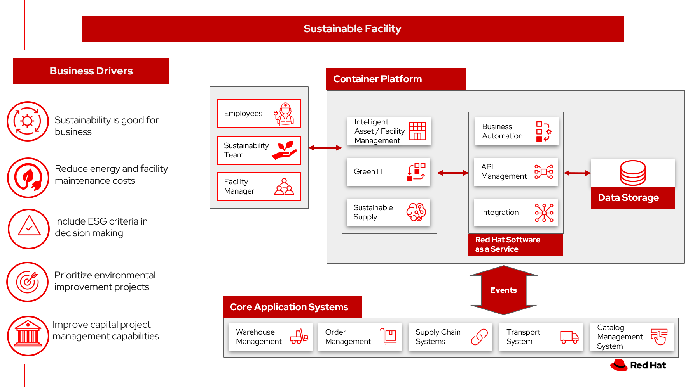

# Sustainable facility

Companies are setting environmental commitments for facilities, such as:

- Achieving net zero green house gas (GHG) emissions by 2030 
- Diverting 90% of nonhazardous waste (by weight) from landfill and incineration by 2025

Real estate plays a critical role in meeting these targets. Buildings account for [40% of the annual carbon dioxide emissions](https://architecture2030.org/) globally.

More than 80% of CEOs expect sustainability investments to produce improved business results in the next five years.

> The key to a successful sustainability strategy is balancing the environmental drivers with market demands.

Real estate is typically one of the largest expenses for an organization. Now an organization can make the most out of every square inch and meter of space.

The [World Economic Forum](https://www.weforum.org/agenda/2021/02/why-the-buildings-of-the-future-are-key-to-an-efficient-energy-ecosystem/) explains, energy consumption in the built environment accounted for 40% of global energy use and 33% of global energy-related CO2 emissions in 2019. In Europe alone, more than 220 million existing buildings – or 75% of the building stock – are energy-inefficient, with many relying on fossil fuels for heating and cooling. 

They continue:

> The more innovative, more efficient and cheaper way is to equip buildings with the digital tools that allow them to automatically adjust heating, lighting and other systems to the number of people present at any given time, using real-time data analysis.

Executing on this mission involves a staggering number of decisions, ranging from room configurations and leasing terms, to capital project planning and facilities maintenance.

## Use cases

Manage competing needs with constrained resources. 

Improve an organization’s capital project management capabilities.

Manage buildings to encourage sustainability through the real estate lifecycle. Specifically:

- Include sustainability criteria in space acquisition and disposals (ISO 14000 as an example)
- Prioritize sustainability in construction and renovation projects
- Enable energy efficiency with green leases
- Reduce waste by integrating portfolio data
- Reach carbon footprint goals with space optimization
- Extend asset life through improved maintenance and assessment
- Maintain compliance to regulations and manage remediation with integrated Environmental, Health, and Safety (EHS/HSE) processes.

Minimize the environmental impact of your operations.

- Cut energy use.
- Minimize/combine facility management work orders.
- Use data from sensors, such as HVAC, refrigerator and freezer temperatures.
- Identify and manage energy usage.
- Green IT, reducing environmental impact of your data center.

## Background

Roughly 40% of the global share of annual carbon dioxide emissions comes from buildings. The UN Environment Program states that if nothing is done, greenhouse gas (GHG) emissions from buildings will more than double in the next 20 years.

To meet targets for green house gas (GHG) emissions, buildings and cities must shift from being part of the problem to being part of the solution. 

## Business problem

There is a constant tension between using every square inch of space, reducing real estate operating costs, and creating outstanding occupant experiences.

IDC in its [Worldwide Integrated Workplace Management System 2020–2021 Vendor Assessment](https://www.ibm.com/account/reg/us-en/signup?formid=urx-49090) reports:

> Now organizations must prioritize creating safe and productive environments for their employees, students, and customers. In the short term, organizations had to take measures such as allowing a dramatic shift to working remotely where possible, modifying floor plans for social distancing, reducing building capacity, implementing new schedules, and deploying novel technology. Real estate and facility professionals have turned to a variety of "return-to-work solutions" for space reservations, health attestation, contact tracing, proximity monitoring, wayfinding, cleaning, communications, and so on.

Organizations have an unprecedented opportunity to capture and analyze their data and develop greater operational resiliency and effectiveness. These data insights give companies the tools needed to react quickly to change, care for their employees and occupants, and make strategic space and occupancy decisions.

> Sustainability promotes business, supports the needs of our customers, generates profitability, and 
contributes to a better world. This is how we see our transformative role. 
> &mdash; Fausto Ribeiro, CEO of Banco do Brasi

### Challenges / Business Drivers 

**Challenges**

There are several challenges to overcome in the pursuit of becoming a truly sustainable business:

- **Customer readiness**. While the mindset around sustainability is shifting, no business can afford to be left behind, and few can financially afford to be too far ahead of the appetite for sustainable offerings. Co-creating a sustainable future requires a deep understanding of your customers and having partners with the right relationships and ecosystems to bring them along on the journey.
- **Cost**. Implementing sustainable business practices typically requires higher upfront investments. In the short term, it will often be cheaper to stick with the status quo. Some organizations will need help building an investment case to show how immediate investment will result in more durable profitability over the long run.
- **Systemic inertia**. While sustainability is an important goal, it often isn’t seen as more important than other key priorities that may provide benefits sooner. Many businesses plan in ten-year increments, so while a 2050 commitment is good, it often isn’t enough to drive sufficient action in this decade, from a planning standpoint. It comes back to reframing risks as opportunities and building the case that acting on sustainability now is necessary to achieving future sustainability in business.
- **Lack of tools, insights and expertise**. Being unprepared to develop a corporate sustainability vision, strategy and framework is a monumental risk. Companies may lack the ability to implement sustainable solutions or even know where to start. Sustainability in business is evolving and so are the answers. Every business needs an ecosystem of innovation partners to help them reinvent the world and create a sustainable future.

**Drivers**

- **Capture and calculate carbon emissions data**, report it according to regulations and set targets to drive action.
- **Reduce energy costs**.
- **Include ESG criteria in decision making**.
- **Prioritize environmental improvement projects**.
- **Improve an capital project management capabilities**.
- **Use AI models to “squeeze” more insights from the existing sensors**.

### Responses

| Business Problem | Solution |
| - | - |
| Automating ESG Reporting | Capture and manage over quantitative and qualitive data types to support your expanding sustainability reporting requirements to frameworks and reporting schemes  |
| Manage competing needs with constrained resources | <ul><li>Predict when important assets and building systems will require maintenance, refurbishment or replacement. <li>Document the impact on productivity and building value when systems fail.</ul> |
| Incorporate sustainability options into customer decison making | Connect your strategy with day-to-day operations to embed sustainability into your business transformation |
| Create a lower-emissions business | Build intelligent asset management into operations. |
| Data exists, but may be in silos | Standardize, integrate, and centralize data. Availability and transparency of data to bring them to top-of-mind in decision making |

## Business outcomes

- Improved utilization of office and warehouse space
- Improved energy efficiency
- Increased asset life
- Improved maintenance 
- Sustainable buildings helps create a greener environment

## Solution overview

The solution shown in Figure 1 uses components that can be grouped into three main categories as shown in the following diagram:

- Core application systems. Often customer-provided technologies, such as order management, facilities management. These systems can be stand-alone applications, on premises and cloud services, databases. 
- Foundational infrastructure. The Red Hat/IBM solution is built on Red Hat OpenShift. Data is routed through API management. Events are routed through Business Automation tools such as Business Automation Workshop.
- Sustainable enterprise systems acts to coordinate facilities management with workplace management backed by sustainability reporting.

_Figure 1. Overall view of sustainable facilities solution._

The sustainable enterprise works within the existing enterprise infrastructure.

_Figure 2. Sustainable enterprise works within existing digital infrastructure._

## Logical diagrams

_Figure 3. The personas and technologies that provide a platform for some of the biggest potential breakthroughs in managing a sustainable enterprise._

## Architecture

The figures in this section show the interaction of customer systems with sustainability facilities systems.

### Sustainable facilities

The following diagram shows how data is provided for insights and decision making along with how those data can be also used in compliance and reporting.

_Figure 4. Schematic diagram of the sustainable facilities use case._

Sustainable facilties workflow steps:

<ol>
<li>Collect sensor and energy consumption (energy, refrigerators, HVAC) across the enterprise. Unusual data can be from a piece of equipment that no longer functions, a walk-in refrigerator door being left open, HVAC that is providing temps outside of nominal ranges
<li>Sensors report to Intelligent Assets and Facilities Management software that provides alerts. AI is used to determine abnormal behavior of data from sensors.
<li>Data is sent in real time to Intelligent Assets and Facilities system to take remediation actions, provide information for space planning and utilization
<li>Data is sent in real time to the Sustainability Control Tower, an enterprise-wide repository.
<li>A Data Fabric provides consistent ways of pulling data from existing data, maps data heirarchies between systems, removing inconsistencies in data.
<ol type="a">
<li>Intelligence Assets and Facilities software collects data. (It also provides work orders, proactive maintence, project planning.) 
</ol>
<li>Data is collected in Sustainability Control Tower and used for decision making across the enterprise, across multiple scenarios.
<li>Sustainability Manager, Facility Managers, company execs reviews KPI, update energy consumption metrics, sets energy consumption goals. Uses the insights it generates to help informed decision-making that makes both business and environmental sense
<li>Sustainability Control Tower provides reporting for compliance and to demonstrate the impacts of decisions on sustainability and the environment.
</ol>

## Action Guide

From a high-level perspective, the **Action Guide** represents a future state for organizations considering a comprehensive commitment. The idea is to outline a set steps that can be prioritized to reach that future state by adding new functionality to your existing systems.

- Automation
- Sustainability
- Modernization

| | Actionable Step | Implementation details |
| - | - | - |
| Automation | Advance the quality of capital, facility and environmental projects | Integrate data from multiple systems to get enterprise-wide view to capture and evaluate occupancy to align usage with business requirements and objectives.  |
| Automation | Optimize real estate portfolios | Centralize and integrate critical information at an enterprise level, giving organizations the ability to make the most cost-effective decisions. |
| Automation | Amp up AI to make workflows smarter | <ul><li>Using self-service, automated and mobile processes for move management and reservation and hoteling workspaces.<li>Manage and monitor the assets within each structure – like HVAC systems, elevators and even the exit signs – and use AI-driven insights to perform predictive instead of reactive maintenance<./ul> |
| Automation | Automate ESG data collection | Integrate technologies to help address the complexities of ESG data volume and types and your Hybrid IT preference. |
| Sustainability| Build a data foundation. | <ol><li>Monitor and measure your operations<li>Manage assets, infrastructure and resources<li>Improve product and service quality<li>Enable sustainable operations</ol> |
| Sustainability | Streamline reporting and disclosures  | Use powerful emissions calculation engine and flexible reporting tools to meet strict internal and external requirements. |
| Sustainability | Accelerate decarbonization | Identify energy and emissions savings opportunities and tracking progress at every stage of your journey. |
| Modernization | Modernization for modern infrastructures, scale hybrid cloud platforms | The decision for a future, Kubernetes-based enterprise platform is defining the standards for development, deployment and operations tools and processes for years to come and thus represents a foundational decision point. |

For specific steps on this approach, see **The Action Guide** details in [_Own Your Impact: Practical Pathways to Transformational Sustainability_](https://www.ibm.com/downloads/cas/6NJEKDD8) survey of 3,000 CEOs worldwide, that reveals sustainability's emergence onto the mainstream corporate agenda.

## Technology

The following technologies offered by Red Hat and IBM can augment the solutions already in place in your organization.

### Core systems

[*Red Hat OpenShift*](https://www.redhat.com/en/technologies/cloud-computing/openshift) Kubernetes offering, the hybrid platform offering allow deployment across data centers, private and public clouds offering choices and flexible for hosting system and services. You can manage clusters and applications from a single console, with built-in security policies with [_Red Hat Advanced Cluster Management_](https://www.redhat.com/en/technologies/management/advanced-cluster-management) and [_Red Hat Advanced Cluster Security_](https://www.redhat.com/en/technologies/cloud-computing/openshift/advanced-cluster-security-kubernetes).

[*Red Hat Ansible Automation Platform*](https://www.redhat.com/en/technologies/management/ansible) operate, scale and delegate automate IT services, track changes an update inventory, prevent configuration drift and  integrated with ITSM.

[*Red Hat OpenShift DevOps*](https://www.redhat.com/en/getting-started-devops) represents an approach to culture, automation and platform design intended to deliver increased business value and responsiveness through rapid, high-quality service delivery. DevOps means linking legacy apps with newer cloud-native apps and infrastructure. A DevOps developer can link legacy apps with newer cloud-native apps and infrastructure.

### Integration services

[*Red Hat OpenShift API Management*](https://access.redhat.com/documentation/en-us/red_hat_openshift_api_management/1/guide/53dfb804-2038-4545-b917-2cb01a09ef98) is a managed API traffic control and program management service to secure, manage, and monitor APIs at every stage of the development lifecycle.

[*Red Hat Intgration*](https://www.redhat.com/en/products/integration) is a comprehensive set of integration and messaging technologies to connect applications and data across hybrid infrastructures. It is an agile, distributed, containerized, and API-centric solution. It provides service composition and orchestration, application connectivity and data transformation, real-time message streaming, change data capture, and API management.

[*IBM Business Automation*](https://www.ibm.com/business-automation) delivers intelligent automations quickly with low-code tooling, such as business processes automation, decisioning software, robotic process automation, process mining, workflow automation, business process mapping, Watson Orchestrate, content services, and document processing.

[*IBM Data Fabric*](https://www.ibm.com/data-fabric) empowers your teams and works across the ecosystem by connecyting data from disparate data sources in multicloud envrionments. In particular, [_Watson Knowledge Catalog_](https://www.ibm.com/cloud/watson-knowledge-catalog) provides you users with a catalog tool for intelligent, self-service discovery of data, models. [_Watson Query_](https://www.ibm.com/products/watson-query) provides data consumers with a universal query engine that executes distributed and virtualized queries across databases, data warehouses, data lakes, and streaming data without additional manual changes, data movement or replication. 

### Sustainable enterprise sub-system

[*Envizi*](https://www.ibm.com/products/envizi) simplifies the capture, consolidation, management, analysis and reporting of your environmental, social and governance (ESG) data.

[*IBM TRIRIGA*](https://www.ibm.com/products/tririga/sustainability) harnesses the power of data and AI to infuse sustainability into your real estate and facilities management operations.

[*IBM Maximo Application Suite (MAS)*](https://www.ibm.com/products/maximo/sustainability) Infuse sustainability into your asset management by harnessing the power of data and AI.

[*IBM Turbonomic*](https://www.ibm.com/products/turbonomic) monitors resource consumption of applications within the data center. It provides FinOps engineering teams the ability to ensure your applications are performing efficiently, allowing cloud and ITOps teams to cut cloud spend and multiply ROI.

[*Transparent Supply*](https://www.ibm.com/products/supply-chain-intelligence-suite/blockchain-transparent-supply) provides supply chain management with a robust traceability solution.

## References

- [IBM journey to more sustainable facilities: IBM as client zero](https://www.ibm.com/blogs/internet-of-things/ibm-journey-to-more-sustainable-facilities-ibm-as-client-zero/)
- IBM Institute for Business Value [Balancing sustainability and profitability](https://www.ibm.com/thought-leadership/institute-business-value/report/2022-sustainability-consumer-research)
- [How sustainability technologies help make facilities work better](https://www.ibm.com/case-studies/ibm-gre)
- [What is sustainability in business?](https://www.ibm.com/topics/business-sustainability)
- IBM Institute for Business Value [Sustainability at a turning point](https://www.ibm.com/downloads/cas/WLJ7LVP4) 
- IBM Institute for Business Value [Own Your Impact: Practical Pathways to Transformational Sustainability](https://www.ibm.com/downloads/cas/6NJEKDD8)
- [Unlock opportunities with an integrated workplace management system](https://www.ibm.com/internet-of-things/learn/integrated-workplace-management-system/)
- [Sustainable asset management with IBM Maximo Application Suite](https://www.ibm.com/products/maximo/sustainability)
- World Economic Forum [Why buildings are the foundation of an energy-efficient future](https://www.weforum.org/agenda/2021/02/why-the-buildings-of-the-future-are-key-to-an-efficient-energy-ecosystem/)
- IBM [Build tomorrow’s predictive enterprise today](https://www.ibm.com/resources/guides/intelligent-asset-management/)
- [EY and IBM Collaborate to Address Complex ESG Challenges and Drive Value-Led Sustainability](https://newsroom.ibm.com/2023-03-08-EY-and-IBM-Collaborate-to-Address-Complex-ESG-Challenges-and-Drive-Value-Led-Sustainability)

## Next steps

See:

- Loss and waste management (coming soon)
- Product timeliness (coming soon)
- Perfect order (coming soon)
- Intelligent order (coming soon)
- Sustainable supply (coming soon)

For a comprehensive supply chain overview, see [Supply Chain Optimization](https://www.redhat.com/architect/portfolio/detail/36).

## Contributors

- Iain Boyle, Chief Architect, Red Hat
- Mahesh Dodani, Principal Industry Engineer, IBM Technology
- Thalia Hooker, Senior Principal Specialist Solution Architect, Red Hat
- Lee Carbonell, Senior Solution Architect & Master Inventor, IBM
- Eric Singsaas, Account Technical Lead, IBM Technology
- Mike Lee, Principal Integration Technical Specialist, IBM
- Rajeev Shrivastava, Account Technical Lead, IBM
- Bruce Kyle, Sr Solution Architect, IBM Client Engineering
