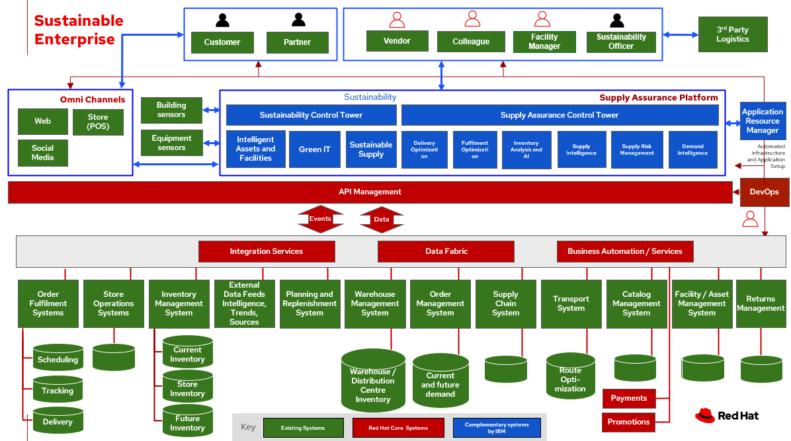

# Sustainable supply

## Use cases

- Pharmacy
- Perishable items

## Business problem

### Challenges / Business Drivers 

Challenges

- Companies may be wary of sharing competitive data are more willing to participate on the platform.

Drivers

- Enhance traceability. If a company discovers a faulty product, the blockchain enables the firm and its supply chain partners to trace the product, identify all suppliers involved with it, identify production and shipment batches associated with it, and efficiently recall it.
- Increase efficiency and speed and reducing disruptions
- Improve financing, contracting, and international transactions
- Reducing loss, increasing efficiency regarding waste management.

## Business outcomes

- Quality assurance. Authenticate product origins and validate their provenance to demonstrate brand differentiators to consumers.
- Improved forecasting. Improve product traceability throughout the supply chain in near real-time. Optimize with automatic replenishment.
- Reduced friction. The use of blockchain reduces the costs of dispute resolutions, product recalls, compliance and documentation sharing.
- Extensive automation. Shorten the timeframe to achieve automation through embedded intelligence and smart workflows.
- Reducing loss, increasing efficiency regarding waste management.

## Solution overview

The solution shown in Figure 1 uses components that can be grouped into three main categories as shown in the following diagram:

- Core application systems. Often customer-provided technologies, such as order management, facilities management. These systems can be stand-alone applications, on premises and cloud services, databases. 
- Foundational infrastructure. The Red Hat/IBM solution is built on Red Hat OpenShift. Data is routed through API management. Events are routed through Business Automation tools such as Business Automation Workshop.
- Sustainable enterprise systems acts to coordinate facilities management with workplace management backed by sustainability reporting.

_Figure 1. Overall view of sustainable facilities solution._

The sustainable enterprise works within the existing enterprise infrastructure.

_Figure 2. Sustainable enterprise works within existing digital infrastructure._

## Logical diagrams

_Figure 3. The personas and technologies that provide a platform for some of the biggest potential breakthroughs in the supply chain._

## Architecture

The figures in this section show the interaction of 3rd party logistics data to your customer systems.

_Figure 4. Updates provided to your data based on information obtained from 3rd party providers to reduce waste._

In this scenario, 3rd Party Logistics provides data for decision making to make your supply chain more sustainable

<ol>
<li>3rd party logistics software provides product sourcing updates through API
<li>API Management provides and monitors the input of the 3rd partly logistics information
<li>Your organization receives the 3rd party logistics information and incorporates it into Sustainable Supply
<li>The Supply Assurance Control Tower surfaces the end-to-end logistics supply chain to users, such as the inventory controller and logistics
<ol type="a">
<li>Sourcing data is routed to Sustainability Control Tower for reporting
<li>Sourcing data is routed to Supply Chain Control Tower for visitibility to Inventory Controller and others and creates work queues as needed
</ol>
<li>Based on the visibility into the supply chain, the inventory controller and logistics officer can take actions to replenish supplies or to act to reduce loss
<li>The Business Automation provides a consistent way for multiple systems to respond, such as
<li>Update:
<ol type="a">
<li>Inventory management system counts of current inventory, store inventory, and future inventory
<li>Place orders in Order Management System
</ol>
</ol>

## Action Guide

From a high-level perspective, the **Action Guide** represents a future state for organizations considering a comprehensive commitment. The idea is to outline a set steps that can be prioritized to reach that future state by adding new functionality to your existing systems.

- Automation
- Sustainability
- Modernization

| | Actionable Step | Implementation details |
| - | - | - |
| Automation | Automate the collection of sustainability data | Reduce manual processing of data |
| Automation | Amp up AI to make workflows smarter | <ul><li>Automate decision processes<li>Automate steps taken to implement decisions across systems, such as inventory manageent, transport and order management</ul> |
| Sustainability | Include sustainability data in decision making | Integrate sustainability metrics in supply chain, facility management, and data center operations |
| Sustainability | Track sustainability data within your supply chain | Engage vendors and partners to provide sustainability data as part of your purchasing requirements |
| Modernization | Modernization for modern infrastructures, scale hybrid cloud platforms | The decision for a future, Kubernetes-based enterprise platform is defining the standards for development, deployment and operations tools and processes for years to come and thus represents a foundational decision point. |
| Modernization | Modernize application deployment and operations practices | Include DevOps best practices to deploy, monitor, and maintain applications |

For specific steps on this approach, see **The Action Guide** details in [_Own Your Transformation_](https://www.ibm.com/downloads/cas/1BYY6VEM) survey of 1500 CSCOs across 24 industries.

## Technology

The following technologies offered by Red Hat and IBM can augment the solutions already in place in your organization.

### Core systems

[*Red Hat OpenShift*](https://www.redhat.com/en/technologies/cloud-computing/openshift) Kubernetes offering, the hybrid platform offering allow deployment across data centers, private and public clouds offering choices and flexible for hosting system and services. You can manage clusters and applications from a single console, with built-in security policies with [_Red Hat Advanced Cluster Management_](https://www.redhat.com/en/technologies/management/advanced-cluster-management) and [_Red Hat Advanced Cluster Security_](https://www.redhat.com/en/technologies/cloud-computing/openshift/advanced-cluster-security-kubernetes).

[*Red Hat Ansible Automation Platform*](https://www.redhat.com/en/technologies/management/ansible) operate, scale and delegate automate IT services, track changes an update inventory, prevent configuration drift and  integrated with ITSM.

[*Red Hat OpenShift DevOps*](https://www.redhat.com/en/getting-started-devops) represents an approach to culture, automation and platform design intended to deliver increased business value and responsiveness through rapid, high-quality service delivery. DevOps means linking legacy apps with newer cloud-native apps and infrastructure. A DevOps developer can link legacy apps with newer cloud-native apps and infrastructure.

### Integration services

[*Red Hat OpenShift API Management*](https://access.redhat.com/documentation/en-us/red_hat_openshift_api_management/1/guide/53dfb804-2038-4545-b917-2cb01a09ef98) is a managed API traffic control and program management service to secure, manage, and monitor APIs at every stage of the development lifecycle.

[*Red Hat Intgration*](https://www.redhat.com/en/products/integration) is a comprehensive set of integration and messaging technologies to connect applications and data across hybrid infrastructures. It is an agile, distributed, containerized, and API-centric solution. It provides service composition and orchestration, application connectivity and data transformation, real-time message streaming, change data capture, and API management.

[*IBM Business Automation*](https://www.ibm.com/business-automation) delivers intelligent automations quickly with low-code tooling, such as business processes automation, decisioning software, robotic process automation, process mining, workflow automation, business process mapping, Watson Orchestrate, content services, and document processing. 

[*IBM Data Fabric*](https://www.ibm.com/data-fabric) empowers your teams and works across the ecosystem by connecyting data from disparate data sources in multicloud envrionments. In particular, [_Watson Knowledge Catalog_](https://www.ibm.com/cloud/watson-knowledge-catalog) provides you users with a catalog tool for intelligent, self-service discovery of data, models. [_Watson Query_](https://www.ibm.com/products/watson-query) provides data consumers with a universal query engine that executes distributed and virtualized queries across databases, data warehouses, data lakes, and streaming data without additional manual changes, data movement or replication. 

### Sustainable enterprise sub-system

[*Envizi*](https://www.ibm.com/products/envizi) simplifies the capture, consolidation, management, analysis and reporting of your environmental, social and governance (ESG) data.

[*IBM TRIRIGA*](https://www.ibm.com/products/tririga/sustainability) harnesses the power of data and AI to infuse sustainability into your real estate and facilities management operations.

[*IBM Maximo Application Suite (MAS)*](https://www.ibm.com/products/maximo/sustainability) Infuse sustainability into your asset management by harnessing the power of data and AI.

[*IBM Turbonomic*](https://www.ibm.com/products/turbonomic) monitors resource consumption of applications within the data center. It provides FinOps engineering teams the ability to ensure your applications are performing efficiently, allowing cloud and ITOps teams to cut cloud spend and multiply ROI.

[*Transparent Supply*](https://www.ibm.com/products/supply-chain-intelligence-suite/blockchain-transparent-supply) provides supply chain management with a robust traceability solution.

## References

- Harvard Business Review [Building a Transparent Supply Chain](https://hbr.org/2020/05/building-a-transparent-supply-chain)

## Contributors

- Iain Boyle, Chief Architect, Red Hat
- Mahesh Dodani, Principal Industry Engineer, IBM Technology
- Thalia Hooker, Senior Principal Specialist Solution Architect, Red Hat
- Lee Carbonell, Senior Solution Architect & Master Inventor, IBM
- Eric Singsaas, Account Technical Lead, IBM Technology
- Mike Lee, Principal AI Ops Technical Specialist, IBM
- Rajeev Shrivastava, Account Technical Lead, IBM
- Bruce Kyle, Sr Solution Architect, IBM Client Engineering
